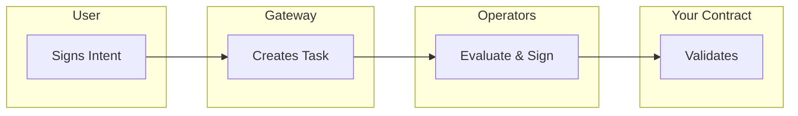
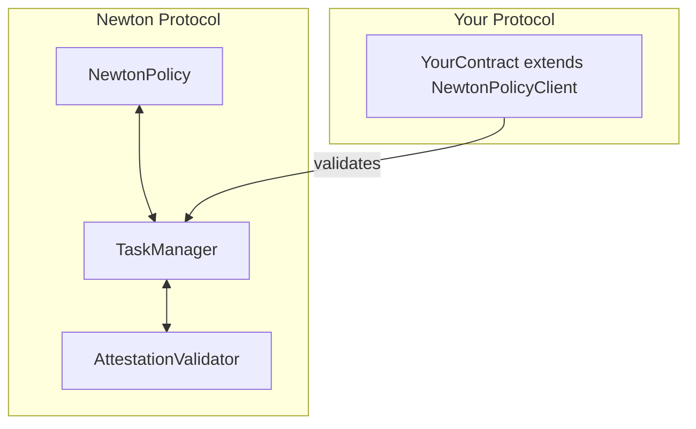
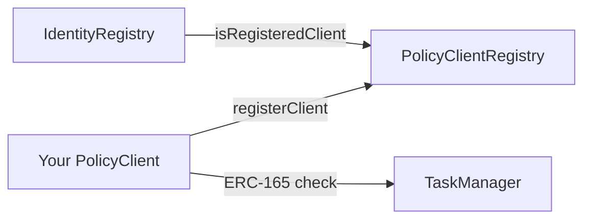
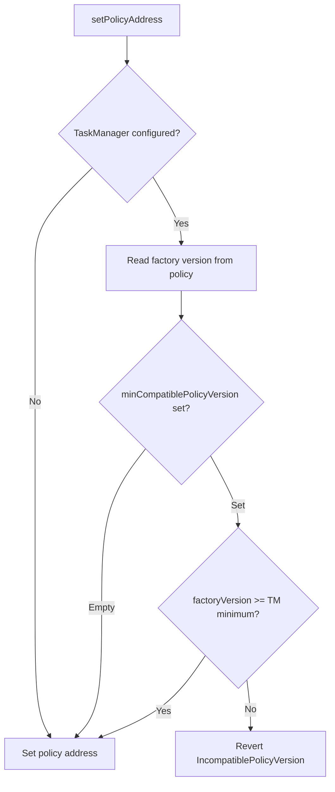

The Newton Protocol is a decentralized policy evaluation service built on EigenLayer. It enables smart contracts to enforce complex authorization rules (written in Rego) before executing transactions. By extending the `NewtonPolicyClient` mixin, your contract can:

- **Define custom policies** governing transaction authorization
- **Validate attestations** proving that transactions comply with your policies
- **Leverage decentralized security** through EigenLayer's restaked ETH

### When to use Newton Policy Client

| Use Case | Example |
|---|---|
| Transaction authorization | Wallet contracts requiring multi-party approval |
| Spend limits | Daily/weekly transfer limits on treasury contracts |
| Allowlist/blocklist enforcement | Restricting interactions to approved addresses |
| Time-based access control | Operations only allowed during certain hours |
| Complex business logic | Multi-condition approval workflows |
| Off-chain data verification | Price feeds, identity verification, compliance checks |

---

## Core concepts

### Intent

An **Intent** describes the transaction a user wants to execute:

```solidity
struct Intent {
    address from;              // Transaction initiator (tx.origin equivalent)
    address to;                // Target contract
    uint256 value;             // ETH value
    bytes data;                // ABI-encoded calldata
    uint256 chainId;           // Chain ID for cross-chain safety
    bytes functionSignature;   // Human-readable function signature
}
```

### Policy

A **Policy** is a Rego program that evaluates whether an Intent should be approved. Policies are stored on IPFS and referenced by their CID (Content Identifier).

### Attestation

An **Attestation** is cryptographic proof that Newton operators have evaluated your policy and approved the Intent:

```solidity
struct Attestation {
    bytes32 taskId;            // Unique task identifier
    bytes32 policyId;          // Policy that was evaluated
    address policyClient;      // Your contract address
    uint32 expiration;         // Block number when attestation expires
    Intent intent;             // The approved intent
    bytes intentSignature;     // User's signature on the intent
}
```

### Task lifecycle



1. **User signs Intent** — User creates and signs an Intent describing their desired transaction
2. **Task created** — The Gateway creates a task on the TaskManager contract
3. **Operators evaluate** — Newton operators fetch the policy, evaluate it, and BLS-sign the result
4. **Aggregator collects** — Signatures are aggregated until quorum is reached
5. **Contract validates** — Your contract validates the attestation and executes the transaction

---

## Architecture

### Contract relationships



### Key addresses

Your contract needs to know:

| Component | Description |
|---|---|
| `policyTaskManager` | The Newton TaskManager contract address |
| `policy` | Your deployed NewtonPolicy contract address |
| `policyClientOwner` | Address authorized to update policy configuration |

---

## Quick start

<Steps>
  <Step title="Install dependencies">
    ```bash
    forge install newt-foundation/newton-prover-avs
    ```
  </Step>
  <Step title="Import the mixin">
    ```solidity
    import {NewtonPolicyClient} from "newton-prover-avs/contracts/src/mixins/NewtonPolicyClient.sol";
    import {NewtonMessage} from "newton-prover-avs/contracts/src/core/NewtonMessage.sol";
    ```
  </Step>
  <Step title="Extend your contract">
    <Note>
      Calling `_initNewtonPolicyClient` in the constructor is **optional**. You can initialize the policy client later via an `initialize` function or admin setter. The policy address is set separately via `_setPolicyAddress()` (internal, for constructors) or `setPolicyAddress()` (public, for deferred setup by the owner). This flexibility supports both new contracts and existing upgradeable contracts.
    </Note>

    <Tabs>
      <Tab title="New Contract">
        ```solidity
        contract MyProtectedContract is NewtonPolicyClient {
            error InvalidAttestation();

            constructor(
                address policyTaskManager,
                address policy,
                address owner
            ) {
                _initNewtonPolicyClient(policyTaskManager, owner);
                _setPolicyAddress(policy);
            }

            function protectedFunction(
                NewtonMessage.Attestation calldata attestation
            ) external {
                require(_validateAttestation(attestation), InvalidAttestation());
                // Your business logic here
            }
        }
        ```
      </Tab>
      <Tab title="Existing Upgradeable Contract">
        ```solidity
        contract MyExistingVault is NewtonPolicyClient, OwnableUpgradeable {
            error InvalidAttestation();
            error AlreadyInitialized();

            bool private _policyClientInitialized;

            /// @notice Initialize Newton policy client (can be called post-upgrade)
            function initializeNewtonPolicyClient(
                address policyTaskManager,
                address policyClientOwner
            ) external onlyOwner {
                require(!_policyClientInitialized, AlreadyInitialized());
                _initNewtonPolicyClient(policyTaskManager, policyClientOwner);
                _policyClientInitialized = true;
            }

            // setPolicyAddress(address policy) is inherited from NewtonPolicyClient
            // and can be called by the policyClientOwner once a policy is deployed.

            function protectedWithdraw(
                NewtonMessage.Attestation calldata attestation
            ) external {
                require(_validateAttestation(attestation), InvalidAttestation());
                // Your withdrawal logic here
            }
        }
        ```
      </Tab>
    </Tabs>
  </Step>
</Steps>

---

## Step-by-step integration

Newton supports two integration paths depending on your situation:

| Scenario | Policy Contract Required? | When to Initialize |
|---|---|---|
| New contract development | Optional (can use external policy) | Constructor or initializer |
| Upgrading existing contract | Optional (can add later) | Post-upgrade admin function |

### Step 1: Deploy your policy (optional)

Having a Newton Policy contract is **not required** upfront. You can:

1. **Deploy a policy first** — If you have your Rego policy ready
2. **Use an existing policy** — Reference a policy already deployed by another protocol
3. **Initialize without a policy** — Pass `address(0)` as the policy address and configure later

If deploying a new policy, work with the Newton team or use the `NewtonPolicyFactory`:

- **Policy CID**: IPFS hash of your Rego policy
- **Schema CID**: IPFS hash of your policy parameters schema
- **Entrypoint**: The Rego package and output path (e.g., `myPolicy.allowed`)
- **Policy Data**: Contract addresses providing data to your policy

### Step 2: Create or upgrade your contract

<Tabs>
  <Tab title="New Contract">
    ```solidity
    // SPDX-License-Identifier: MIT
    pragma solidity ^0.8.27;

    import {NewtonPolicyClient} from "newton-prover-avs/contracts/src/mixins/NewtonPolicyClient.sol";
    import {NewtonMessage} from "newton-prover-avs/contracts/src/core/NewtonMessage.sol";
    import {INewtonPolicy} from "newton-prover-avs/contracts/src/interfaces/INewtonPolicy.sol";

    contract MyVault is NewtonPolicyClient {
        error InvalidAttestation();
        error TransferFailed();

        event WithdrawalExecuted(address indexed user, uint256 amount);

        constructor(
            address _policyTaskManager,
            address _policy,  // Can be address(0) if policy not yet deployed
            address _owner
        ) {
            _initNewtonPolicyClient(_policyTaskManager, _owner);
            if (_policy != address(0)) {
                _setPolicyAddress(_policy);
            }
        }

        /// @notice Initialize the policy configuration
        function initializePolicy(
            INewtonPolicy.PolicyConfig calldata config
        ) external onlyPolicyClientOwner returns (bytes32) {
            return _setPolicy(config);
        }

        /// @notice Protected withdrawal requiring Newton attestation
        function withdraw(
            NewtonMessage.Attestation calldata attestation
        ) external {
            require(_validateAttestation(attestation), InvalidAttestation());

            NewtonMessage.Intent memory intent = attestation.intent;

            (bool success, ) = intent.to.call{value: intent.value}(intent.data);
            require(success, TransferFailed());

            emit WithdrawalExecuted(intent.from, intent.value);
        }
    }
    ```
  </Tab>
  <Tab title="Upgrading Existing Contract">
    ```solidity
    // SPDX-License-Identifier: MIT
    pragma solidity ^0.8.27;

    import {NewtonPolicyClient} from "newton-prover-avs/contracts/src/mixins/NewtonPolicyClient.sol";
    import {NewtonMessage} from "newton-prover-avs/contracts/src/core/NewtonMessage.sol";
    import {INewtonPolicy} from "newton-prover-avs/contracts/src/interfaces/INewtonPolicy.sol";
    import {OwnableUpgradeable} from "@openzeppelin-upgrades/contracts/access/OwnableUpgradeable.sol";

    /// @title MyExistingVaultV2
    /// @notice Upgraded version with Newton policy support
    contract MyExistingVaultV2 is OwnableUpgradeable, NewtonPolicyClient {
        error InvalidAttestation();
        error PolicyClientAlreadyInitialized();

        bool private _newtonPolicyClientInitialized;

        // ... existing contract storage and functions remain unchanged ...

        /// @notice Initialize Newton policy client support (one-time, post-upgrade)
        function initializeNewtonPolicyClient(
            address policyTaskManager,
            address policyClientOwner
        ) external onlyOwner {
            require(!_newtonPolicyClientInitialized, PolicyClientAlreadyInitialized());
            _initNewtonPolicyClient(policyTaskManager, policyClientOwner);
            _newtonPolicyClientInitialized = true;
        }

        // setPolicyAddress(address policy) is inherited from NewtonPolicyClient.

        function protectedWithdraw(
            NewtonMessage.Attestation calldata attestation
        ) external {
            require(_validateAttestation(attestation), InvalidAttestation());
            // Execute withdrawal logic...
        }

        function supportsInterface(bytes4 interfaceId) public view override returns (bool) {
            return super.supportsInterface(interfaceId);
        }
    }
    ```

    <Warning>
      When adding `NewtonPolicyClient` to an existing upgradeable contract:
      1. Be careful with storage layout — add new storage variables at the end
      2. The `_newtonPolicyClientInitialized` flag prevents re-initialization
      3. Test thoroughly on a fork before mainnet deployment
      4. Consider using a timelock or multisig for the initialization call
    </Warning>
  </Tab>
</Tabs>

### Step 3: Initialize your policy

After deployment, configure your policy parameters:

```solidity
INewtonPolicy.PolicyConfig memory config = INewtonPolicy.PolicyConfig({
    policyParams: abi.encode(
        1000 ether,           // Daily spend limit
        allowedRecipients     // Array of allowed addresses
    ),
    expireAfter: 100          // Attestations expire after 100 blocks
});

myVault.initializePolicy(config);
```

### Step 4: Handle user requests

When a user wants to execute a protected action:

```javascript
// 1. User creates an intent
const intent = {
    from: userAddress,
    to: vaultAddress,
    value: withdrawAmount,
    data: encodeWithdrawCall(amount, recipient),
    chainId: currentChainId,
    functionSignature: "withdraw(uint256,address)"
};

// 2. User signs the intent
const intentSignature = await wallet.signTypedData(intent);

// 3. Submit to Newton Gateway
const attestation = await newtonGateway.createTask({
    policyClient: vaultAddress,
    intent: intent,
    intentSignature: intentSignature
});

// 4. Call your contract with the attestation
await vault.withdraw(attestation);
```

---

## API reference

### Interface: INewtonPolicyClient

```solidity
interface INewtonPolicyClient is IERC165 {
    /// @notice Get the policy ID for this client
    function getPolicyId() external view returns (bytes32);

    /// @notice Get the policy contract address
    function getPolicyAddress() external view returns (address);

    /// @notice Get the TaskManager address
    function getNewtonPolicyTaskManager() external view returns (address);

    /// @notice Get the policy client owner
    function getOwner() external view returns (address);
}
```

### Mixin: NewtonPolicyClient

#### Initialization

```solidity
/// @notice Initialize the policy client (task manager and owner only)
function _initNewtonPolicyClient(
    address policyTaskManager,
    address policyClientOwner
) internal;

/// @notice Set the policy contract address (internal, no version check)
function _setPolicyAddress(address policy) internal;

/// @notice Set the policy contract address (external, owner only, with version check)
function setPolicyAddress(address policy) public onlyPolicyClientOwner;
```

#### Policy management

```solidity
/// @notice Set or update the policy configuration (internal)
/// @return policyId The generated policy ID
function _setPolicy(
    INewtonPolicy.PolicyConfig memory policyConfig
) internal returns (bytes32);

/// @notice Set or update the policy configuration (external, owner only)
function setPolicy(
    INewtonPolicy.PolicyConfig memory policyConfig
) external onlyPolicyClientOwner returns (bytes32);

/// @notice Update the policy client owner
function setPolicyClientOwner(
    address policyClientOwner
) public onlyPolicyClientOwner;
```

#### Getters

```solidity
function _getPolicyId() internal view returns (bytes32);
function _getPolicyAddress() internal view returns (address);
function _getPolicyConfig() internal view returns (INewtonPolicy.PolicyConfig memory);
function _getNewtonPolicyTaskManager() internal view returns (address);
function _getOwner() internal view returns (address);
```

---

## Validation methods

Newton provides two validation methods for different use cases.

### Standard validation: `_validateAttestation`

Use this when the Newton aggregator has already submitted the task response to the blockchain via `respondToTask`.

```solidity
function _validateAttestation(
    NewtonMessage.Attestation memory attestation
) internal returns (bool);
```

**How it works:**

1. Verifies the policy ID matches your contract's configured policy
2. Verifies the intent sender (`from`) matches `msg.sender`
3. Verifies the chain ID matches the current chain
4. Delegates to TaskManager which checks:
   - Attestation hash matches the stored hash
   - Attestation has not expired
   - Attestation has not been spent (prevents replay)

### Direct validation: `_validateAttestationDirect`

Use this for immediate validation without waiting for `respondToTask`.

```solidity
function _validateAttestationDirect(
    INewtonProverTaskManager.Task calldata task,
    INewtonProverTaskManager.TaskResponse calldata taskResponse,
    bytes calldata signatureData
) internal returns (bool);
```

**How it works:**

1. Verifies the policy ID matches your contract's configured policy
2. Verifies the intent sender matches `msg.sender`
3. Verifies the chain ID matches the current chain
4. Delegates to TaskManager which:
   - Verifies BLS signatures on-chain
   - Checks quorum requirements
   - Creates and immediately validates the attestation

### Comparison

| Aspect | `_validateAttestation` | `_validateAttestationDirect` |
|---|---|---|
| **Prerequisite** | `respondToTask` called | Task created only |
| **Gas Cost** | Lower | Higher (BLS verification) |
| **Latency** | Wait for aggregator | Immediate |
| **Parameters** | Attestation only | Task + Response + Signatures |
| **Use Case** | Standard flow | Time-sensitive operations |

### Example: Direct validation

```solidity
import {INewtonProverTaskManager} from "../interfaces/INewtonProverTaskManager.sol";

contract UrgentVault is NewtonPolicyClient {
    error InvalidAttestation();

    /// @notice Execute urgent withdrawal with direct BLS verification
    function urgentWithdraw(
        INewtonProverTaskManager.Task calldata task,
        INewtonProverTaskManager.TaskResponse calldata taskResponse,
        bytes calldata signatureData
    ) external {
        require(
            _validateAttestationDirect(task, taskResponse, signatureData),
            InvalidAttestation()
        );

        NewtonMessage.Intent memory intent = taskResponse.intent;
        (bool success, ) = intent.to.call{value: intent.value}(intent.data);
        require(success, "Execution failed");
    }
}
```

---

## Example implementations

<AccordionGroup>
  <Accordion title="Simple Token Transfer Protection">
    Protect ERC20 transfers with policy-based authorization:

    ```solidity
    contract ProtectedToken is NewtonPolicyClient {
        IERC20 private _token;
        error InvalidAttestation();

        constructor(
            address token,
            address policyTaskManager,
            address policy,
            address owner
        ) {
            _initNewtonPolicyClient(policyTaskManager, owner);
            _setPolicyAddress(policy);
            _token = IERC20(token);
        }

        function protectedTransfer(
            NewtonMessage.Attestation calldata attestation
        ) external returns (bool) {
            require(_validateAttestation(attestation), InvalidAttestation());

            return _token.transferFrom(
                attestation.intent.from,
                attestation.intent.to,
                attestation.intent.value
            );
        }
    }
    ```
  </Accordion>
  <Accordion title="Vault with Multiple Operations">
    ERC4626 vault router with protected deposit/withdraw:

    ```solidity
    contract VaultRouter is NewtonPolicyClient {
        IERC4626 public vault;
        error InvalidAttestation();
        error MismatchedSelector();

        constructor(
            address _vault,
            address _policyTaskManager,
            address _policy,
            INewtonPolicy.PolicyConfig memory _config,
            address _owner
        ) {
            vault = IERC4626(_vault);
            _initNewtonPolicyClient(_policyTaskManager, _owner);
            _setPolicyAddress(_policy);
            _setPolicy(_config);
        }

        function protectedDeposit(
            NewtonMessage.Attestation calldata attestation
        ) external returns (uint256 shares) {
            require(_validateAttestation(attestation), InvalidAttestation());

            (bytes4 selector, uint256 assets, address receiver) =
                abi.decode(attestation.intent.data, (bytes4, uint256, address));

            require(selector == IERC4626.deposit.selector, MismatchedSelector());

            IERC20(vault.asset()).transferFrom(
                attestation.intent.from,
                address(this),
                assets
            );
            IERC20(vault.asset()).approve(address(vault), assets);
            shares = vault.deposit(assets, receiver);
        }
    }
    ```
  </Accordion>
  <Accordion title="Modular Vault System">
    Base module for composable vault architecture:

    ```solidity
    abstract contract VaultModule is NewtonPolicyClient {
        constructor(
            address _policyTaskManager,
            address _policy,
            address owner
        ) {
            _initNewtonPolicyClient(_policyTaskManager, owner);
            _setPolicyAddress(_policy);
        }

        /// @notice Validate attestation — can be overridden for custom logic
        function validate(
            NewtonMessage.Attestation memory attestation
        ) external virtual returns (bool) {
            return _validateAttestation(attestation);
        }

        /// @notice Execute module-specific logic
        function execute(
            NewtonMessage.Attestation calldata attestation
        ) external virtual returns (bytes memory);
    }
    ```
  </Accordion>
  <Accordion title="Upgradeable Contract">
    Using the OpenZeppelin upgradeable pattern:

    ```solidity
    contract UpgradeableVault is
        Initializable,
        OwnableUpgradeable,
        NewtonPolicyClient
    {
        error InvalidAttestation();

        /// @custom:oz-upgrades-unsafe-allow constructor
        constructor() {
            _disableInitializers();
        }

        function initialize(
            address policyTaskManager,
            address policy,
            address owner
        ) public initializer {
            __Ownable_init();
            _transferOwnership(owner);
            _initNewtonPolicyClient(policyTaskManager, owner);
            _setPolicyAddress(policy);
        }

        function protectedAction(
            NewtonMessage.Attestation calldata attestation
        ) external returns (bool) {
            require(_validateAttestation(attestation), InvalidAttestation());
            return true;
        }
    }
    ```
  </Accordion>
</AccordionGroup>

---

## Common patterns

<AccordionGroup>
  <Accordion title="Decode Intent Data">
    Extract function arguments from the attestation:

    ```solidity
    function decodeTransferIntent(
        NewtonMessage.Attestation calldata attestation
    ) internal pure returns (address to, uint256 amount) {
        // Skip the function selector (4 bytes)
        (to, amount) = abi.decode(
            attestation.intent.data[4:],
            (address, uint256)
        );
    }
    ```
  </Accordion>
  <Accordion title="Verify Function Selector">
    Ensure the attestation is for the expected function:

    ```solidity
    function verifySelector(
        NewtonMessage.Attestation calldata attestation,
        bytes4 expectedSelector
    ) internal pure {
        bytes4 actualSelector = bytes4(attestation.intent.data[:4]);
        require(actualSelector == expectedSelector, "Wrong function");
    }
    ```
  </Accordion>
  <Accordion title="Execute Raw Intent">
    Execute the intent exactly as specified:

    ```solidity
    function executeIntent(
        NewtonMessage.Attestation calldata attestation
    ) internal returns (bytes memory) {
        require(_validateAttestation(attestation), "Invalid attestation");

        (bool success, bytes memory returnData) = attestation.intent.to.call{
            value: attestation.intent.value
        }(attestation.intent.data);

        if (!success) {
            if (returnData.length > 0) {
                assembly {
                    revert(add(32, returnData), mload(returnData))
                }
            }
            revert("Execution failed");
        }

        return returnData;
    }
    ```
  </Accordion>
  <Accordion title="Multi-Attestation Batching">
    Process multiple attestations in one transaction:

    ```solidity
    function batchExecute(
        NewtonMessage.Attestation[] calldata attestations
    ) external returns (bool[] memory results) {
        results = new bool[](attestations.length);

        for (uint256 i = 0; i < attestations.length; i++) {
            require(_validateAttestation(attestations[i]), "Invalid attestation");
            results[i] = _executeAction(attestations[i]);
        }
    }
    ```
  </Accordion>
  <Accordion title="Conditional Validation">
    Apply different validation based on operation type:

    ```solidity
    function conditionalExecute(
        NewtonMessage.Attestation calldata attestation,
        bool requireDirectValidation,
        INewtonProverTaskManager.Task calldata task,
        INewtonProverTaskManager.TaskResponse calldata response,
        bytes calldata signatureData
    ) external {
        if (requireDirectValidation) {
            require(
                _validateAttestationDirect(task, response, signatureData),
                "Direct validation failed"
            );
        } else {
            require(
                _validateAttestation(attestation),
                "Validation failed"
            );
        }

        // Execute logic...
    }
    ```
  </Accordion>
</AccordionGroup>

---

## Security considerations

<Warning>
  Always validate before executing any business logic. Never execute state-changing operations before validation completes.
</Warning>

```solidity
// CORRECT
function withdraw(NewtonMessage.Attestation calldata attestation) external {
    require(_validateAttestation(attestation), "Invalid");  // Validate first
    _transfer(attestation.intent.to, attestation.intent.value);  // Then execute
}

// WRONG - DO NOT DO THIS
function withdraw(NewtonMessage.Attestation calldata attestation) external {
    _transfer(attestation.intent.to, attestation.intent.value);  // Executes before validation!
    require(_validateAttestation(attestation), "Invalid");
}
```

### Built-in protections

The `NewtonPolicyClient` mixin automatically handles several security checks:

| Check | Protection |
|---|---|
| `intent.from == msg.sender` | Prevents user A from using user B's attestation |
| `intent.chainId == block.chainid` | Prevents cross-chain replay attacks |
| Attestation expiration | Attestations expire after configured block count |
| Single-use attestations | Each attestation can only be used once (prevents double spending) |

### Additional best practices

- **Validate function selectors** — Always verify the function being called matches expectations:
  ```solidity
  bytes4 selector = bytes4(attestation.intent.data[:4]);
  require(selector == IMyContract.expectedFunction.selector, "Wrong function");
  ```
- **Protect the owner key** — The `policyClientOwner` can change policy configuration and transfer ownership. Use a multisig or timelock.
- **Set appropriate `expireAfter` values** — Too short and users may not have time to execute; too long and it increases the window for potential issues.

---

## PolicyClientRegistry

The `PolicyClientRegistry` is a central on-chain directory of approved policy client contracts. Registration is required for policy clients that participate in the identity linking flow via `IdentityRegistry`.

### Why register?

| Benefit | Description |
|---|---|
| Identity linking | IdentityRegistry enforces that only registered clients can have user identity data linked |
| Discoverability | `getClientsByOwner()` enables enumeration of all clients owned by an address |
| Lifecycle management | Deactivate/reactivate clients without re-deploying |
| Ownership transfer | Transfer the registry record to a new owner |

### Registration

Registration is permissionless — any address can register a policy client contract, becoming its registered owner:

```solidity
// The caller becomes the registered owner
policyClientRegistry.registerClient(address(myPolicyClient));
```

Requirements:
- The client contract must implement `INewtonPolicyClient` (verified via ERC-165)
- Each client can only be registered once

### How it connects to other contracts



<Note>
  **PolicyClientRegistry vs TaskManager**: These enforce different things. TaskManager checks protocol version compatibility (are the factories new enough?). PolicyClientRegistry checks client authorization (is this client approved?).
</Note>

### Managing client status

```solidity
// Deactivate a client (prevents new identity links)
policyClientRegistry.deactivateClient(address(myPolicyClient));

// Reactivate
policyClientRegistry.activateClient(address(myPolicyClient));

// Transfer ownership of the registry record
policyClientRegistry.setClientOwner(address(myPolicyClient), newOwnerAddress);
```

### CLI management

All registry operations are also available via `newton-cli policy-client`:

```bash
# Register a client
newton-cli policy-client register --registry 0x... --client 0x... --private-key $KEY --rpc-url $RPC

# Check registration status
newton-cli policy-client status --registry 0x... --client 0x... --rpc-url $RPC

# List clients by owner
newton-cli policy-client list --registry 0x... --owner 0x... --rpc-url $RPC

# Deactivate / activate / transfer ownership
newton-cli policy-client deactivate --registry 0x... --client 0x... --private-key $KEY --rpc-url $RPC
newton-cli policy-client activate --registry 0x... --client 0x... --private-key $KEY --rpc-url $RPC
newton-cli policy-client transfer-ownership --registry 0x... --client 0x... --new-owner 0x... --private-key $KEY --rpc-url $RPC

# Set the policy address on a policy client contract (owner-only)
newton-cli policy-client set-policy --client 0x... --policy 0x... --private-key $KEY --rpc-url $RPC

# Set policy parameters (policy config, expire-after)
newton-cli policy-client set-policy-params --policy-client 0x... --policy-params params.json --expire-after 600 --private-key $KEY --rpc-url $RPC
```

### IdentityRegistry integration

The PolicyClientRegistry provides **mandatory enforcement** for identity linking. Only registered and active policy clients can have user identity data linked to them.

The IdentityRegistry requires a `policyClientRegistry` address at initialization. Every `_linkIdentity()` call checks `IPolicyClientRegistry.isRegisteredClient()` and reverts with `PolicyClientNotRegistered` if the client is not registered or has been deactivated.

```solidity
// Step 1: Deploy and initialize PolicyClientRegistry
PolicyClientRegistry pcr = new PolicyClientRegistry(PROTOCOL_VERSION);
pcr.initialize(admin);

// Step 2: Deploy IdentityRegistry with mandatory PCR reference
IdentityRegistry registry = new IdentityRegistry();
registry.initialize(admin, address(pcr));

// Step 3: Register clients
pcr.registerClient(myPolicyClient);

// Linking against unregistered clients reverts with PolicyClientNotRegistered
registry.linkIdentityAsSignerAndUser(unregisteredClient, domains);
```

---

## Version compatibility

### Runtime version validation

When you call `setPolicyAddress()`, the policy's factory version is validated against the TaskManager's runtime minimum:

| Check | Source | Mutable | Where |
|---|---|---|---|
| Runtime | `minCompatiblePolicyVersion` in TaskManager | Yes (admin calls `setMinCompatibleVersion()`) | `setPolicyAddress()` and `createNewTask()` |

The check uses `VersionLib.isCompatible()` which enforces SemVer compatibility (same major version, minor >= minimum).

<Note>
  There is no compile-time gate — policy clients **never need to be redeployed** for version upgrades. Owners call `setPolicyAddress(newPolicy)` to point their client to a policy from a newer factory. Since the policy client address never changes, identity links and user consent remain intact.
</Note>

### Version check flow



### Migration with newton-cli

The `newton-cli version migrate` command automates the full upgrade workflow:

1. Checks compatibility of current policy and policy data factories
2. Deploys new policy data contracts if any are incompatible
3. Deploys a new policy via the latest factory
4. Calls `setPolicyAddress(newPolicy)` on the existing client (no redeployment)
5. Verifies the migration succeeded

```bash
newton-cli version migrate \
  --policy-client 0x... \
  --private-key $OWNER_KEY \
  --chain-id 11155111
```

### Remediation for IncompatiblePolicyVersion

If your `setPolicyAddress()` or `createNewTask()` reverts with `IncompatiblePolicyVersion`:

<Steps>
  <Step title="Check the TaskManager's current minimum">
    ```solidity
    string memory minVersion = taskManager.minCompatiblePolicyVersion();
    ```
  </Step>
  <Step title="Check your policy's factory version">
    ```solidity
    address factory = INewtonPolicy(policy).factory();
    string memory factoryVersion = ISemVerMixin(factory).version();
    ```
  </Step>
  <Step title="Deploy a new policy via the latest factory">
    ```solidity
    address newPolicy = policyFactory.deployPolicy(
        entrypoint, policyCid, schemaCid, policyDataAddresses, metadataCid, owner
    );
    ```
  </Step>
  <Step title="Update your client and reconfigure">
    ```solidity
    // Point to new policy
    myClient.setPolicyAddress(newPolicy);
    // Reconfigure with same parameters
    myClient.setPolicy(policyConfig);
    ```
  </Step>
</Steps>

---

## Troubleshooting

<AccordionGroup>
  <Accordion title='Error: "IncompatiblePolicyVersion"'>
    **Cause**: The policy's factory version does not meet the minimum required by the TaskManager.

    **Solutions**:
    1. Check `taskManager.minCompatiblePolicyVersion()` and compare with your policy's factory version
    2. Deploy a new policy through the latest `NewtonPolicyFactory`
    3. Call `setPolicyAddress(newPolicy)` on your client
    4. Reconfigure the policy via `setPolicy(policyConfig)`
  </Accordion>
  <Accordion title='Error: "PolicyClientNotRegistered"'>
    **Cause**: The policy client is not registered in the PolicyClientRegistry, or has been deactivated.

    **Solutions**:
    1. Register the client: `policyClientRegistry.registerClient(address(myClient))`
    2. If deactivated, reactivate: `policyClientRegistry.activateClient(address(myClient))`
    3. Verify the IdentityRegistry is pointing to the correct registry
  </Accordion>
  <Accordion title='Error: "Policy ID does not match"'>
    **Cause**: The attestation's policy ID doesn't match your contract's configured policy.

    **Solutions**:
    1. Verify your contract has called `_setPolicy()` with the correct configuration
    2. Check that the task was created against the correct policy
    3. Debug with: `bytes32 currentPolicyId = _getPolicyId();`
  </Accordion>
  <Accordion title='Error: "Not authorized intent sender"'>
    **Cause**: The transaction sender doesn't match `attestation.intent.from`.

    **Solutions**:
    1. Ensure the user who signed the intent is calling the function
    2. If using a relayer, implement meta-transaction support
  </Accordion>
  <Accordion title='Error: "Chain ID does not match"'>
    **Cause**: The attestation was created for a different chain.

    **Solutions**:
    1. Ensure the intent specifies the correct chain ID
    2. Don't reuse attestations across chains
  </Accordion>
  <Accordion title='Error: "Attestation expired"'>
    **Cause**: `block.number >= attestation.expiration`.

    **Solutions**:
    1. Request a new attestation
    2. Consider increasing `expireAfter` in policy config
  </Accordion>
  <Accordion title='Error: "Attestation already spent"'>
    **Cause**: This attestation has already been used.

    **Solutions**:
    1. Each attestation can only be used once
    2. Request a new attestation for the same intent
  </Accordion>
  <Accordion title='Error: "InterfaceNotSupported"'>
    **Cause**: Your contract doesn't properly implement `IERC165`.

    **Solution**: Override `supportsInterface` correctly:
    ```solidity
    function supportsInterface(bytes4 interfaceId)
        public view override returns (bool)
    {
        return super.supportsInterface(interfaceId);
    }
    ```
  </Accordion>
  <Accordion title="Gas Estimation Failures">
    BLS signature verification in direct validation is gas-intensive. Ensure sufficient gas limit.

    | Operation | Approximate Gas |
    |---|---|
    | `_validateAttestation` | ~50,000 – 100,000 |
    | `_validateAttestationDirect` | ~200,000 – 500,000 |
  </Accordion>
</AccordionGroup>
