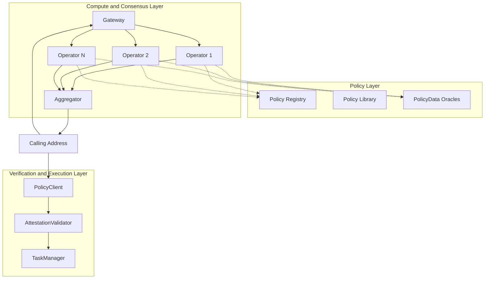
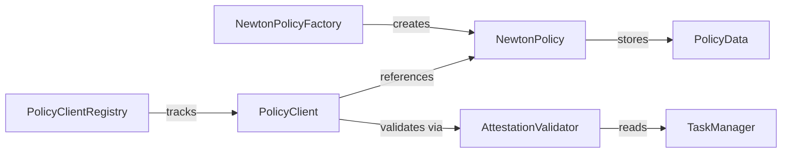

Newton Protocol is a three-layer system that separates policy definition, policy evaluation, and policy enforcement. This modular architecture allows each layer to evolve independently while maintaining strong security guarantees.

## System Overview

## Policy Layer

The Policy Layer defines what rules exist and how they are configured.

| Component | Purpose |
|-----------|---------|
| **Policy Registry** | On-chain registry of all deployed policies, referenced by CID |
| **Policy Library** | Reusable policy templates (spend limits, sanctions checks, KYC gates) |
| **PolicyData Oracles** | WASM components that fetch external data at evaluation time |

Developers publish policies to the registry by:
1. Writing a Rego policy and WASM oracle
2. Uploading to IPFS via `newton-cli`
3. Deploying PolicyData and Policy contracts on-chain

Users configure policies by deploying a PolicyClient contract with specific parameters (thresholds, allowlists, expiration).

## Compute & Consensus Layer

The Compute Layer handles offchain policy evaluation by the Newton AVS operator network.

| Component | Purpose |
|-----------|---------|
| **Gateway** | JSON-RPC endpoint that receives tasks and routes them to operators |
| **Operators** | EigenLayer nodes that independently evaluate policies |
| **Aggregator** | Collects individual BLS signatures into a single consensus proof |

When a task is submitted:
1. The Gateway receives the intent and identifies the target policy
2. Available operators fetch PolicyData (run WASM oracles)
3. Each operator evaluates the Rego policy independently
4. Each operator produces a BLS signature over the result
5. The Aggregator collects signatures and produces a consensus proof once quorum is reached

## Verification & Execution Layer

The Verification Layer handles onchain proof verification and transaction execution.

| Component | Purpose |
|-----------|---------|
| **NewtonProverTaskManager** | Core task management — creates tasks, stores responses, manages challenge windows |
| **AttestationValidator** | Validates BLS aggregate signatures against the operator set |
| **PolicyClient** | Developer's smart contract that calls validation before executing transactions |
| **PolicyClientRegistry** | Tracks registered PolicyClient contracts |

## Key Smart Contracts

| Contract | Purpose |
|----------|---------|
| `NewtonProverTaskManager` | Task creation, response storage, challenge management |
| `NewtonPolicyFactory` | Creates and registers new policies |
| `PolicyClientRegistry` | Tracks registered PolicyClient contracts |
| `IdentityRegistry` | Maps identities for policy evaluation |
| `AttestationValidator` | Validates BLS attestation proofs on-chain |

See [Contract Addresses](/developers/reference/contract-addresses) for deployed addresses on each network.

## Contract Relationships

## Data Flow

A complete evaluation cycle:

1. **Intent submitted** — caller sends intent + PolicyClient address to Gateway
2. **Task created** — Gateway creates a task pairing the intent with the policy
3. **Data fetched** — operators execute PolicyData WASM oracles
4. **Policy evaluated** — operators run Rego policy with intent + oracle data + params
5. **Signatures produced** — each operator signs the result with their BLS key
6. **Proof aggregated** — Aggregator combines signatures into consensus proof
7. **Proof returned** — caller receives the attestation
8. **On-chain verification** — PolicyClient validates the proof via AttestationValidator
9. **Transaction executes** — if valid, the guarded transaction proceeds

## Next Steps

<Card icon="lock" href="/developers/concepts/privacy-layer" title="Privacy Layer">
  How Newton protects sensitive data during evaluation
</Card>
<Card icon="shield" href="/developers/concepts/consensus-security" title="Consensus & Security">
  BLS aggregation, quorum thresholds, and the security model
</Card>
