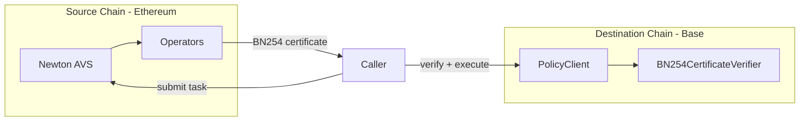

Newton Protocol supports policy evaluation across multiple chains. The AVS operators run on Ethereum (the source chain), while PolicyClient contracts can be deployed on destination chains like Base Sepolia.

## Source vs Destination Chains

| Chain Type | Role | Examples |
|------------|------|---------|
| **Source chain** | Where Newton AVS operators are registered and BLS keys are managed | Ethereum Sepolia |
| **Destination chain** | Where PolicyClient contracts are deployed and transactions execute | Base Sepolia, Ethereum Sepolia |

The source chain provides the security foundation (operator registrations, staking, slashing). Destination chains consume attestations via lightweight verifier contracts that use cached operator state.

## How It Works



1. **Task submitted** — a caller submits a task to the Gateway with the intent's `chain_id` set to the destination chain
2. **Operators evaluate** — operators evaluate the policy using the source chain infrastructure
3. **BN254 certificate produced** — the BLS aggregate signature is encoded as a BN254 certificate for the destination chain
4. **Attestation verified on destination** — the PolicyClient on the destination chain validates the certificate using the `BN254CertificateVerifier`

## Destination Chain Contracts

Destination chains require four contracts to verify attestations:

| Contract | Purpose |
|----------|---------|
| `ECDSAOperatorTableUpdater` | Receives operator state (BLS keys, stake weights, Merkle roots) from the source chain |
| `BN254CertificateVerifier` | Verifies BLS certificates against cached operator state |
| `DestinationTaskResponseHandler` | Decodes BN254 certificates and validates task responses |
| `NewtonProverDestTaskManager` | Task lifecycle management (creation, response storage) |

### Operator State Synchronization

The operator set from the source chain must be synced to each destination chain:

1. A **Table Syncer** service reads operator state from Ethereum (BLS keys, stake weights)
2. It computes a `BN254OperatorSetInfo` containing `operatorInfoTreeRoot`, `numOperators`, `aggregatePubkey`, and `totalWeights`
3. It calls `confirmGlobalTableRoot()` and `updateOperatorTable()` on the destination chain's `ECDSAOperatorTableUpdater`
4. The `BN254CertificateVerifier` uses this cached state for certificate verification

<Warning>
All operators must be synced in a single atomic update. Sequential calls to `updateOperatorTable()` overwrite `numOperators`, `aggregatePubkey`, and `operatorInfoTreeRoot` on each call, causing intermediate states where non-signer Merkle proofs fail validation (`InvalidOperatorIndex` errors). Always batch all operator updates into one transaction.
</Warning>

## BN254 Certificates

Cross-chain attestations use BN254 elliptic curve certificates. BN254 (alt_bn128) is the curve used by Ethereum's pairing precompiled contracts (EIP-196/EIP-197), enabling efficient on-chain verification on any EVM chain.

A `BN254Certificate` contains:

| Field | Description |
|-------|-------------|
| `referenceTimestamp` | Timestamp binding the certificate to a specific operator set snapshot |
| `messageHash` | Hash of the task response being attested |
| `signature` | BN254 G1 point — the aggregate BLS signature |
| `apk` | BN254 G2 point — the aggregate public key of signing operators |
| `nonSignerWitnesses` | Merkle proof-based witnesses for operators who did **not** sign |

The verifier validates certificates by:
1. Checking `referenceTimestamp` freshness against `maxStalenessPeriod`
2. Loading cached `BN254OperatorSetInfo` from the synced operator table
3. Verifying each non-signer's Merkle proof against `operatorInfoTreeRoot`
4. Subtracting non-signer stakes from totals to compute signer stake
5. Performing a BLS pairing check
6. Checking quorum thresholds are met

## Cross-Chain Challenge Flow

If an attestation on a destination chain is disputed, the challenge flows across both chains:

1. **Destination chain:** Challenger calls `raiseAndResolveChallenge()` — the attestation is invalidated, but no slashing occurs (destination chains have no `ServiceManager`)
2. **Source chain:** Challenger relays the same challenge to Ethereum — actual slashing occurs via the source chain's slashing mechanism

## Tasks on Destination Chains

When creating a task for a destination chain:

```typescript
const { result } = await walletClient.evaluateIntentDirect({
  policyClient: '0x...', // PolicyClient on destination chain
  intent: {
    from: '0x...',
    to: '0x...',
    value: '0x0',
    data: '0x...',
    chainId: 84532, // Base Sepolia (destination chain)
    functionSignature: '0x...',
  },
});
```

The SDK automatically routes the task to the correct Gateway and encodes the attestation for the destination chain's verifier.

## Single-Chain vs Multi-Chain Mode

| Aspect | Single-Chain (Source) | Multi-Chain (Destination) |
|--------|----------------------|--------------------------|
| **Task Manager** | `NewtonProverTaskManager` | `NewtonProverDestTaskManager` |
| **Signature Verification** | Direct BLS via precompile | BN254 certificate verification |
| **Operator State** | Live queries to registries | Cached `BN254OperatorSetInfo` |
| **Challenge Location** | Same chain as task | Destination (invalidation) + source (slashing) |
| **Gas Efficiency** | Higher (BLS precompiles) | Lower (cached verification) |

## Supported Networks

| Chain | Chain ID | Role | Status |
|-------|----------|------|--------|
| Ethereum Sepolia | `11155111` | Source + Destination | Active |
| Base Sepolia | `84532` | Destination | Active |
| Ethereum Mainnet | `1` | Source + Destination | Forthcoming |

The architecture supports deployment to any EVM-compatible chain as a destination chain.

## Next Steps

<Card icon="building" href="/developers/concepts/architecture" title="Architecture">
  Full system architecture overview
</Card>
<Card icon="code" href="/developers/reference/contract-addresses" title="Contract Addresses">
  Deployed contracts on all networks
</Card>
