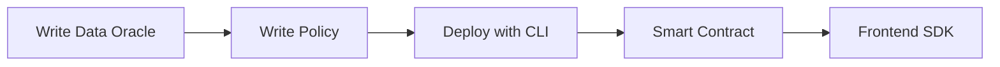

This guide walks through the full Newton Protocol integration flow. Each step links to a dedicated guide with complete code and instructions.

## Overview

A complete Newton integration involves five steps:



## Prerequisites

| Requirement | Use |
|---|---|
| **Rust + Cargo** | Building and running `newton-cli` |
| **Node.js >= 20 + npm** | Running `@bytecodealliance/jco` and the Next.js app |
| **Foundry** (`forge`, `cast`, `anvil`) | Compiling and deploying Solidity contracts |
| **newton-cli 0.2.0** | Uploading policy files, generating CIDs, deploying policies |
| **Pinata account** | IPFS pinning (you will need a JWT and a gateway URL) |
| **Sepolia ETH** | Gas fees on the Ethereum Sepolia testnet |
| **Newton API key** | Authenticate SDK requests — create one via the [Newton Dashboard API](https://dashboard.api.newt.foundation) (SIWE or email authentication), or email [product@magicnewton.com](mailto:product@magicnewton.com) |

### Install tooling

```bash
# Rust (includes cargo)
curl --proto '=https' --tlsv1.2 -sSf https://sh.rustup.rs | sh

# Node.js (macOS — or use your preferred method)
brew install node

# Foundry
curl -L https://foundry.paradigm.xyz | bash
foundryup

# newton-cli
cargo install newton-cli@0.2.0

# jco (WASM componentization)
npm install -g @bytecodealliance/jco @bytecodealliance/componentize-js
```

<Warning>
After installing Rust, Foundry, or Node via Homebrew, **restart your terminal** (or run `source ~/.zshrc`) so the new binaries are on your `PATH`.
</Warning>

## Step 1: Write a Data Oracle

Build a WebAssembly component that fetches external data (e.g., price feeds, sanctions screening, KYC status) for policy evaluation.

<Card icon="database" href="/developers/guides/writing-data-oracles" title="Writing Data Oracles">
  Define the WIT interface, implement in JavaScript, build WASM, test locally
</Card>

## Step 2: Write a Rego Policy

Create a Rego policy that evaluates transaction intents using data from your oracle and configuration parameters.

<Card icon="file-code" href="/developers/guides/writing-policies" title="Writing Policies">
  Write Rego rules, define parameter schemas, organize policy files
</Card>

## Step 3: Deploy with CLI

Upload your policy files to IPFS and register PolicyData and Policy contracts on-chain.

<Card icon="rocket" href="/developers/guides/deploying-with-cli" title="Deploying with CLI">
  Generate CIDs, deploy PolicyData, deploy Policy, register PolicyClient
</Card>

## Step 4: Smart Contract Integration

Deploy a PolicyClient smart contract that validates Newton attestations before executing transactions.

<Card icon="shield" href="/developers/guides/smart-contract-integration" title="Smart Contract Integration">
  Inherit NewtonPolicyClient, configure validation, deploy with Foundry
</Card>

## Step 5: Frontend SDK Integration

Build a Next.js application that submits evaluation requests via the SDK and executes attested transactions.

<Card icon="window" href="/developers/guides/frontend-sdk-integration" title="Frontend SDK Integration">
  Create Newton client, submit evaluations, execute with attestations
</Card>

## End-to-End Flow

Once everything is deployed:

1. Your frontend submits an Intent via the Newton SDK
2. The Newton Gateway forwards it to AVS operators
3. Operators run the WASM data oracle, evaluate the Rego policy, and produce BLS-signed attestations
4. The attestation is returned to your app
5. Your app submits the transaction + attestation to the PolicyClient on-chain
6. The contract validates the attestation and executes the transaction

## Troubleshooting

<AccordionGroup>
  <Accordion title="'command not found' after installing tools">
    Restart your shell after installing Rust, Node via Homebrew, or Foundry:
    ```bash
    source ~/.zshrc  # or source ~/.bashrc
    ```
  </Accordion>
  <Accordion title="jco componentize fails">
    Ensure both packages are installed:
    ```bash
    npm install -g @bytecodealliance/jco @bytecodealliance/componentize-js
    ```
    If installed locally, use `npx jco componentize ...`.
  </Accordion>
  <Accordion title="InvalidAttestation error (0xbd8ba84d)">
    Most common cause: wrong Task Manager address. The wallet **must** use `0xecb741F4875770f9A5F060cb30F6c9eb5966eD13` on Sepolia. BLS signatures are bound to this address.

    Other causes: intent parameter mismatch, policy ID mismatch, incorrect struct passthrough from `evaluateIntentDirect`.
  </Accordion>
  <Accordion title="ExecutionFailed error (0xacfdb444)">
    The attestation passed but the inner call reverted. Common causes:
    - Wallet contract has no ETH (fund it directly)
    - Target contract reverted
    - Malformed calldata
  </Accordion>
  <Accordion title="WebSocket connection fails">
    Use `wss://` protocol, not `https://`:
    ```bash
    NEXT_PUBLIC_SEPOLIA_ALCHEMY_WS_URL=wss://eth-sepolia.g.alchemy.com/v2/YOUR_KEY
    ```
  </Accordion>
  <Accordion title="Policy evaluation times out">
    - Test WASM locally with `newton-cli policy-data simulate`
    - Verify `wasmArgs` format matches your WASM expectations
    - Increase the `timeout` value in the evaluation request
    - Check external APIs your WASM calls are responding
  </Accordion>
</AccordionGroup>

## Factory Pattern

<Accordion title="Advanced: Factory pattern for deploying multiple PolicyClients">

If you need to deploy multiple PolicyClient instances (e.g., one per user), use a factory contract:

```solidity
// SPDX-License-Identifier: MIT
pragma solidity ^0.8.27;

import {NewtonPolicyWallet} from "./NewtonPolicyWallet.sol";

contract WalletFactory {
    address public immutable taskManager;
    address public immutable policy;

    event WalletCreated(address indexed owner, address wallet);

    constructor(address _taskManager, address _policy) {
        taskManager = _taskManager;
        policy = _policy;
    }

    function createWallet() external returns (address) {
        NewtonPolicyWallet wallet = new NewtonPolicyWallet();
        wallet.initialize(taskManager, policy, msg.sender);
        emit WalletCreated(msg.sender, address(wallet));
        return address(wallet);
    }
}
```

This deploys pre-configured wallet instances bound to your policy. Each user gets their own wallet with the same policy enforcement.
</Accordion>
