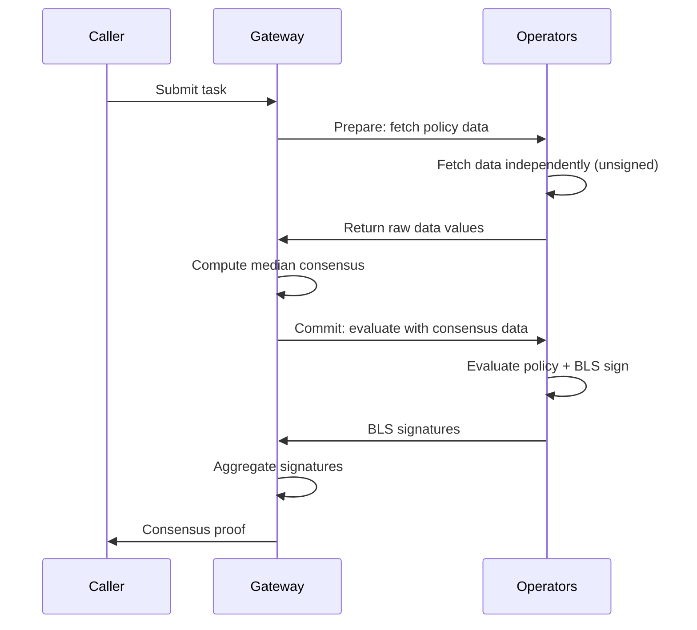

Newton Protocol uses BLS signature aggregation and EigenLayer restaked ETH to provide cryptographic and economic security for policy evaluations.

## Two-Phase Consensus (Prepare-Commit)

Newton uses two-phase consensus to handle data variance when operators independently fetch time-sensitive data (e.g., prices from external APIs). All operators end up signing the same message despite receiving slightly different values.



1. **Prepare phase:** Gateway sends `newt_fetchPolicyData` to operators. Each operator fetches external data independently and returns **unsigned** responses.
2. **Consensus computation:** Gateway computes median values across all operator responses and verifies tolerance (default 10%).
3. **Commit phase:** Gateway broadcasts the canonical consensus data via `newt_evaluateAndSign`. Operators evaluate the policy using identical data and BLS-sign the result.
4. **Aggregation:** Gateway collects BLS signatures until quorum is reached and produces the aggregate proof.

## Median Consensus

For data oracles that return numeric values (e.g., price feeds), Newton uses **median consensus** with a configurable tolerance:

1. Each operator fetches data independently during the Prepare phase
2. The Gateway collects all responses and computes the median for each numeric field
3. If any operator's value exceeds the tolerance threshold from the median, consensus **fails** with `ToleranceExceeded`
4. If all values are within tolerance, the Gateway normalizes responses to use median values

```
Operator 1: price = 100.0
Operator 2: price = 102.0
Operator 3: price = 101.0

Median: 101.0
Tolerance: 10%

All within |value - median| / median <= 10% → Consensus value: 101.0
```

<Note>
Values outside the tolerance cause a `ToleranceExceeded` error — operators are not silently excluded.
</Note>

## Configuration Parameters

| Parameter | Default | Description |
|-----------|---------|-------------|
| `two_phase_prepare_timeout_ms` | 30000 | Prepare phase timeout in milliseconds |
| `two_phase_commit_timeout_ms` | 15000 | Commit phase timeout in milliseconds |
| `two_phase_consensus_tolerance_pct` | 10.0 | Tolerance percentage for median consensus |
| `quorum_threshold_percentage` | 67 | Minimum percentage of operator stake required |
| `quorum_number` | `"00"` | Quorum numbers to use (hex bytes) |

## BLS Signature Aggregation

Newton uses the **alt_bn128** curve (EIP-196/EIP-197) for BLS signature aggregation. This is the curve supported by Ethereum's pairing precompiled contracts, enabling efficient on-chain verification.

### How It Works

1. Each operator holds a BLS private key registered with the AVS
2. Operators sign the task response hash with their individual key
3. The Gateway aggregates individual signatures into a single aggregate signature
4. The on-chain verifier validates the aggregate signature against the registered operator set

### Two-Digest System

BLS aggregation requires all operators to sign the **exact same message**. However, each operator generates a unique ECDSA attestation. Newton solves this with two digest types:

| Digest Type | Used For | Attestations |
|-------------|----------|-------------|
| **Consensus Digest** | BLS signing and verification | Excluded (zeroed out) |
| **Full Digest** | Contract storage and challenge verification | Included |

Operators BLS-sign the consensus digest (which is identical across all operators). The full digest (with unique attestations) is stored on-chain for challenge verification.

## Security Model

### Economic Security

Newton's security is backed by EigenLayer restaked ETH:

- Operators must stake ETH (via EigenLayer restaking) to participate
- Malicious behavior (incorrect evaluations) can be proven and results in **slashing** of staked ETH
- The economic cost of attacking the network exceeds the potential gain

### Challenge Window

After an attestation is submitted on-chain, there is a challenge window during which the result can be disputed:

- Anyone can submit a challenge proving an operator's evaluation was incorrect
- If the challenge succeeds, the offending operator is slashed
- The attestation is marked as `SuccessfullyChallenged`

### Slashing Conditions

Operators can be slashed for:

| Violation | Description |
|-----------|-------------|
| **Incorrect evaluation** | Signing a result that provably contradicts the policy |
| **Equivocation** | Signing conflicting results for the same task |

### Privacy Guarantees

- Only hashes and commitments go on-chain — no PII or sensitive data
- PolicyData oracle secrets are encrypted with HPKE
- Intent details are visible to operators during evaluation but not stored permanently

## Error Handling

### Consensus Failures

| Error | Cause | Resolution |
|-------|-------|------------|
| `ToleranceExceeded` | Operator values differ by more than tolerance | Increase `consensus_tolerance_pct` or investigate data source |
| `NoResponses` | No operators responded in Prepare phase | Check operator health, increase timeout |
| `InsufficientQuorum` | Not enough operators for quorum | Check operator registration and stake thresholds |

### BLS Aggregation Failures

| Error | Cause | Resolution |
|-------|-------|------------|
| `DigestMismatch` | Operators signed different messages | Verify consensus computation |
| `InvalidSignature` | Operator signature verification failed | Check operator BLS key registration |
| `QuorumNotReached` | Insufficient stake for quorum | Lower threshold or wait for more operators |

## Next Steps

<Card icon="globe" href="/developers/concepts/multichain" title="Multichain Support">
  How Newton works across multiple chains
</Card>
<Card icon="building" href="/developers/concepts/architecture" title="Architecture">
  Full system architecture overview
</Card>
