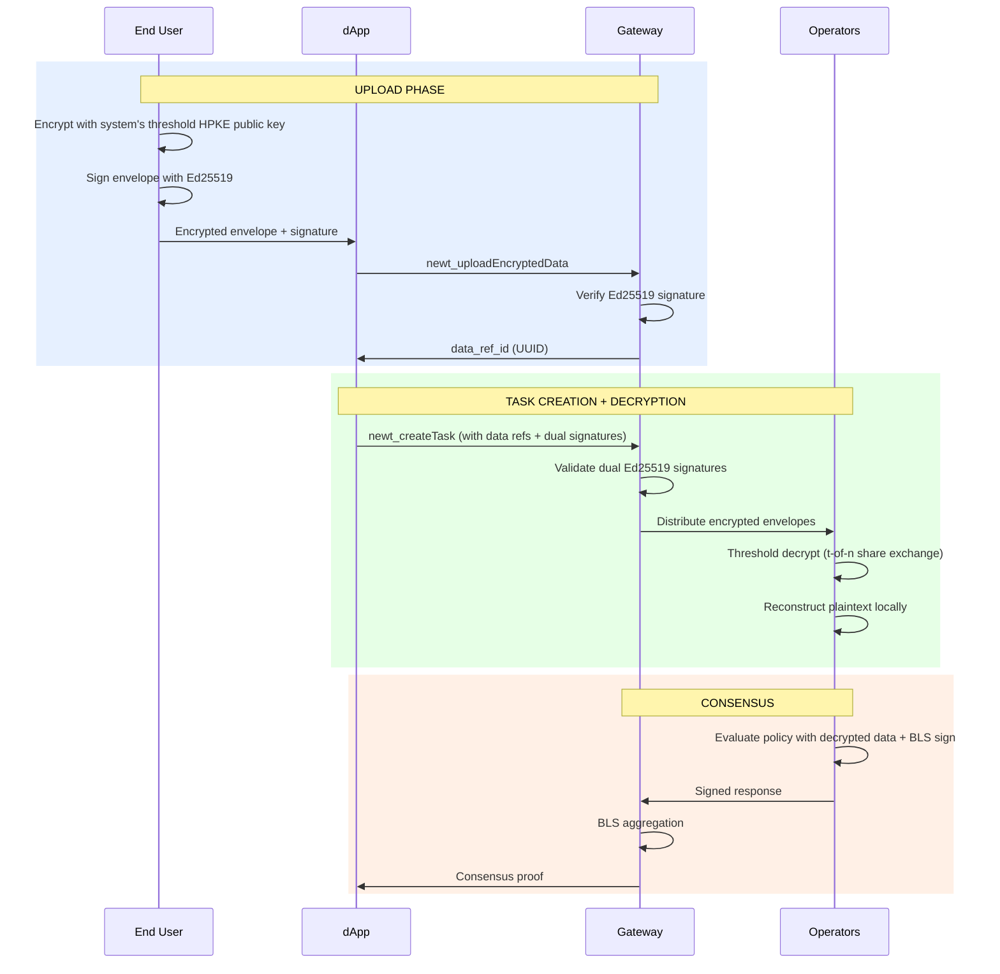

Newton's privacy layer enables end users to submit encrypted sensitive data (PII, credentials, financial records) that operators threshold-decrypt during policy evaluation. The data never appears on-chain.

## Overview

Many policies require access to sensitive data — identity documents, API keys, compliance records, or proprietary parameters. Newton's privacy layer provides:

- **End-to-end encryption** of sensitive inputs using HPKE (X25519/ChaCha20-Poly1305)
- **Threshold decryption** — operators collectively decrypt data using t-of-n key shares; no single party ever holds the full decryption key
- **Zero on-chain exposure** — only hashes and commitments go on-chain, never plaintext data
- **Dual-signature authorization** — both the end user and the dApp must sign off before operators will decrypt anything

## How It Works



The integration is three steps:

1. **Encrypt** sensitive data on the client side using the system's threshold public key (via `newt_getPrivacyPublicKey`)
2. **Upload** the encrypted envelope to the Gateway, receiving a reference ID
3. **Create a task** that includes the reference ID — operators threshold-decrypt the data during evaluation

## HPKE Encryption

Newton uses the HPKE standard (RFC 9180) with the following cipher suite:

| Component | Algorithm |
|-----------|-----------|
| KEM | DHKEM(X25519, HKDF-SHA256) |
| KDF | HKDF-SHA256 |
| AEAD | ChaCha20-Poly1305 |
| Signing | Ed25519 |

HPKE Base mode encrypts data to the system's threshold X25519 public key. This key is produced via interactive DKG (distributed key generation) across the operator set — no single operator holds the full private key. Sender authentication is handled separately via Ed25519 signatures on the serialized envelope.

## SecureEnvelope Structure

Encrypted data is wrapped in a `SecureEnvelope`:

```json
{
  "enc": "<hex-encoded HPKE encapsulated key>",
  "ciphertext": "<hex-encoded HPKE ciphertext + Poly1305 tag>",
  "policy_client": "0x<policy client address>",
  "chain_id": 11155111,
  "recipient_pubkey": "<hex-encoded system Ed25519 public key>"
}
```

| Field | Description |
|-------|-------------|
| `enc` | 32-byte X25519 ephemeral public key for HPKE decapsulation (hex) |
| `ciphertext` | HPKE ciphertext including the ChaCha20-Poly1305 authentication tag (hex) |
| `policy_client` | 0x-prefixed EVM address of the target PolicyClient |
| `chain_id` | Chain ID for context binding |
| `recipient_pubkey` | System's Ed25519 public key (hex) |

**AAD construction:** The additional authenticated data is `keccak256(abi.encodePacked(policy_client_bytes, chain_id_be_bytes))`. This binds the ciphertext to a specific PolicyClient and chain — tampering with either field causes decryption to fail.

## Threshold Decryption

Newton distributes the HPKE private key across operators using interactive DKG (FROST DKG / Pedersen VSS). During task evaluation:

1. Each operator computes a **partial decryption share** from its DKG key share
2. Operators exchange shares via encrypted NATS messages
3. Each operator **reconstructs the plaintext locally** from t-of-n shares
4. The reconstructed plaintext is used for policy evaluation and BLS signing

The threshold keypair is cryptographically independent from operators' ECDSA and BLS keys — a compromised signing key does not yield a decryption share. The combined public key is stored on-chain and readable via a single contract call (`getThresholdPublicKey()`), or via the `newt_getPrivacyPublicKey` RPC method.

DKG ceremonies run only during operator set changes, not per-task.

## Dual-Signature Authorization

Privacy-enabled tasks require two Ed25519 signatures to authorize decryption:

1. **User signature** — the end user signs `keccak256(abi.encodePacked(policy_client, intent_hash, ref_id_1, ref_id_2, ...))` with their Ed25519 key
2. **App signature** — the dApp signs `keccak256(abi.encodePacked(policy_client, intent_hash, user_signature))` with its Ed25519 key

Both signatures must be valid before operators will decrypt any data. A stolen reference ID alone is not sufficient.

## RPC Methods

<Note>These RPC methods are under active development and not yet available in production. The API surface may change.</Note>

### `newt_getPrivacyPublicKey`

Retrieves the system's threshold HPKE public key for encrypting data.

```json
{
  "jsonrpc": "2.0",
  "method": "newt_getPrivacyPublicKey",
  "params": {},
  "id": 1
}
```

Returns:

```json
{
  "jsonrpc": "2.0",
  "result": {
    "public_key": "<hex-encoded X25519 public key (32 bytes)>",
    "key_type": "x25519",
    "encryption_suite": "HPKE-Base-X25519-HKDF-SHA256-ChaCha20Poly1305"
  },
  "id": 1
}
```

### `newt_uploadEncryptedData`

Uploads an encrypted data reference for later use in privacy-enabled tasks.

```json
{
  "jsonrpc": "2.0",
  "method": "newt_uploadEncryptedData",
  "params": {
    "sender_address": "0xf39Fd6e51aad88F6F4ce6aB8827279cffFb92266",
    "policy_client": "0x0000000000000000000000000000000000000001",
    "envelope": "{\"enc\":\"...\",\"ciphertext\":\"...\",\"policy_client\":\"0x...\",\"chain_id\":11155111,\"recipient_pubkey\":\"...\"}",
    "signature": "0x<64-byte Ed25519 signature hex>",
    "recipient_pubkey": "0x<32-byte Ed25519 public key hex>",
    "ttl": 3600
  },
  "id": 1
}
```

| Field | Type | Required | Description |
|-------|------|----------|-------------|
| `sender_address` | Address | Yes | End user's EVM address (intent sender) |
| `policy_client` | Address | Yes | PolicyClient address this data is scoped to |
| `envelope` | String | Yes | Serialized `SecureEnvelope` JSON string |
| `signature` | String | Yes | Ed25519 signature over the envelope bytes (hex, 0x-prefixed) |
| `recipient_pubkey` | String | Yes | System's Ed25519 public key (hex, 0x-prefixed) |
| `ttl` | Number | No | Time-to-live in seconds (data expires after this duration) |

Returns:

```json
{
  "jsonrpc": "2.0",
  "result": {
    "success": true,
    "data_ref_id": "550e8400-e29b-41d4-a716-446655440000",
    "error": null
  },
  "id": 1
}
```

## Using Privacy in Tasks

When creating a task that requires encrypted data, include the data references and authorization signatures in the `newt_createTask` request:

- `encrypted_data_refs` — array of UUID reference IDs from `newt_uploadEncryptedData`
- `user_signature` — end user's Ed25519 authorization signature
- `app_signature` — dApp's Ed25519 authorization signature

The Gateway validates both signatures and distributes the encrypted envelopes to operators, who threshold-decrypt the data and merge plaintext into `policyTaskData` for evaluation.

For stored secrets (API keys for PolicyData oracles), see [Encrypting Secrets](/developers/advanced/kms-encryption).

## Use Cases

| Use Case | What's Encrypted |
|----------|-----------------:|
| **KYC-gated DeFi** | Government ID, proof of address |
| **Compliance checking** | Financial records, tax documents |
| **Private credential verification** | API keys, OAuth tokens, signed attestations |
| **Institutional policy enforcement** | Internal risk scores, portfolio data |
| **Privacy-preserving allowlists** | Membership proofs, signed approvals |

## Security Properties

| Threat | Mitigation |
|--------|------------|
| Unauthorized decryption | Dual-signature authorization required before operators decrypt |
| Single point of trust | Threshold decryption — no single operator holds the full private key |
| Ciphertext tampering | AEAD (ChaCha20-Poly1305) detects any modification |
| Context rebinding | AAD binds ciphertext to specific `policy_client` + `chain_id` |
| Replay of encrypted data | UUID-based references; TTL expiration; authorization signatures include `intent_hash` |
| Key compromise | DKG key shares are cryptographically independent from ECDSA/BLS keys |
| Data persistence | TTL-based expiration with automatic cleanup |

## Next Steps

<Card icon="shield" href="/developers/concepts/consensus-security" title="Consensus & Security">
  BLS aggregation and the economic security model
</Card>
<Card icon="key" href="/developers/advanced/kms-encryption" title="Encrypting Secrets">
  Store encrypted secrets for PolicyData oracles
</Card>
