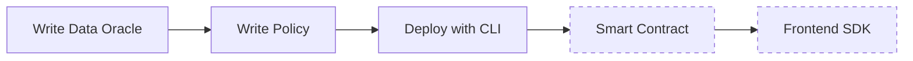

This guide walks through the full Newton Protocol integration: a [WASM data oracle](/developers/guides/writing-data-oracles), a [Rego policy](/developers/guides/writing-policies), a [PolicyClient smart contract](/developers/guides/smart-contract-integration), and a [frontend](/developers/guides/frontend-sdk-integration) that submits intents and executes attested transactions. Choose your starting point based on what you need:

<Tabs>
  <Tab title="Use an existing policy">
    If a policy is already deployed (e.g., you completed the [quickstart](/developers/overview/quickstart) or someone shared a policy address with you), skip directly to [Step 4: Smart Contract Integration](#step-4-smart-contract-integration) or [Step 5: Frontend SDK Integration](#step-5-frontend-sdk-integration). You only need **Node.js** and optionally **Foundry**.
  </Tab>
  <Tab title="Build everything from scratch">
    Follow all five steps below to create a data oracle, write a Rego policy, deploy it, and integrate with a smart contract and frontend.
  </Tab>
</Tabs>

## Overview

A complete Newton integration involves five steps:



<Note>
  Steps 4 and 5 (dashed) can be done independently if you already have a deployed policy. You do not need the full toolchain to integrate via the SDK.
</Note>

## Prerequisites

Install only what you need for the steps you plan to follow:

| Requirement                            | Steps | Use                                                                                    |
| -------------------------------------- | ----- | -------------------------------------------------------------------------------------- |
| **Node.js \>= 20 + npm**               | All   | SDK, frontend, WASM tooling                                                            |
| **Sepolia ETH**                        | 3–5   | Gas fees on testnet                                                                    |
| **Newton API key**                     | 4–5   | Authenticate SDK requests — [create one here](/developers/overview/dashboard-api-keys) |
| **Foundry** (`forge`, `cast`, `anvil`) | 4     | Compiling and deploying Solidity contracts                                             |
| **Rust + Cargo**                       | 1–3   | Building and running `newton-cli`                                                      |
| **newton-cli 0.2.0**                   | 3     | Uploading policy files, generating CIDs, deploying policies                            |
| **Pinata account**                     | 3     | IPFS pinning (you will need a JWT and a gateway URL)                                   |

<Accordion title="Install all tooling (Steps 1–5)">
  ```bash
  # Rust (includes cargo)
  curl --proto '=https' --tlsv1.2 -sSf https://sh.rustup.rs | sh
  
  # Node.js (macOS — or use your preferred method)
  brew install node
  
  # Foundry
  curl -L https://foundry.paradigm.xyz | bash
  foundryup
  
  # newton-cli
  cargo install newton-cli@0.2.0
  
  # jco (WASM componentization)
  npm install -g @bytecodealliance/jco @bytecodealliance/componentize-js
  ```

  <Warning>
    After installing Rust, Foundry, or Node via Homebrew, **restart your terminal** (or run `source ~/.zshrc`) so the new binaries are on your `PATH`.
  </Warning>
</Accordion>

## Step 1: Write a Data Oracle (~30 min)

Build a WebAssembly component that fetches external data (e.g., price feeds, sanctions screening, KYC status) for [policy evaluation](/developers/overview/core-concepts#policydata).

<Card icon="database" href="/developers/guides/writing-data-oracles" title="Writing Data Oracles">
  Define the WIT interface, implement in JavaScript, build WASM, test locally
</Card>

## Step 2: Write a Rego Policy (~20 min)

Create a [Rego policy](/developers/overview/core-concepts#policy) that evaluates transaction intents using data from your oracle and configuration parameters.

<Card icon="file-code" href="/developers/guides/writing-policies" title="Writing Policies">
  Write Rego rules, define parameter schemas, organize policy files
</Card>

## Step 3: Deploy with CLI (~15 min)

Upload your policy files to IPFS and register [PolicyData](/developers/overview/core-concepts#policydata) and [Policy](/developers/overview/core-concepts#policy) contracts on-chain.

<Card icon="rocket" href="/developers/guides/deploying-with-cli" title="Deploying with CLI">
  Generate CIDs, deploy PolicyData, deploy Policy, register PolicyClient
</Card>

## Step 4: Smart Contract Integration (~30 min)

Deploy a [PolicyClient](/developers/overview/core-concepts#policyclient) smart contract that validates Newton [attestations](/developers/overview/core-concepts#attestation) before executing transactions.

<Card icon="shield" href="/developers/guides/smart-contract-integration" title="Smart Contract Integration">
  Inherit NewtonPolicyClient, configure validation, deploy with Foundry
</Card>

## Step 5: Frontend SDK Integration (~30 min)

Build a Next.js application that submits evaluation requests via the [SDK](/developers/reference/sdk-reference) and executes attested transactions.

<Card icon="window" href="/developers/guides/frontend-sdk-integration" title="Frontend SDK Integration">
  Create Newton client, submit evaluations, execute with attestations
</Card>

## End-to-End Flow

Once everything is deployed:

1. Your frontend submits an [Intent](/developers/overview/core-concepts#intent) via the Newton [SDK](/developers/reference/sdk-reference)
2. The Newton [Gateway](/developers/overview/core-concepts#gateway) forwards it to AVS [operators](/developers/overview/core-concepts#operator)
3. Operators run the WASM [data oracle](/developers/overview/core-concepts#policydata), evaluate the [Rego policy](/developers/overview/core-concepts#policy), and produce BLS-signed attestations
4. The [attestation](/developers/overview/core-concepts#attestation) is returned to your app
5. Your app submits the transaction + attestation to the [PolicyClient](/developers/overview/core-concepts#policyclient) on-chain
6. The contract validates the attestation and executes the transaction

For the full architecture, see [Architecture](/developers/concepts/architecture).

## Troubleshooting

<AccordionGroup>
  <Accordion title="'command not found' after installing tools">
    Restart your shell after installing Rust, Node via Homebrew, or Foundry:

    ```bash
    source ~/.zshrc  # or source ~/.bashrc
    ```
  </Accordion>
  <Accordion title="jco componentize fails">
    Ensure both packages are installed:

    ```bash
    npm install -g @bytecodealliance/jco @bytecodealliance/componentize-js
    ```

    If installed locally, use `npx jco componentize ...`.
  </Accordion>
  <Accordion title="InvalidAttestation error (0xbd8ba84d)">
    Most common cause: wrong Task Manager address. The wallet **must** use `0xecb741F4875770f9A5F060cb30F6c9eb5966eD13` on Sepolia. BLS signatures are bound to this address.

    Other causes: intent parameter mismatch, policy ID mismatch, incorrect struct passthrough from `evaluateIntentDirect`.
  </Accordion>
  <Accordion title="ExecutionFailed error (0xacfdb444)">
    The attestation passed but the inner call reverted. Common causes:

    - Wallet contract has no ETH (fund it directly)
    - Target contract reverted
    - Malformed calldata
  </Accordion>
  <Accordion title="WebSocket connection fails">
    Use `wss://` protocol, not `https://`:

    ```bash
    NEXT_PUBLIC_SEPOLIA_ALCHEMY_WS_URL=wss://eth-sepolia.g.alchemy.com/v2/YOUR_KEY
    ```
  </Accordion>
  <Accordion title="Policy evaluation times out">
    - Test WASM locally with `newton-cli policy-data simulate`
    - Verify `wasmArgs` format matches your WASM expectations
    - Increase the `timeout` value in the evaluation request
    - Check external APIs your WASM calls are responding
  </Accordion>
</AccordionGroup>

## Factory Pattern

<Accordion title="Advanced: Factory pattern for deploying multiple PolicyClients">
  If you need to deploy multiple PolicyClient instances (e.g., one per user), use a factory contract:

  ```solidity
  // SPDX-License-Identifier: MIT
  pragma solidity ^0.8.27;
  
  import {NewtonPolicyWallet} from "./NewtonPolicyWallet.sol";
  
  contract WalletFactory {
      address public immutable taskManager;
      address public immutable policy;
  
      event WalletCreated(address indexed owner, address wallet);
  
      constructor(address _taskManager, address _policy) {
          taskManager = _taskManager;
          policy = _policy;
      }
  
      function createWallet() external returns (address) {
          NewtonPolicyWallet wallet = new NewtonPolicyWallet();
          wallet.initialize(taskManager, policy, msg.sender);
          emit WalletCreated(msg.sender, address(wallet));
          return address(wallet);
      }
  }
  ```

  This deploys pre-configured wallet instances bound to your policy. Each user gets their own wallet with the same policy enforcement.
</Accordion>

<Card icon="comment-question" title="Have questions?">
  Get in touch with someone from the Newton team to discuss your integration 
</Card>