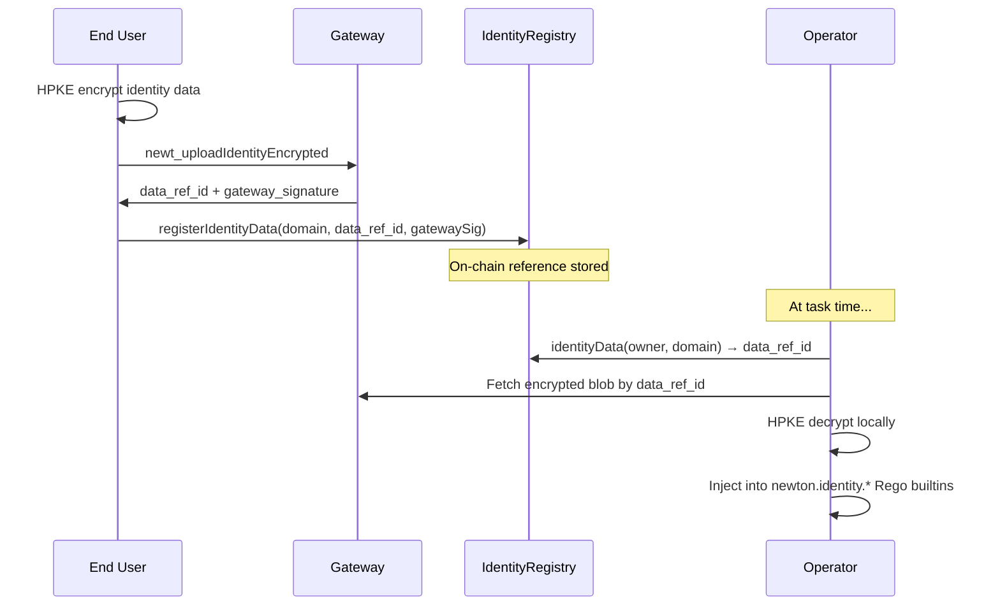
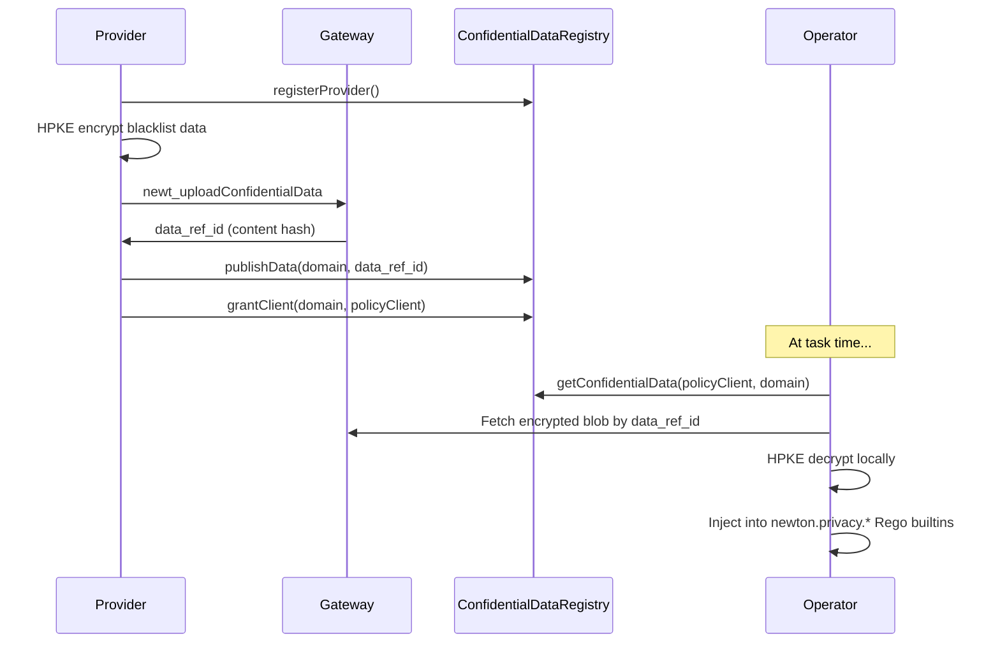

Newton supports three distinct privacy data flows, each designed for a different use case. All three use HPKE encryption (X25519 + ChaCha20-Poly1305) and share the same `encrypted_data_refs` storage table, but they differ in who uploads data, how it's referenced, and which Rego namespace it appears in.

## At a Glance

| Flow | Who Uploads | Lifecycle | On-Chain Contract | Rego Namespace | SDK Method |
|------|------------|-----------|-------------------|----------------|------------|
| **Identity** | End user | Persistent, registered on-chain | `IdentityRegistry` | `newton.identity.*` | `registerIdentityData` |
| **Confidential** | Provider | Persistent, versioned, granted per client | `ConfidentialDataRegistry` | `newton.privacy.*` | `uploadConfidentialData` |
| **Ephemeral** | Client (per-task) | Single task only | None | `data.privacy.*` | Inline in `wasm_args` |

---

## 1. Identity Data (User-Uploaded)

For long-lived user data like KYC credentials, identity documents, or verifiable credentials. The user encrypts and uploads once, registers a reference on-chain, and operators decrypt it at task time for any policy that requires identity verification.

### Flow



### Integration Steps

1. **Encrypt and upload** identity data to the gateway. The gateway stores the encrypted blob and returns a `data_ref_id` (content hash) plus an EIP-712 co-signature.

2. **Register on-chain** by calling `IdentityRegistry.registerIdentityData(domain, data_ref_id, gatewaySig, deadline)`. The gateway signature prevents impersonation.

3. **Link to a policy client** by calling `linkIdentityAsSignerAndUser(policyClient, clientUser, domain)` so the policy can look up the user's identity data at task time.

4. **Write a Rego policy** that uses `newton.identity.*` builtins:

```rego
package kyc_gate

default allow := false

allow if {
    newton.identity.kyc.check_approved()
    newton.identity.kyc.age_gte(18)
    newton.identity.kyc.address_in_countries(["US", "CA", "GB"])
}
```

### SDK Usage

```typescript
import { registerIdentityData, identityDomainHash, linkIdentityAsSignerAndUser } from '@magicnewton/newton-protocol-sdk'

// Step 1: Upload is handled by the newton-identity popup (not the SDK)
// Step 2: Register on-chain
await client.registerIdentityData({
  identityDomain: identityDomainHash('kyc'),
  dataRefId: 'content-hash-from-upload',
  gatewaySignature: '0x...',
  deadline: BigInt(Math.floor(Date.now() / 1000) + 3600),
})

// Step 3: Link to policy client
await client.linkIdentityAsSignerAndUser({
  policyClient: '0xYourPolicyClient',
  clientUser: '0xEndUserAddress',
  identityDomain: identityDomainHash('kyc'),
})
```

See [Verified Credentials](/developers/verified-credential/overview) for the full identity integration guide.

---

## 2. Confidential Data (Provider-Managed)

For provider-managed datasets like blacklists, allowlists, or sanctions lists. A provider encrypts and uploads the data, publishes a versioned reference on-chain, and grants access to specific policy clients. When a provider updates the data, they publish a new version — all granted clients automatically see the latest version.

### Flow



### Integration Steps

1. **Register as a provider** by calling `ConfidentialDataRegistry.registerProvider()` (self-registration, no gatekeeping).

2. **Encrypt and upload** via the SDK:

```typescript
import { uploadConfidentialData } from '@magicnewton/newton-protocol-sdk'

const result = await uploadConfidentialData(
  11155111, // chainId
  'your-api-key',
  {
    provider: '0xYourProviderAddress',
    domain: '0x6f389bcc...', // keccak256("newton.privacy.blacklist")
    plaintext: {
      addresses: ['0xBadActor1...', '0xBadActor2...'],
    },
    chainId: 11155111,
  },
)
// result.data_ref_id → use this for publishData
```

3. **Publish on-chain** by calling `ConfidentialDataRegistry.publishData(domain, dataRefId)`. Each call increments the version.

4. **Grant access** per policy client: `ConfidentialDataRegistry.grantClient(domain, policyClientAddress)`.

5. **Write a Rego policy** using `newton.privacy.*` builtins. The policy's `policyParams` must include a `confidential_domain` field matching the domain hash:

```rego
package sanctions_check

default allow := false

# Deny if sender is on the provider's blacklist
allow if {
    not newton.privacy.blacklist.contains(input.from)
}
```

### Access Control

Providers manage per-client access:

| Method | Description |
|--------|-------------|
| `grantClient(domain, policyClient)` | Grant a policy client access to a domain |
| `revokeClient(domain, policyClient)` | Revoke a specific client's access |
| `revokeGlobal(domain)` | Revoke all clients from a domain |
| `getProviders(policyClient, domain)` | List all providers that granted access |
| `hasGrant(provider, domain, policyClient)` | Check if a specific grant exists |

### Versioning

Each `publishData` call creates a new version. Operators always resolve the latest version via `getConfidentialData`. There is no explicit version pinning — all granted clients see the most recent data.

---

## 3. Ephemeral Privacy Data (Per-Task Inline)

For data that should only exist for a single task evaluation — no upload step, no on-chain registration. The client embeds encrypted data directly in the task request's `wasm_args`.

### How It Works

The client places HPKE-encrypted data in a reserved `_newton` namespace inside `wasm_args`:

```json
{
  "base_symbol": "ETH",
  "_newton": {
    "privacy": [
      {
        "enc": "...",
        "ciphertext": "...",
        "policy_client": "0x...",
        "chain_id": 11155111,
        "recipient_pubkey": "..."
      }
    ]
  }
}
```

The gateway extracts the `_newton` object from `wasm_args` before passing the remaining fields to operators. Operators decrypt the embedded envelopes locally and inject the plaintext into `data.privacy.*` in the Rego context.

### When to Use

- One-time privacy data that doesn't need to be stored or reused
- Testing and development before committing to the persistent upload flow
- Data that changes every transaction (e.g., real-time portfolio snapshots)

### Differences from Persistent Flows

| Aspect | Ephemeral | Persistent (Identity/Confidential) |
|--------|-----------|-----------------------------------|
| Storage | None (inline in request) | Gateway database |
| On-chain | None | `IdentityRegistry` or `ConfidentialDataRegistry` |
| Reusability | Single task only | Referenced by any future task |
| Authorization | Part of task request | Dual-signature (identity) or provider grant (confidential) |
| Rego namespace | `data.privacy.*` | `newton.identity.*` or `newton.privacy.*` |

---

## Encryption Primer

All three flows use the same HPKE encryption scheme:

| Component | Algorithm |
|-----------|-----------|
| KEM | X25519-HKDF-SHA256 |
| KDF | HKDF-SHA256 |
| AEAD | ChaCha20-Poly1305 |

The gateway's HPKE public key is available via `newt_getPrivacyPublicKey` or through the SDK:

```typescript
import { getPrivacyPublicKey } from '@magicnewton/newton-protocol-sdk'

const { public_key } = await getPrivacyPublicKey(11155111, 'your-api-key')
```

Encryption is always client-side. The `SecureEnvelope` binds ciphertext to a specific `policy_client` and `chain_id` via AAD (additional authenticated data), preventing replay across different policy contexts.

---

## Rego Namespace Summary

| Namespace | Access Pattern | Data Source |
|-----------|---------------|-------------|
| `newton.identity.kyc.*` | Domain-specific builtins | `IdentityRegistry` (user identity) |
| `newton.identity.get(field)` | Generic field accessor | Any identity domain |
| `newton.privacy.blacklist.*` | Domain-specific builtins | `ConfidentialDataRegistry` (provider blacklists) |
| `newton.privacy.allowlist.*` | Domain-specific builtins | `ConfidentialDataRegistry` (provider allowlists) |
| `newton.privacy.get(field)` | Generic field accessor | Any confidential domain |
| `newton.time.*` | Date arithmetic | Reference dates in policy data |

See the [Rego Syntax Guide](/developers/advanced/rego-syntax-guide) for the full builtin reference.

## Next Steps

<Card icon="shield" href="/developers/concepts/privacy-layer" title="Privacy Layer Architecture">
  HPKE encryption, threshold decryption, and the security model
</Card>
<Card icon="user" href="/developers/verified-credential/overview" title="Verified Credentials">
  Full identity data integration with the newton-identity popup
</Card>
<Card icon="code" href="/developers/advanced/rego-syntax-guide" title="Rego Syntax Guide">
  All Newton Rego extensions including privacy and time builtins
</Card>
