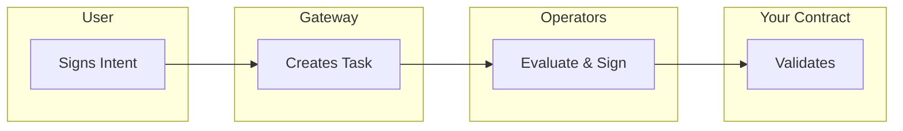
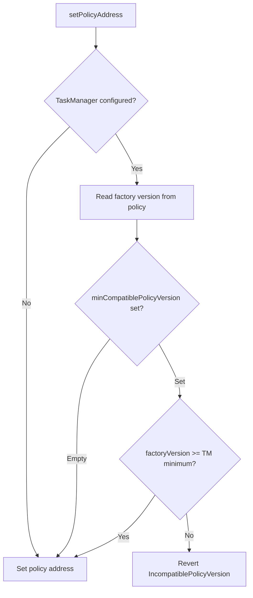

This guide shows how to integrate Newton attestation validation into your smart contracts. You will inherit from `NewtonPolicyClient`, configure validation, and manage your policy lifecycle.

## Overview

Newton provides the `NewtonPolicyClient` Solidity mixin that handles:
- Attestation validation (standard and direct methods)
- Policy configuration and parameter management
- On-chain ownership and version compatibility

### When to Use

| Use Case | Example |
|----------|---------|
| Transaction authorization | Wallet contracts requiring policy approval |
| Spend limits | Daily/weekly transfer limits on treasury contracts |
| Allowlist/blocklist enforcement | Restricting interactions to approved addresses |
| Time-based access control | Operations only allowed during certain hours |
| Complex business logic | Multi-condition approval workflows |
| Off-chain data verification | Price feeds, identity verification, compliance checks |

## Core Concepts

Before writing code, understand the key data structures your contract will work with.

### Intent

An [Intent](/developers/reference/glossary#intent) describes the transaction a user wants to execute:

```solidity
struct Intent {
    address from;              // Transaction initiator (tx.origin equivalent)
    address to;                // Target contract
    uint256 value;             // ETH value
    bytes data;                // ABI-encoded calldata
    uint256 chainId;           // Chain ID for cross-chain safety
    bytes functionSignature;   // Human-readable function signature
}
```

### Attestation

An [Attestation](/developers/reference/glossary#attestation) is cryptographic proof that Newton operators evaluated a policy and approved the Intent:

```solidity
struct Attestation {
    bytes32 taskId;            // Unique task identifier
    bytes32 policyId;          // Policy that was evaluated
    address policyClient;      // Your contract address
    uint32 expiration;         // Block number when attestation expires
    Intent intent;             // The approved intent
    bytes intentSignature;     // User's signature on the intent
}
```

### Task Lifecycle



1. **User signs Intent** — creates and signs an Intent describing the desired transaction
2. **Task created** — the Gateway creates a task on the TaskManager contract
3. **Operators evaluate** — operators fetch the policy, evaluate it, and BLS-sign the result
4. **Aggregator collects** — signatures are aggregated until quorum is reached
5. **Contract validates** — your contract validates the attestation and executes the transaction

## Quick Start

<Tabs>
  <Tab title="New Contract">

### Create the Foundry project

```bash
mkdir newton-policy-wallet && cd newton-policy-wallet
forge init --no-git
git init
forge install newt-foundation/newton-contracts
```

### Write the contract

Create `src/NewtonPolicyWallet.sol`:

```solidity
// SPDX-License-Identifier: MIT
pragma solidity ^0.8.27;

import {NewtonPolicyClient} from "newton-contracts/src/mixins/NewtonPolicyClient.sol";
import {INewtonProverTaskManager} from "newton-contracts/src/interfaces/INewtonProverTaskManager.sol";

contract NewtonPolicyWallet is NewtonPolicyClient {
    event Executed(address indexed to, uint256 value, bytes data, bytes32 taskId);
    error InvalidAttestation();
    error ExecutionFailed();

    constructor() {}

    function supportsInterface(bytes4 interfaceId) public view override returns (bool) {
        return interfaceId == 0xdbdcaa9c || super.supportsInterface(interfaceId);
    }

    function initialize(
        address policyTaskManager,
        address policy,
        address owner
    ) external {
        _initNewtonPolicyClient(policyTaskManager, policy, owner);
    }

    function validateAndExecuteDirect(
        address to,
        uint256 value,
        bytes calldata data,
        INewtonProverTaskManager.Task calldata task,
        INewtonProverTaskManager.TaskResponse calldata taskResponse,
        bytes calldata signatureData
    ) external returns (bytes memory) {
        require(
            _validateAttestationDirect(task, taskResponse, signatureData),
            InvalidAttestation()
        );

        (bool success, bytes memory result) = to.call{value: value}(data);
        if (!success) revert ExecutionFailed();

        emit Executed(to, value, data, task.taskId);
        return result;
    }

    receive() external payable {}
}
```

### Configure foundry.toml

<Warning>
You **must** set `via_ir = true`. The newton-contracts library requires IR-based compilation. Without it, compilation fails.
</Warning>

```toml
[profile.default]
src = "src"
out = "out"
libs = ["lib"]
solc = "0.8.27"
via_ir = true
optimizer = true
optimizer_runs = 200

remappings = [
    "newton-contracts/=lib/newton-contracts/",
    "forge-std/=lib/forge-std/src/"
]

fs_permissions = [{ access = "read", path = "./policy_params.json" }]

[rpc_endpoints]
sepolia = "${RPC_URL}"
```

  </Tab>
  <Tab title="Existing Contract">

Add Newton attestation validation to an existing contract by inheriting `NewtonPolicyClient`. Initialization is deferred to a post-deployment admin function.

```solidity
// SPDX-License-Identifier: MIT
pragma solidity ^0.8.27;

import {NewtonPolicyClient} from "newton-contracts/src/mixins/NewtonPolicyClient.sol";
import {NewtonMessage} from "newton-contracts/src/core/NewtonMessage.sol";
import {INewtonProverTaskManager} from "newton-contracts/src/interfaces/INewtonProverTaskManager.sol";
import {OwnableUpgradeable} from "@openzeppelin-upgrades/contracts/access/OwnableUpgradeable.sol";

contract MyExistingVaultV2 is OwnableUpgradeable, NewtonPolicyClient {
    error InvalidAttestation();
    error PolicyClientAlreadyInitialized();

    bool private _newtonPolicyClientInitialized;

    // ... existing contract storage and functions remain unchanged ...

    /// @notice Initialize Newton policy client support (one-time, post-upgrade)
    function initializeNewtonPolicyClient(
        address policyTaskManager,
        address policyClientOwner
    ) external onlyOwner {
        require(!_newtonPolicyClientInitialized, PolicyClientAlreadyInitialized());
        _initNewtonPolicyClient(policyTaskManager, policyClientOwner);
        _newtonPolicyClientInitialized = true;
    }

    // setPolicyAddress(address policy) is inherited from NewtonPolicyClient.
    // The policyClientOwner can call it once a policy contract is deployed.

    /// @notice Add policy-protected functionality
    function protectedWithdraw(
        NewtonMessage.Attestation calldata attestation
    ) external {
        require(_validateAttestation(attestation), InvalidAttestation());
        // Execute withdrawal logic...
    }

    function supportsInterface(bytes4 interfaceId) public view override returns (bool) {
        return super.supportsInterface(interfaceId);
    }
}
```

<Warning>
When adding `NewtonPolicyClient` to an existing upgradeable contract:
- Add new storage variables at the end to avoid layout conflicts
- The `_newtonPolicyClientInitialized` flag prevents re-initialization
- Test thoroughly on a fork before mainnet deployment
- Consider using a timelock or multisig for the initialization call
</Warning>

Install the dependency:

```bash
forge install newt-foundation/newton-contracts
```

  </Tab>
</Tabs>

## Validation Methods

Newton provides two validation methods for different use cases.

### Standard Validation

```solidity
function _validateAttestation(
    NewtonMessage.Attestation memory attestation
) internal returns (bool);
```

The standard method validates against an attestation that the Newton aggregator has already submitted on-chain via `respondToTask`. It verifies:
1. Policy ID matches your contract's configured policy
2. Intent sender (`from`) matches `msg.sender`
3. Chain ID matches the current chain
4. Attestation hash matches stored hash, is not expired, and has not been spent

### Direct Validation

```solidity
function _validateAttestationDirect(
    INewtonProverTaskManager.Task calldata task,
    INewtonProverTaskManager.TaskResponse calldata taskResponse,
    bytes calldata signatureData
) internal returns (bool);
```

Direct validation verifies BLS signatures on-chain without waiting for the aggregator to call `respondToTask`. It performs the same policy/sender/chain checks, plus on-chain BLS signature verification and quorum checks.

### Comparison

| Aspect | `_validateAttestation` | `_validateAttestationDirect` |
|--------|------------------------|------------------------------|
| **Prerequisite** | `respondToTask` called | Task created only |
| **Gas Cost** | ~50,000 - 100,000 | ~200,000 - 500,000 (BLS verification) |
| **Latency** | Wait for aggregator | Immediate |
| **Parameters** | Attestation only | Task + Response + Signatures |
| **Use Case** | Standard flow | Time-sensitive operations |

Direct validation is recommended for most use cases as it avoids waiting for the aggregator and works with the `evaluateIntentDirect` SDK method.

## API Reference

### INewtonPolicyClient Interface

```solidity
interface INewtonPolicyClient is IERC165 {
    function getPolicyId() external view returns (bytes32);
    function getPolicyAddress() external view returns (address);
    function getNewtonPolicyTaskManager() external view returns (address);
    function getOwner() external view returns (address);
}
```

### NewtonPolicyClient Mixin

#### Initialization

| Function | Visibility | Description |
|----------|------------|-------------|
| `_initNewtonPolicyClient(policyTaskManager, owner)` | `internal` | Initialize the policy client with TaskManager and owner |
| `_setPolicyAddress(policy)` | `internal` | Set policy address (no version check, for constructors) |
| `setPolicyAddress(policy)` | `public` | Set policy address (owner-only, with version compatibility check) |

#### Policy Management

| Function | Visibility | Description |
|----------|------------|-------------|
| `_setPolicy(policyConfig)` | `internal` | Set or update policy configuration, returns `policyId` |
| `setPolicy(policyConfig)` | `external` | Owner-only wrapper for `_setPolicy` |
| `setPolicyClientOwner(newOwner)` | `public` | Transfer policy client ownership |

#### Getters

| Function | Visibility | Description |
|----------|------------|-------------|
| `_getPolicyId()` | `internal view` | Current policy ID |
| `_getPolicyAddress()` | `internal view` | Policy contract address |
| `_getPolicyConfig()` | `internal view` | Current `PolicyConfig` (params + expireAfter) |
| `_getNewtonPolicyTaskManager()` | `internal view` | TaskManager address |
| `_getOwner()` | `internal view` | Policy client owner address |

## Deployment

Create `script/Deploy.s.sol`:

```solidity
// SPDX-License-Identifier: MIT
pragma solidity ^0.8.27;

import {Script, console} from "forge-std/Script.sol";
import {NewtonPolicyWallet} from "../src/NewtonPolicyWallet.sol";

contract DeployScript is Script {
    // Newton Task Manager on Sepolia
    address constant NEWTON_TASK_MANAGER = 0xecb741F4875770f9A5F060cb30F6c9eb5966eD13;

    function run() external {
        uint256 deployerPrivateKey = vm.envUint("PRIVATE_KEY");
        address policy = vm.envAddress("POLICY");
        address owner = vm.addr(deployerPrivateKey);

        vm.startBroadcast(deployerPrivateKey);

        NewtonPolicyWallet wallet = new NewtonPolicyWallet();
        wallet.initialize(NEWTON_TASK_MANAGER, policy, owner);

        console.log("Deployed at:", address(wallet));
        vm.stopBroadcast();
    }
}
```

<Warning>
The Task Manager address **must** be `0xecb741F4875770f9A5F060cb30F6c9eb5966eD13` on Sepolia. BLS signatures are bound to this address — using any other causes `InvalidAttestation`.
</Warning>

Deploy:

```bash
source .env
forge script script/Deploy.s.sol:DeployScript --rpc-url $RPC_URL --broadcast
```

## Set Policy

After deployment, configure the policy on your contract. Create `script/SetPolicy.s.sol`:

```solidity
// SPDX-License-Identifier: MIT
pragma solidity ^0.8.27;

import {Script, console} from "forge-std/Script.sol";
import {NewtonPolicyWallet} from "../src/NewtonPolicyWallet.sol";
import {INewtonPolicy} from "newton-contracts/src/interfaces/INewtonPolicy.sol";

contract SetPolicyScript is Script {
    function run() external {
        uint256 deployerPrivateKey = vm.envUint("PRIVATE_KEY");
        address walletAddress = vm.envAddress("WALLET_ADDRESS");
        uint32 expireAfter = uint32(vm.envUint("EXPIRE_AFTER"));
        string memory paramsJson = vm.readFile("policy_params.json");

        vm.startBroadcast(deployerPrivateKey);

        NewtonPolicyWallet wallet = NewtonPolicyWallet(payable(walletAddress));
        bytes32 newPolicyId = wallet.setPolicy(
            INewtonPolicy.PolicyConfig({
                policyParams: bytes(paramsJson),
                expireAfter: expireAfter
            })
        );

        console.log("Policy set with ID:");
        console.logBytes32(newPolicyId);
        vm.stopBroadcast();
    }
}
```

```bash
WALLET_ADDRESS=0x... EXPIRE_AFTER=31536000 \
forge script script/SetPolicy.s.sol:SetPolicyScript --rpc-url $RPC_URL --broadcast
```

## PolicyClientRegistry

The `PolicyClientRegistry` is a central on-chain directory of approved policy client contracts. Registration is required for policy clients that participate in the identity linking flow via `IdentityRegistry`.

### Why Register?

| Benefit | Description |
|---------|-------------|
| Identity linking | `IdentityRegistry` enforces that only registered clients can have user identity data linked |
| Discoverability | `getClientsByOwner()` enables enumeration of all clients owned by an address |
| Lifecycle management | Deactivate/reactivate clients without re-deploying |
| Ownership transfer | Transfer the registry record to a new owner |

### Registration

Registration is permissionless — any address can register a policy client contract, becoming its registered owner:

```solidity
// The caller becomes the registered owner
policyClientRegistry.registerClient(address(myPolicyClient));
```

Requirements:
- The client contract must implement `INewtonPolicyClient` (verified via ERC-165)
- Each client can only be registered once

### Managing Client Status

```solidity
// Deactivate a client (prevents new identity links)
policyClientRegistry.deactivateClient(address(myPolicyClient));

// Reactivate
policyClientRegistry.activateClient(address(myPolicyClient));

// Transfer ownership of the registry record
policyClientRegistry.setClientOwner(address(myPolicyClient), newOwnerAddress);
```

### CLI Management

All registry operations are available via `newton-cli policy-client`:

```bash
# Register a client
newton-cli policy-client register \
  --registry 0x... --client 0x... --private-key $KEY --rpc-url $RPC

# Check registration status
newton-cli policy-client status \
  --registry 0x... --client 0x... --rpc-url $RPC

# List clients by owner
newton-cli policy-client list \
  --registry 0x... --owner 0x... --rpc-url $RPC

# Deactivate / activate / transfer ownership
newton-cli policy-client deactivate \
  --registry 0x... --client 0x... --private-key $KEY --rpc-url $RPC
newton-cli policy-client activate \
  --registry 0x... --client 0x... --private-key $KEY --rpc-url $RPC
newton-cli policy-client transfer-ownership \
  --registry 0x... --client 0x... --new-owner 0x... --private-key $KEY --rpc-url $RPC
```

### IdentityRegistry Integration

The `IdentityRegistry` requires a `policyClientRegistry` address at initialization. Every `_linkIdentity()` call checks `IPolicyClientRegistry.isRegisteredClient()` on the target policy client and reverts with `PolicyClientNotRegistered` if the client is not registered or has been deactivated.

Deployment lifecycle:

1. Deploy `PolicyClientRegistry` and initialize it
2. Deploy `IdentityRegistry` and pass the registry address to `initialize(admin, policyClientRegistry)`
3. Register approved policy clients via `registerClient()`
4. Any identity linking attempt against an unregistered or deactivated client reverts

## Version Compatibility

When you call `setPolicyAddress()`, the policy's factory version is validated against the TaskManager's runtime minimum. This ensures protocol upgrades do not break existing clients.

### How It Works



There is no compile-time gate — policy clients never need to be redeployed for version upgrades. Owners call `setPolicyAddress(newPolicy)` to point their client to a policy from a newer factory. The policy client address never changes, so identity links and user consent remain intact.

### Migration with newton-cli

The `newton-cli version migrate` command automates the full upgrade workflow:

1. Checks compatibility of current policy and policy data factories
2. Deploys new policy data contracts if any are incompatible
3. Deploys a new policy via the latest factory
4. Calls `setPolicyAddress(newPolicy)` on the existing client (no redeployment)
5. Verifies the migration succeeded

```bash
newton-cli version migrate \
  --policy-client 0x... \
  --private-key $OWNER_KEY \
  --chain-id 11155111
```

### Remediation for IncompatiblePolicyVersion

If `setPolicyAddress()` or `createNewTask()` reverts with `IncompatiblePolicyVersion`:

1. Check the TaskManager's current minimum:
   ```solidity
   string memory minVersion = taskManager.minCompatiblePolicyVersion();
   ```

2. Check your policy's factory version:
   ```solidity
   address factory = INewtonPolicy(policy).factory();
   string memory factoryVersion = ISemVerMixin(factory).version();
   ```

3. Deploy a new policy through the current `NewtonPolicyFactory`:
   ```solidity
   address newPolicy = policyFactory.deployPolicy(
       entrypoint, policyCid, schemaCid, policyDataAddresses, metadataCid, owner
   );
   ```

4. Update your client: `setPolicyAddress(newPolicy)`

5. Reconfigure: `setPolicy(policyConfig)` with the same policy parameters

Your existing policy data addresses and Rego CIDs can be reused — only the policy contract (and its factory reference) needs to change.

## Common Patterns

### Decode Intent Data

Extract function arguments from the attestation:

```solidity
function decodeTransferIntent(
    NewtonMessage.Attestation calldata attestation
) internal pure returns (address to, uint256 amount) {
    // Skip the function selector (4 bytes)
    (to, amount) = abi.decode(
        attestation.intent.data[4:],
        (address, uint256)
    );
}
```

### Verify Function Selector

Ensure the attestation is for the expected function:

```solidity
bytes4 selector = bytes4(attestation.intent.data[:4]);
require(selector == IMyContract.expectedFunction.selector, "Wrong function");
```

### Execute Raw Intent

Execute the intent exactly as specified with error bubbling:

```solidity
function executeIntent(
    NewtonMessage.Attestation calldata attestation
) internal returns (bytes memory) {
    require(_validateAttestation(attestation), "Invalid attestation");

    (bool success, bytes memory returnData) = attestation.intent.to.call{
        value: attestation.intent.value
    }(attestation.intent.data);

    if (!success) {
        if (returnData.length > 0) {
            assembly {
                revert(add(32, returnData), mload(returnData))
            }
        }
        revert("Execution failed");
    }

    return returnData;
}
```

### Multi-Attestation Batching

Process multiple attestations in one transaction:

```solidity
function batchExecute(
    NewtonMessage.Attestation[] calldata attestations
) external returns (bool[] memory results) {
    results = new bool[](attestations.length);

    for (uint256 i = 0; i < attestations.length; i++) {
        require(_validateAttestation(attestations[i]), "Invalid attestation");
        results[i] = _executeAction(attestations[i]);
    }
}
```

## Security Considerations

### Always Validate Before Execution

Never execute business logic before validation completes:

```solidity
// CORRECT
function withdraw(NewtonMessage.Attestation calldata attestation) external {
    require(_validateAttestation(attestation), "Invalid");  // Validate first
    _transfer(attestation.intent.to, attestation.intent.value);  // Then execute
}

// WRONG - DO NOT DO THIS
function withdraw(NewtonMessage.Attestation calldata attestation) external {
    _transfer(attestation.intent.to, attestation.intent.value);  // Executes before validation!
    require(_validateAttestation(attestation), "Invalid");
}
```

### Built-in Safety Checks

The `NewtonPolicyClient` mixin automatically enforces:

- **Sender verification** — `attestation.intent.from == msg.sender` (prevents user A from using user B's attestation)
- **Chain ID verification** — `attestation.intent.chainId == block.chainid` (prevents cross-chain replay attacks)
- **Expiration** — `block.number < attestation.expiration` (attestations expire after the configured block window)
- **Replay protection** — each attestation can only be used once (marked as "spent" after validation)

### Additional Best Practices

- Always verify function selectors match expectations when decoding intent data
- Set appropriate `expireAfter` values — too short and users cannot execute; too long and the security window increases
- Protect the `policyClientOwner` key with a multisig or timelock
- Use `supportsInterface` to return `0xdbdcaa9c` (required by the Newton Policy contract)
- Fund the contract with ETH if it needs to execute value transfers

## Troubleshooting

| Error | Cause | Resolution |
|-------|-------|------------|
| `InvalidAttestation()` | Wrong Task Manager address, expired attestation, or policy mismatch | Verify Task Manager address matches [Sepolia deployment](/developers/reference/contract-addresses) |
| `ExecutionFailed()` | The target call reverted | Debug the target transaction independently |
| `IncompatiblePolicyVersion` | Policy factory version below TaskManager minimum | See [Version Compatibility](#version-compatibility) remediation steps |
| `PolicyClientNotRegistered` | Client not registered in `PolicyClientRegistry` | Register via `registerClient()` or CLI `newton-cli policy-client register` |
| `Policy ID does not match` | Attestation's policy ID differs from configured policy | Verify `_setPolicy()` was called with correct configuration |
| `Not authorized intent sender` | `msg.sender` does not match `attestation.intent.from` | Ensure the user who signed the intent calls the function |
| `Chain ID does not match` | Attestation created for a different chain | Ensure the intent specifies the correct `chainId` |
| `Attestation expired` | `block.number >= attestation.expiration` | Request a new attestation; consider increasing `expireAfter` |
| `Attestation already spent` | Attestation has already been used | Each attestation is single-use; request a new one |
| `InterfaceNotSupported` | Contract does not implement `IERC165` correctly | Override `supportsInterface` and call `super.supportsInterface(interfaceId)` |
| Stack too deep | Missing `via_ir = true` | Add `via_ir = true` to foundry.toml |

See [Error Reference](/developers/reference/error-reference) for the full list of Newton error codes.

## Next Steps

<Card icon="window" href="/developers/guides/frontend-sdk-integration" title="Frontend SDK Integration">
  Build a frontend that submits tasks and executes attested transactions
</Card>
<Card icon="code" href="/developers/reference/sdk-reference" title="SDK Reference">
  Full TypeScript SDK documentation
</Card>
<Card icon="file-code" href="/developers/reference/contract-addresses" title="Contract Addresses">
  Deployed Newton contract addresses on all networks
</Card>
