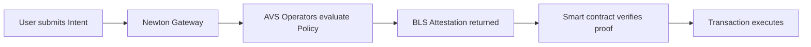
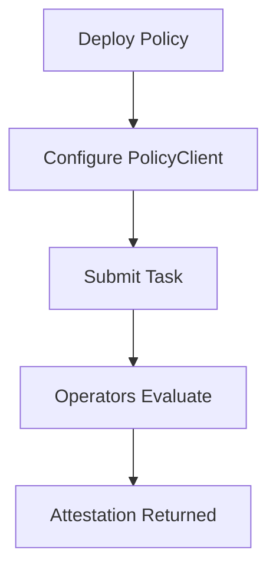

Newton Protocol is a policy engine for onchain transaction authorization, built as an EigenLayer Actively Validated Service (AVS). This page explains how the core pieces fit together. Refer back here as you work through the [integration guide](/developers/guides/integration-guide).

## How Newton Works

You write rules (policies) that define when a transaction should be allowed. When a user submits a transaction (intent), Newton's decentralized operator network evaluates it against your policy, and returns a cryptographic proof (attestation) that your smart contract verifies before executing.

## Key Concepts

### Policy

A **Policy** is a Rego program that defines the conditions an Intent must meet to be approved. Policies are stored on IPFS (referenced by CID) and are reusable across multiple PolicyClients.

Policies can reference two data sources:
- **`data.params`** — configuration parameters set by the PolicyClient owner (e.g., spend limits, allowlists)
- **`data.data`** — runtime data fetched by PolicyData WASM oracles (e.g., token prices, KYC status)

You write policies in [Step 2 of the integration guide](/developers/guides/writing-policies). See the [Rego syntax guide](/developers/advanced/rego-syntax-guide) for language reference.

### Intent

An **Intent** is a proposed transaction submitted for policy evaluation. It contains standard EVM fields:

| Field | Description |
|-------|-------------|
| `from` | Transaction sender address |
| `to` | Transaction recipient address |
| `value` | Wei value to transfer |
| `data` | Transaction calldata |
| `chain_id` | Target chain ID |
| `function_signature` | ABI-encoded function signature |

You construct Intents when calling [`simulateTask`](/developers/reference/sdk-reference) or [`submitEvaluationRequest`](/developers/reference/sdk-reference) in the SDK.

### Task

A **Task** pairs an Intent with its Policy for evaluation. Tasks are the atomic unit of evaluation in Newton — each Task is either **compliant** or **non-compliant**. You can track task status via the [RPC API](/developers/reference/rpc-api) or [Newton Explorer](/developers/resources/newton-explorer).

### Attestation

An **Attestation** is a cryptographic proof (BLS aggregate signature) that Newton operators evaluated a policy and approved or rejected the Intent. Attestations contain the `taskId`, `policyId`, evaluation result, and expiration block. Learn how attestations are produced in [Consensus & Security](/developers/concepts/consensus-security).

### PolicyClient

A **PolicyClient** is a smart contract that validates attestations before executing transactions. You integrate Newton into your contract by inheriting `NewtonPolicyClient` and calling `_validateAttestation()` or `_validateAttestationDirect()` in your function modifiers. See [Smart Contract Integration](/developers/guides/smart-contract-integration) for implementation.

### PolicyData

A **PolicyData** oracle is a WASM component that fetches or computes external data at evaluation time. The output is fed to the Rego policy as `data.data`. Examples include fetching token prices, checking sanctions lists, or verifying KYC status. See [Writing Data Oracles](/developers/guides/writing-data-oracles) to build one.

### Operator

An **Operator** is an EigenLayer node registered with the Newton AVS. Operators independently evaluate tasks, and their individual BLS signatures are aggregated into a single consensus proof once quorum is reached. See [Consensus & Security](/developers/concepts/consensus-security) for details on quorum and slashing.

### Gateway

The **Gateway** is the JSON-RPC 2.0 endpoint that receives tasks and coordinates operator evaluation. All SDK and CLI interactions go through the Gateway. See the [RPC API reference](/developers/reference/rpc-api) for available methods.

## Evaluation Lifecycle

<Steps>
  <Step title="Developer deploys a Policy">
    Publish a reusable policy to the Newton registry with Rego logic, schema, and optional PolicyData dependencies. The policy is stored on IPFS and referenced by CID. See [Deploying with CLI](/developers/guides/deploying-with-cli).
  </Step>
  <Step title="User configures a PolicyClient">
    Deploy a PolicyClient smart contract with a chosen policy, configuration parameters (thresholds, allowlists), and expiration settings. See [Smart Contract Integration](/developers/guides/smart-contract-integration).
  </Step>
  <Step title="Caller submits a Task">
    An Intent is paired with the PolicyClient and sent to the Newton Gateway via the [SDK](/developers/reference/sdk-reference) or [RPC API](/developers/reference/rpc-api).
  </Step>
  <Step title="Operators evaluate">
    AVS operators independently fetch PolicyData, evaluate the Rego policy, and produce individual BLS signatures. The Aggregator collects signatures into a single consensus proof once quorum is reached. See [Consensus & Security](/developers/concepts/consensus-security).
  </Step>
  <Step title="Attestation returned">
    The aggregated attestation is returned to the caller, who submits it on-chain. The contract validates the proof and executes or blocks the transaction. See the [Frontend SDK Integration](/developers/guides/frontend-sdk-integration) for how to handle this in your app.
  </Step>
</Steps>

## Architecture Layers

| Layer | Purpose | Components |
|-------|---------|------------|
| **Policy Layer** | Defines policies, schemas, rules, thresholds, offchain inputs | Policy Registry, Policy Library |
| **Compute & Consensus Layer** | Offchain policy evaluation by AVS operators, outputs verifiable proofs | AVS Operators, Aggregator, Consensus Proofs |
| **Verification & Execution Layer** | Onchain proof verification and outcome enforcement | NewtonVerifier, PolicyClient, SDKs |

## Validation Methods

When your smart contract receives an attestation, you validate it using one of two methods:

| Method | Function | Trade-off |
|--------|----------|-----------|
| **Standard** | `_validateAttestation(attestation, proof)` | Uses PolicyClientRegistry lookup — more gas but automatically resolves contract configuration. See [Smart Contract Integration](/developers/guides/smart-contract-integration). |
| **Direct** | `_validateAttestationDirect(attestation, proof)` | Bypasses registry — less gas but requires the contract to manage its own policy reference. See [Policy Client Guide](/developers/advanced/policy-client-guide). |

## Supported Chains

See [Contract Addresses](/developers/reference/contract-addresses) for deployed contract addresses on each chain.

| Chain | Chain ID | Status |
|-------|----------|--------|
| Ethereum Mainnet | `1` | Active |
| Ethereum Sepolia | `11155111` | Active |
| Base Sepolia | `84532` | Active |

## Next Steps

<Card icon="book" href="/developers/guides/integration-guide" title="Integration Guide">
  Build and deploy a full Newton integration end-to-end
</Card>
<Card icon="building" href="/developers/concepts/architecture" title="Architecture Deep Dive">
  Explore the three-layer architecture in detail
</Card>
<Card icon="code" href="/developers/reference/sdk-reference" title="SDK Reference">
  Full TypeScript SDK documentation
</Card>
<Card icon="terminal" href="/developers/reference/rpc-api" title="RPC API Reference">
  Gateway JSON-RPC methods and parameters
</Card>
