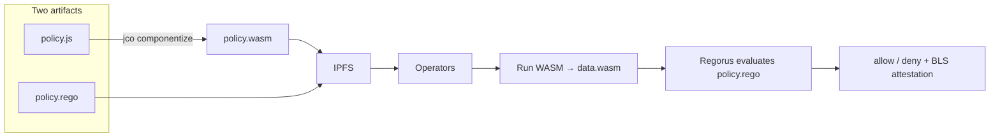

> This is the canonical model for how Newton policies work. Prefer this page when explaining Newton to an LLM or onboarding a new engineer.

A Newton policy is made of **two artifacts**, not one. Operators fetch both from IPFS, run the oracle, then evaluate the policy.

## The two artifacts

| Artifact | Source file | What ships | Runtime |
| --- | --- | --- | --- |
| **Data oracle** | `policy.js` (or Rust/Python) | Compiled **WASM** component | Wasmtime on operators |
| **Policy** | `policy.rego` | **Raw Rego text** on IPFS | **Regorus** on operators |



### 1. Oracle (`policy.js` → WASM)

You write a JS, Rust, or Python oracle that implements the `newton:provider` WIT world. For JavaScript, build it with **jco componentize** into `policy.wasm`:

```bash
jco componentize -w newton-provider.wit -o policy.wasm policy.js \
  -d stdio random clocks http fetch-event
```

What you pin and deploy is the **compiled WASM** (PolicyData). The JS source is build-time only — it is not what runs on operators.

### 2. Policy (`policy.rego` → Regorus)

You write Rego against three namespaces: `input` (the intent), `data.params` (PolicyClient config), and `data.wasm` (oracle JSON output). The `policy.rego` file is stored as **raw text** on IPFS (by CID). Operators evaluate that text with **Regorus**, not OPA.

## Regorus vs OPA

| Tool | Role in Newton |
| --- | --- |
| **Regorus** | Production evaluator — used by operators, Gateway simulation, and `newton-cli regorus` |
| **OPA (`opa test`)** | For local unit tests only |

If you need checks that match production — including Newton protocol builtins — use Regorus or Gateway simulation, not OPA.

## What this is not

- Not a single Rego file that also makes HTTP calls. External data goes through the WASM oracle.
- Not JavaScript evaluated at runtime. JS compiles to WASM first.
- Not an OPA server or OPA bundle in production.

## Minimal file set

```
policy-files/
├── policy.rego
├── policy.wasm
├── params_schema.json
├── policy_metadata.json
└── policy_data_metadata.json
```

## Evaluation in one sentence

Operators run `policy.wasm`, merge the JSON into `data.wasm`, evaluate the raw `policy.rego` with **Regorus** against the intent, then sign the result.

## Next Steps

<CardGroup cols={2}>
<Card icon="database" href="/developers/guides/writing-data-oracles" title="Writing Data Oracles">
  Build JS, Rust, or Python oracles and compile them to WASM with jco
</Card>
<Card icon="file-code" href="/developers/guides/writing-policies" title="Writing Policies">
  Write Rego policies using input, data.params, and data.wasm
</Card>
<Card icon="flask" href="/developers/guides/testing-policies" title="Testing Policies & Oracles">
  Use opa test locally; use Regorus or simulate for production-faithful checks
</Card>
<Card icon="building" href="/developers/concepts/architecture" title="Architecture">
  Explore the three-layer system architecture
</Card>
</CardGroup>
