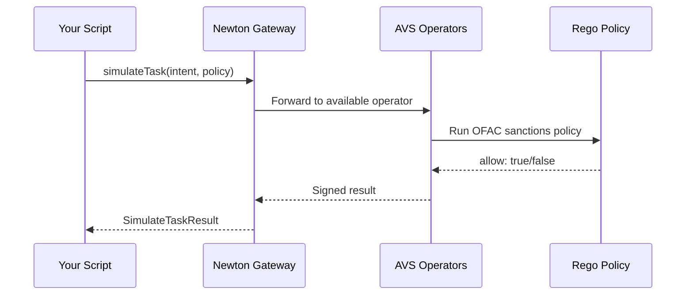

Simulate a policy evaluation in under 5 minutes. The example policy performs **OFAC sanctions screening** — checking a transaction sender against a sanctions list before allowing it to proceed. No smart contract deployment required.

## Prerequisites

| Requirement        | How to get it                                                                                                           |
| ------------------ | ----------------------------------------------------------------------------------------------------------------------- |
| **Node.js \>= 20** | [nodejs.org](https://nodejs.org/)                                                                                       |
| **Newton API key** | [Dashboard](/developers/overview/dashboard-api-keys) or email [product@magicnewton.com](mailto:product@magicnewton.com) |

<Note>
  This quickstart uses `simulateTask` — a dry run that does not submit anything on-chain. No Sepolia ETH or wallet needed.
</Note>

## Step 1 — Install

<CodeGroup>

```bash pnpm (recommended)
mkdir newton-quickstart && cd newton-quickstart
pnpm init
pnpm add @magicnewton/newton-protocol-sdk viem
```


```bash npm
mkdir newton-quickstart && cd newton-quickstart
npm init -y
npm install @magicnewton/newton-protocol-sdk viem
```


```bash yarn
mkdir newton-quickstart && cd newton-quickstart
yarn init -y
yarn add @magicnewton/newton-protocol-sdk viem
```

</CodeGroup>

## Step 2 — Run a simulation

Create `quickstart.ts` and paste:

```typescript
import { createPublicClient, createWalletClient, http } from 'viem';
import { sepolia } from 'viem/chains';
import {
  newtonPublicClientActions,
  newtonWalletClientActions,
} from '@magicnewton/newton-protocol-sdk';

const API_KEY = process.env.NEWTON_API_KEY!;
const RPC_URL = process.env.RPC_URL || 'https://eth-sepolia.g.alchemy.com/v2/YOUR_KEY';

// Public client — read-only operations (poll for task responses, read policy state)
const publicClient = createPublicClient({
  chain: sepolia,
  transport: http(RPC_URL),
}).extend(newtonPublicClientActions());

// Wallet client — write operations (submit tasks, run simulations)
const walletClient = createWalletClient({
  chain: sepolia,
  transport: http(RPC_URL),
}).extend(
  newtonWalletClientActions({
    apiKey: API_KEY,
  })
);

async function main() {
  // Simulate OFAC sanctions screening on a transaction.
  // No on-chain transaction occurs — this is a dry run.
  const result = await walletClient.simulateTask({
    intent: {
      from: '0xf39Fd6e51aad88F6F4ce6aB8827279cffFb92266',   // sender to check against sanctions list
      to: '0xb1aD5f82407bC0f19f42b2614fb9083035a36b69',     // PolicyClient contract on Sepolia
      value: '0x0',                                           // no ETH value
      data: '0x28dca9f7...e42e3458...',                       // ABI-encoded function call (buy/transfer)
      chainId: 11155111,                                      // Sepolia
      functionSignature: '0x627579...',                        // buy(address,uint256,uint32) encoded
    },
    policyTaskData: {
      // Pre-deployed OFAC sanctions policy — you can use this for testing
      policyId: '0x27b7c88f...eecd1626',
      policyAddress: '0x5FeaeBfB4439F3516c74939A9D04e95AFE82C4ae',
      policy: '0x',
      policyData: [
        {
          wasmArgs: '0x7b22626173655f73796d626f6c223a22425443227d', // {"base_symbol":"BTC"}
          data: '0x',
          attestation: '0x',
          policyDataAddress: '0x30E545603d6205B6887BAb0C1a630aa383d71e07', // sanctions list oracle
          expireBlock: 0,
        },
      ],
    },
  });

  console.log('Simulation result:', {
    success: result.success,
    allowed: result.result?.allow,
    reason: result.result?.reason,
    error: result.error,
  });
}

main().catch(console.error);
```

Run it:

```bash
NEWTON_API_KEY=your_key_here npx tsx quickstart.ts
```

## Step 3 — Understand the response

The simulation returns a `SimulateTaskResult`:

| Field           | Type      | Description                                     |
| --------------- | --------- | ----------------------------------------------- |
| `success`       | `boolean` | Whether the evaluation completed without errors |
| `result.allow`  | `boolean` | Whether the policy approved the intent          |
| `result.reason` | `string`  | Human-readable explanation                      |
| `error`         | `string`  | Error message if evaluation failed              |

A successful response:

```json
{
  "success": true,
  "result": {
    "allow": true,
    "reason": "Policy conditions met"
  },
  "error": null
}
```

## Step 4 — What just happened?



Your script submitted an [Intent](/developers/overview/core-concepts#intent) to the Newton [Gateway](/developers/overview/core-concepts#gateway), where an [Operator](/developers/overview/core-concepts#operator) ran the OFAC sanctions [Rego policy](/developers/overview/core-concepts#policy) with a [PolicyData](/developers/overview/core-concepts#policydata) oracle and returned an allow/deny result. This was a **simulation** — no on-chain transaction occurred.

In production, the same flow produces a [**BLS attestation**](/developers/overview/core-concepts#attestation) that your smart contract verifies on-chain before executing the transaction.

## Next steps

<Card icon="book" href="/developers/guides/integration-guide" title="Integration Guide">
  Build and deploy a full Newton integration — policy, contract, and frontend
</Card>

<Card icon="lightbulb" href="/developers/overview/core-concepts" title="Core Concepts">
  Understand policies, intents, tasks, and attestations
</Card>

<Card icon="code" href="/developers/reference/sdk-reference" title="SDK Reference">
  Full TypeScript SDK documentation
</Card>

<Card icon="play" href="https://demo.newton.xyz/" title="Try the demo">
  See a live sanctions-checked transfer app built with the Newton SDK
</Card>

<Accordion title="Alternative: AI-assisted build">
  The fastest way to build a complete Newton application is to use Claude (or a similar AI coding assistant) with the Newton LLM context files. This approach scaffolds a full-stack app including data oracle, Rego policy, Solidity contract, and Next.js frontend.

  ### Get the LLM context files

  Download both Newton LLM context files and place them in your project root. See the [LLM context files reference](/developers/reference/context-file) for full usage details.

  ```bash
  # Policy guide (WASM oracles, Rego, newton-cli)
  curl -o newton-policy-guide.md "https://gist.githubusercontent.com/vmathur/3fce8ced4a8ef8cbe1219366abee9d42/raw/6d472427eda1448350878ed2072ee13027cdcb32/Newton%20Policy%20Guide%20LLM%20context"

  # TypeScript SDK guide (Next.js frontend integration)
  curl -o newton-sdk-guide.md "https://gist.githubusercontent.com/vmathur/bc9a1bfa6cb736daf2ab14d6196223c5/raw/2386e7b13fa3b2591ba2d3c4d0d4bc518bcfbb3b/Newton%20Typescript%20SDK%20guide%20LLM%20context"
  ```

  ### Provide context to your AI assistant

  Start a conversation with Claude and provide the LLM context file. Then ask it to build the Newton sanctions-checked transfer app.

  Example prompt:

  > Using the Newton integration context provided, help me build a complete Newton Protocol app that:
  >
  > 1. Creates a WASM data oracle for sanctions checking
  > 2. Writes a Rego policy that checks the oracle results
  > 3. Deploys the policy via newton-cli
  > 4. Deploys a NewtonPolicyWallet on Sepolia
  > 5. Builds a Next.js frontend using the Newton SDK

  ### Environment variables

  | Variable                             | Description                                    |
  | ------------------------------------ | ---------------------------------------------- |
  | `CHAIN_ID`                           | `11155111` (Sepolia) or `84532` (Base Sepolia) |
  | `PINATA_JWT`                         | Your Pinata API JWT token                      |
  | `PINATA_GATEWAY`                     | Your Pinata gateway URL                        |
  | `PRIVATE_KEY`                        | Deployer wallet private key (with `0x` prefix) |
  | `RPC_URL`                            | Sepolia RPC endpoint                           |
  | `NEXT_PUBLIC_NEWTON_API_KEY`         | Newton Protocol API key                        |
  | `NEXT_PUBLIC_SEPOLIA_ALCHEMY_URL`    | Alchemy HTTP RPC URL                           |
  | `NEXT_PUBLIC_SEPOLIA_ALCHEMY_WS_URL` | Alchemy WebSocket RPC URL                      |

  ### Deploy and run

  ```bash
  # Build the WASM component
  jco componentize -w newton-provider.wit -o policy.wasm policy.js -d stdio random clocks http fetch-event

  # Deploy policy via newton-cli
  newton-cli policy-files generate-cids --directory policy-files --output policy_cids.json --entrypoint "your_policy.allow"
  newton-cli policy-data deploy --policy-cids policy_cids.json
  newton-cli policy deploy --policy-cids policy_cids.json --policy-data-address "0x..."

  # Deploy the wallet contract
  forge script script/Deploy.s.sol:DeployScript --rpc-url $RPC_URL --broadcast

  # Run the Next.js app
  cd newton-sdk-app && npm install && npm run dev
  ```
</Accordion>
