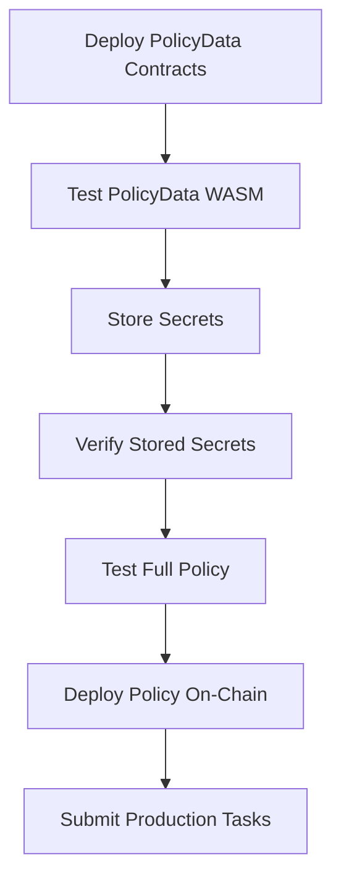

The Newton Gateway provides a JSON-RPC 2.0 interface for submitting policy evaluation tasks to the Newton Protocol AVS (Actively Validated Service). The protocol evaluates user intents against Rego policies and returns cryptographic proofs of compliance through BLS signatures.

For client-side helpers that wrap these RPC calls, see the [SDK Reference](/developers/reference/sdk-reference). For a step-by-step walkthrough of building on Newton, see the [Integration Guide](/developers/guides/integration-guide).

## Base URLs

| Network | URL |
|---------|-----|
| Sepolia | `https://gateway.testnet.newton.xyz/rpc` |
| Base Sepolia | `https://gateway.testnet.newton.xyz/rpc` |
| Mainnet | `https://gateway.newton.xyz/rpc` |

**Protocol:** JSON-RPC 2.0 over HTTPS

<CodeGroup>
```json Request Format
{
  "jsonrpc": "2.0",
  "method": "<method_name>",
  "params": { ... },
  "id": "<request_id>"
}
```

```json Success Response
{
  "jsonrpc": "2.0",
  "result": { ... },
  "id": "<request_id>"
}
```

```json Error Response
{
  "jsonrpc": "2.0",
  "error": {
    "code": -32600,
    "message": "Invalid request"
  },
  "id": "<request_id>"
}
```
</CodeGroup>

---

## Authentication

<Info>
All API requests require authentication via API key. Include the key in the `Authorization` header:

```
Authorization: Bearer <your_api_key>
```

API keys are issued with specific permissions. You can create API keys via the [Newton Dashboard API](https://dashboard.api.newt.foundation) (SIWE or email authentication), or by emailing [product@magicnewton.com](mailto:product@magicnewton.com).
</Info>

### Permission Levels

| Permission | Description |
|------------|---------------------------------------------------|
| `RpcRead` | Read-only operations: task submission, simulation |
| `RpcWrite` | Write operations: secrets management |

### Example

```bash
curl -X POST https://gateway.testnet.newton.xyz/rpc \
  -H "Content-Type: application/json" \
  -H "Authorization: Bearer your_api_key_here" \
  -d '{"jsonrpc":"2.0","method":"newt_createTask","params":{...},"id":1}'
```

### Policy Client Ownership

Some endpoints require **ownership verification** of a `policy_client` address. This mechanism protects access to stored secrets and ensures only authorized users can manage secrets for a given PolicyClient.

<Note>
As of v0.2.0, ownership is determined **on-chain** via the `INewtonPolicyClient.getOwner()` method on the PolicyClient contract. Ownership is transferable using `setOwner()` or `transferOwnership()` on the contract. The Gateway reads on-chain state for every ownership check.
</Note>

**How Ownership Works:**

1. **Ownership is read from the chain** — the Gateway calls `getOwner()` on the `policy_client` contract to determine the current owner.
2. **Ownership is verified** when calling endpoints that require it. The Gateway checks that the caller's API key is associated with the on-chain owner of the `policy_client`.
3. **Ownership is transferable** — transfer ownership on-chain via `setOwner()` or `transferOwnership()`, and the Gateway will recognize the new owner on the next request.

**Endpoints Requiring Ownership Verification:**

| Endpoint | Ownership Required |
|-----|-----|
| `newt_simulatePolicyData` | No (caller provides secrets directly) |
| `newt_simulatePolicyDataWithClient` | Yes (fetches stored secrets) |
| `newt_simulatePolicy` | Conditional (only if PolicyData requires secrets) |
| `newt_storeEncryptedSecrets` | Yes (verifies on-chain owner) |

<Warning>
**Conditional Ownership for `newt_simulatePolicy`:**
The `newt_simulatePolicy` endpoint only requires ownership verification when at least one PolicyData contract has a `secretsSchemaCid` (indicating stored secrets are required). If all PolicyData contracts in your request have empty `secretsSchemaCid` values (no secrets needed), ownership verification is skipped. This allows testing simple policies without requiring secrets to be uploaded first.
</Warning>

**Error Responses:**

If ownership verification fails, you will receive one of these errors:

- `"policy_client is owned by another user"` -- The `policy_client` is owned by a different address on-chain.
- `"policy client has no owner"` -- The contract returned a zero address for `getOwner()`.

---

## Conventions

### Hex Value Encoding

Following Ethereum JSON-RPC conventions:

**Quantities (integers, numbers):**

- Encode as hex with `0x` prefix
- Use most compact representation (no leading zeros except for zero itself)
- Zero is represented as `"0x0"`

```
0x41      (65 in decimal)
0x400     (1024 in decimal)
0x0       (zero)
```

**Unformatted Data (byte arrays, addresses, hashes):**

- Encode as hex with `0x` prefix
- Two hex digits per byte
- Even number of digits required

```
0x1234567890123456789012345678901234567890   (20-byte address)
0x28dca9f7                                   (4-byte function selector)
0x                                           (empty data)
```

### Address Format

Ethereum addresses are 20-byte hex strings with `0x` prefix:

```
0xf39Fd6e51aad88F6F4ce6aB8827279cffFb92266
```

Addresses are case-insensitive but checksummed addresses are recommended.

---

## Common Types

### TaskIntent

Represents a transaction intent to be evaluated against a policy.

| Field | Type | Required | Description |
|---|---|---|---|
| `from` | `Address` | Yes | Transaction sender address |
| `to` | `Address` | Yes | Transaction recipient address |
| `value` | `Quantity` | Yes | Wei value to transfer (hex encoded) |
| `data` | `Data` | Yes | Transaction calldata (hex encoded) |
| `chain_id` | `Quantity` | Yes | Target chain ID (hex encoded) |
| `function_signature` | `Data` | Yes | ABI-encoded function signature (hex encoded) |

<Expandable title="TaskIntent Example">
```json
{
  "from": "0xf39Fd6e51aad88F6F4ce6aB8827279cffFb92266",
  "to": "0xb1aD5f82407bC0f19f42b2614fb9083035a36b69",
  "value": "0x0",
  "data": "0x28dca9f7000000000000000000000000e42e3458283032c669c98e0d8f883a92fc64fe22",
  "chain_id": "0xaa36a7",
  "function_signature": "0x62757928616464726573732c75696e743235362c75696e74333229"
}
```
</Expandable>

### PolicyDataInput

Specifies a PolicyData contract and optional WASM arguments for policy simulation.

| Field | Type | Required | Description |
|---|---|---|---|
| `policy_data_address` | `Address` | Yes | Deployed PolicyData contract address |
| `wasm_args` | `Data` | No | Hex-encoded WASM arguments for this data source |

<Expandable title="PolicyDataInput Example">
```json
{
  "policy_data_address": "0xaaaaaaaaaaaaaaaaaaaaaaaaaaaaaaaaaaaaaaaa",
  "wasm_args": "0x7b22626173655f73796d626f6c223a22425443227d"
}
```
</Expandable>

### TaskStatus

Enumeration of task processing states.

| Value | Description |
|---|---|
| `pending` | Task queued for processing |
| `processing` | Task being evaluated by operators |
| `success` | Task completed successfully |
| `failed` | Task evaluation failed |
| `timeout` | Task exceeded timeout threshold |

---

## RPC Methods

### newt_createTask

Creates a task and waits synchronously for the BLS aggregation result. Use this for simple integrations where blocking is acceptable.

**Permission:** `RpcRead`

#### Parameters

| Field | Type | Required | Description |
|---|---|---|---|
| `policy_client` | `Address` | Yes | Policy client contract address |
| `intent` | `TaskIntent` | Yes | Transaction intent to evaluate |
| `intent_signature` | `Data` | No | Hex-encoded signature of the intent |
| `quorum_number` | `Data` | No | Quorum numbers (hex bytes, e.g., `"00"` for quorum 0) |
| `quorum_threshold_percentage` | `Number` | No | BLS aggregation threshold (0-100) |
| `wasm_args` | `Data` | No | Hex-encoded WASM plugin arguments |
| `timeout` | `Number` | No | Timeout in seconds (default: 30) |
#### Returns

| Field | Type | Description |
|---|---|---|
| `task_id` | `Data` | 32-byte task identifier |
| `status` | `TaskStatus` | Final task status |
| `aggregation_response` | `Object` | BLS aggregation result (if successful) |
| `task` | `Object` | Full Task struct for `validateAttestationDirect` (if success) |
| `task_response` | `Object` | Full TaskResponse struct from aggregation (if success) |
| `reference_block` | `Number` | Block number when response was prepared (if success) |
| `expiration` | `Number` | Expiration block: `reference_block + policyConfig.expireAfter` |
| `error` | `String` | Error message (if failed) |
| `timestamp` | `Number` | Unix timestamp |

<Note>
The `task`, `task_response`, `reference_block`, and `expiration` fields enable clients to call `validateAttestationDirect` optimistically without waiting for on-chain task submission. The `signature_data` field contains pre-built, chain-aware encoded bytes ready to pass directly to the contract.
</Note>

#### Example

<CodeGroup>
```json Request
{
  "jsonrpc": "2.0",
  "method": "newt_createTask",
  "params": {
    "policy_client": "0x1234567890123456789012345678901234567890",
    "intent": {
      "from": "0xf39Fd6e51aad88F6F4ce6aB8827279cffFb92266",
      "to": "0xb1aD5f82407bC0f19f42b2614fb9083035a36b69",
      "value": "0x0",
      "data": "0x28dca9f7000000000000000000000000e42e3458283032c669c98e0d8f883a92fc64fe22",
      "chain_id": "0xaa36a7",
      "function_signature": "0x627579"
    },
    "timeout": 30
  },
  "id": 1
}
```

```json Response (Success)
{
  "jsonrpc": "2.0",
  "result": {
    "task_id": "0x1234567890abcdef1234567890abcdef1234567890abcdef1234567890abcdef",
    "status": "success",
    "aggregation_response": {
      "task_response_digest": "0xabcd...",
      "non_signer_stakes_and_signature": { }
    },
    "task": {
      "taskId": "0x1234...",
      "policyClient": "0x1234567890123456789012345678901234567890",
      "nonce": 0,
      "taskCreatedBlock": 12345678,
      "quorumThresholdPercentage": 67,
      "intent": { },
      "intentSignature": "0x...",
      "wasmArgs": "0x...",
      "quorumNumbers": "0x00"
    },
    "task_response": {
      "task_id": "0x1234...",
      "policy_client": "0x...",
      "policy_id": "0x...",
      "policy_address": "0x...",
      "intent": { },
      "intent_signature": "0x...",
      "evaluation_result": [1],
      "policy_task_data": { },
      "policy_config": {
        "expireAfter": 100
      }
    },
    "reference_block": 12345700,
    "expiration": 12345800,
    "error": null,
    "timestamp": 1705123456
  },
  "id": 1
}
```

```json Response (Failure)
{
  "jsonrpc": "2.0",
  "result": {
    "task_id": "0x1234567890abcdef...",
    "status": "failed",
    "aggregation_response": null,
    "error": "Policy evaluation failed: insufficient permissions",
    "timestamp": 1705123456
  },
  "id": 1
}
```
</CodeGroup>

---

### newt_sendTask

Submits a task asynchronously and returns immediately with a WebSocket subscription topic for receiving updates.

**Permission:** `RpcRead`

#### Parameters

| Field | Type | Required | Description |
|---|---|---|---|
| `policy_client` | `Address` | Yes | Policy client contract address |
| `intent` | `TaskIntent` | Yes | Transaction intent to evaluate |
| `intent_signature` | `Data` | No | Hex-encoded signature of the intent |
| `quorum_number` | `Data` | No | Quorum numbers (hex bytes) |
| `quorum_threshold_percentage` | `Number` | No | BLS aggregation threshold (0-100) |
| `wasm_args` | `Data` | No | Hex-encoded WASM plugin arguments |

#### Returns

| Field | Type | Description |
|---|---|---|
| `task_id` | `Data` | 32-byte task identifier |
| `subscription_topic` | `String` | WebSocket topic for task updates |
| `message` | `String` | Confirmation message |
| `timestamp` | `Number` | Unix timestamp |

#### Example

<CodeGroup>
```json Request
{
  "jsonrpc": "2.0",
  "method": "newt_sendTask",
  "params": {
    "policy_client": "0x1234567890123456789012345678901234567890",
    "intent": {
      "from": "0xf39Fd6e51aad88F6F4ce6aB8827279cffFb92266",
      "to": "0xb1aD5f82407bC0f19f42b2614fb9083035a36b69",
      "value": "0x0",
      "data": "0x28dca9f7",
      "chain_id": "0xaa36a7",
      "function_signature": "0x627579"
    }
  },
  "id": 1
}
```

```json Response
{
  "jsonrpc": "2.0",
  "result": {
    "task_id": "0x1234567890abcdef1234567890abcdef1234567890abcdef1234567890abcdef",
    "subscription_topic": "newton.task.0x1234567890abcdef...",
    "message": "Task submitted for async processing",
    "timestamp": 1705123456
  },
  "id": 1
}
```
</CodeGroup>

#### WebSocket Updates

Connect to the WebSocket endpoint and subscribe to the returned topic:

```json
{
  "type": "subscribe",
  "id": "sub-1",
  "method": "newton.task.0x1234567890abcdef...",
  "params": null
}
```

Updates are received in the following format:

```json
{
  "type": "update",
  "subscription": "sub-1",
  "result": {
    "event": "success",
    "task_id": "0x1234567890abcdef...",
    "timestamp": 1705123460,
    "data": {
      "status": "success",
      "operator_responses": [],
      "result": { },
      "progress": 100
    }
  }
}
```

---

### newt_simulateTask

Forwards a policy simulation request to an available operator and returns the result. This endpoint tests the full operator evaluation flow without executing on-chain. Requires at least one registered operator to be available.

**Permission:** `RpcRead`

#### Parameters

| Field | Type | Required | Description |
|---|---|---|---|
| `intent` | `TaskIntent` | Yes | Transaction intent to simulate |
| `policy_task_data` | `PolicyTaskData` | Yes | Policy task data for evaluation |

**PolicyTaskData Structure:**

| Field | Type | Description |
|---|---|---|
| `policyId` | `bytes32` | Policy identifier (32-byte hex string) |
| `policyAddress` | `address` | Policy contract address |
| `policy` | `bytes` | Policy bytecode (hex string, can be `"0x"`) |
| `policyData` | `PolicyData[]` | Array of policy data sources for evaluation |

**PolicyData Structure:**

| Field | Type | Description |
|---|---|---|
| `wasmArgs` | `bytes` | WASM plugin arguments (hex-encoded) |
| `data` | `bytes` | Pre-fetched data (hex string) |
| `attestation` | `bytes` | Data attestation signature (hex string) |
| `policyDataAddress` | `address` | PolicyData contract address |
| `expireBlock` | `uint32` | Block number when data expires |

#### Returns

| Field | Type | Description |
|---|---|---|
| `success` | `Boolean` | Whether evaluation succeeded |
| `result` | `Object` | Evaluation result (if successful) |
| `error` | `String` | Error message (if failed) |
| `details` | `Object` | Execution details |

#### Example

<Expandable title="Request">
```json
{
  "jsonrpc": "2.0",
  "method": "newt_simulateTask",
  "params": {
    "intent": {
      "from": "0xf39Fd6e51aad88F6F4ce6aB8827279cffFb92266",
      "to": "0xb1aD5f82407bC0f19f42b2614fb9083035a36b69",
      "value": "0x0",
      "data": "0x28dca9f7000000000000000000000000e42e3458283032c669c98e0d8f883a92fc64fe22",
      "chain_id": "31337",
      "function_signature": "0x62757928616464726573732c75696e743235362c75696e74333229"
    },
    "policy_task_data": {
      "policyId": "0x27b7c88f256114a1fc9924953fbbad4d6db50f141978fd7b5766d456eecd1626",
      "policyAddress": "0x5FeaeBfB4439F3516c74939A9D04e95AFE82C4ae",
      "policy": "0x",
      "policyData": [
        {
          "wasmArgs": "0x7b22626173655f73796d626f6c223a22425443227d",
          "data": "0x",
          "attestation": "0x",
          "policyDataAddress": "0x30E545603d6205B6887BAb0C1a630aa383d71e07",
          "expireBlock": 0
        }
      ]
    }
  },
  "id": 1
}
```
</Expandable>

<CodeGroup>
```json Response (Success)
{
  "jsonrpc": "2.0",
  "result": {
    "success": true,
    "result": {
      "allow": true,
      "reason": "Policy conditions met"
    },
    "error": null,
    "details": null
  },
  "id": 1
}
```

```json Response (Error - No Operators)
{
  "jsonrpc": "2.0",
  "result": null,
  "error": {
    "ServiceUnavailable": "No operators available"
  },
  "id": null
}
```
</CodeGroup>

---

### newt_storeEncryptedSecrets

Uploads encrypted secrets for a PolicyData contract. Secrets are validated against the on-chain schema and stored for use during task evaluation.

**Permission:** `RpcWrite`

#### Parameters

| Field | Type | Required | Description |
|---|---|---|---|
| `policy_client` | `Address` | Yes | Policy client contract address |
| `policy_data_address` | `Address` | Yes | PolicyData contract address |
| `secrets` | `String` | Yes | Base64-encoded encrypted ciphertext |

#### Returns

| Field | Type | Description |
|---|---|---|
| `success` | `Boolean` | Whether upload succeeded |
| `schema` | `Object` | JSON schema used for validation (on success) |
| `error` | `String` | Error message (on failure) |

#### Encryption Requirements

Secrets must be encrypted before upload. See [Encrypting Secrets](/developers/advanced/kms-encryption) for the full workflow.

**Plaintext format (before encryption):**

```json
{
  "API_KEY": "sk-xxxxxxxxxxxxx",
  "ENDPOINT": "https://api.example.com"
}
```

#### Ownership Model

<Note>
Only the on-chain owner of the PolicyClient contract (as returned by `getOwner()`) can upload or update secrets. Ownership is transferable on-chain via `setOwner()` or `transferOwnership()`.
</Note>

#### Example

<CodeGroup>
```json Request
{
  "jsonrpc": "2.0",
  "method": "newt_storeEncryptedSecrets",
  "params": {
    "policy_client": "0x1234567890123456789012345678901234567890",
    "policy_data_address": "0xabcdefabcdefabcdefabcdefabcdefabcdefabcd",
    "secrets": "<base64-encoded-encrypted-secrets>"
  },
  "id": 1
}
```

```json Response (Success)
{
  "jsonrpc": "2.0",
  "result": {
    "success": true,
    "schema": {
      "type": "object",
      "properties": {
        "API_KEY": { "type": "string" },
        "ENDPOINT": { "type": "string", "format": "uri" }
      },
      "required": ["API_KEY", "ENDPOINT"]
    },
    "error": null
  },
  "id": 1
}
```

```json Response (Error - Ownership Violation)
{
  "jsonrpc": "2.0",
  "result": {
    "success": false,
    "schema": null,
    "error": "policy_client is owned by a different user"
  },
  "id": 1
}
```

```json Response (Error - Schema Validation)
{
  "jsonrpc": "2.0",
  "result": {
    "success": false,
    "schema": null,
    "error": "Secrets upload validation failed: missing required field 'API_KEY'"
  },
  "id": 1
}
```
</CodeGroup>

---

### newt_simulatePolicyData

Simulates PolicyData WASM execution with caller-provided secrets. Use this endpoint to iterate on WASM plugins before uploading production secrets.

**Permission:** `RpcRead`

**Authorization:** Rate limiting only. Any valid API key can call this endpoint. No ownership verification is performed because secrets are provided directly by the caller.

#### When to Use

- **Iterating on PolicyData WASM** before uploading production secrets
- **Testing WASM execution** with different secret configurations
- **PolicyData contracts that don't require secrets** (secrets field is optional)

#### Workflow

1. Deploy PolicyData contract with `wasmCid` and optional `secretsSchemaCid`
2. Call `newt_simulatePolicyData` with optional encrypted secrets to test
3. Once satisfied, upload production secrets via `newt_storeEncryptedSecrets`
4. Test full policy via `newt_simulatePolicy` or `newt_simulatePolicyDataWithClient`

#### Parameters

| Field | Type | Required | Description |
|---|---|---|---|
| `policy_data_address` | `Address` | Yes | PolicyData contract address |
| `secrets` | `String` | No | Base64-encoded encrypted ciphertext (for testing) |
| `wasm_args` | `Data` | No | Hex-encoded WASM arguments |

#### Returns

| Field | Type | Description |
|---|---|---|
| `success` | `Boolean` | Whether simulation succeeded |
| `policy_data` | `Object` | WASM execution result (on success) |
| `error` | `String` | Error message (on failure) |

The `policy_data` object contains:

| Field | Type | Description |
|---|---|---|
| `specifier` | `String` | WASM source identifier (IPFS CID) |
| `data` | `Object` | WASM output data |
| `timestamp` | `Number` | Execution timestamp |

#### Example

<CodeGroup>
```json Request (with secrets)
{
  "jsonrpc": "2.0",
  "method": "newt_simulatePolicyData",
  "params": {
    "policy_data_address": "0xaaaaaaaaaaaaaaaaaaaaaaaaaaaaaaaaaaaaaaaa",
    "secrets": "<base64-encoded-encrypted-secrets>",
    "wasm_args": "0x7b22626173655f73796d626f6c223a22425443227d"
  },
  "id": 1
}
```

```json Request (without secrets)
{
  "jsonrpc": "2.0",
  "method": "newt_simulatePolicyData",
  "params": {
    "policy_data_address": "0xaaaaaaaaaaaaaaaaaaaaaaaaaaaaaaaaaaaaaaaa",
    "wasm_args": "0x7b22626173655f73796d626f6c223a22425443227d"
  },
  "id": 1
}
```

```json Response (Success)
{
  "jsonrpc": "2.0",
  "result": {
    "success": true,
    "policy_data": {
      "specifier": "bafkreigh2akiscaill...",
      "data": {
        "base_symbol": "BTC",
        "quote_symbol": "USD",
        "price": 42000.5
      },
      "timestamp": 1705123456
    },
    "error": null
  },
  "id": 1
}
```

```json Response (Error)
{
  "jsonrpc": "2.0",
  "result": {
    "success": false,
    "policy_data": null,
    "error": "WASM execution failed: missing required secret 'API_KEY'"
  },
  "id": 1
}
```
</CodeGroup>

---

### newt_simulatePolicyDataWithClient

Simulates PolicyData WASM execution with previously uploaded secrets. Use this endpoint to test that stored secrets work correctly before testing the full policy.

**Permission:** `RpcRead`

**Authorization:** Ownership verification required. The caller's API key must belong to the user who owns the `policy_client` address. Ownership is established when secrets are first uploaded via `newt_storeEncryptedSecrets`.

#### When to Use

- **Testing PolicyData WASM** with previously uploaded secrets
- **Verifying stored secrets** work correctly before using `newt_simulatePolicy`
- **Debugging policy failures** by testing individual PolicyData sources

#### Prerequisites

1. Deploy PolicyData contract with `wasmCid` and optional `secretsSchemaCid`
2. Upload secrets via `newt_storeEncryptedSecrets` (establishes ownership)
3. Call this endpoint to test with stored secrets

#### Parameters

| Field | Type | Required | Description |
|---|---|---|---|
| `policy_data_address` | `Address` | Yes | PolicyData contract address |
| `policy_client` | `Address` | Yes | Policy client address (for ownership check + secrets lookup) |
| `wasm_args` | `Data` | No | Hex-encoded WASM arguments |

#### Returns

| Field | Type | Description |
|---|---|---|
| `success` | `Boolean` | Whether simulation succeeded |
| `policy_data` | `Object` | WASM execution result (on success) |
| `error` | `String` | Error message (on failure) |

#### Example

<CodeGroup>
```json Request
{
  "jsonrpc": "2.0",
  "method": "newt_simulatePolicyDataWithClient",
  "params": {
    "policy_data_address": "0xaaaaaaaaaaaaaaaaaaaaaaaaaaaaaaaaaaaaaaaa",
    "policy_client": "0x1234567890123456789012345678901234567890",
    "wasm_args": "0x7b22626173655f73796d626f6c223a22425443227d"
  },
  "id": 1
}
```

```json Response (Success)
{
  "jsonrpc": "2.0",
  "result": {
    "success": true,
    "policy_data": {
      "specifier": "bafkreigh2akiscaill...",
      "data": {
        "base_symbol": "BTC",
        "quote_symbol": "USD",
        "price": 42000.5
      },
      "timestamp": 1705123456
    },
    "error": null
  },
  "id": 1
}
```

```json Response (Error - Unauthorized)
{
  "jsonrpc": "2.0",
  "error": {
    "code": -32002,
    "message": "Authorization failed: policy client 0x1234... is owned by another user"
  },
  "id": 1
}
```

```json Response (Error - Missing Secrets)
{
  "jsonrpc": "2.0",
  "result": {
    "success": false,
    "policy_data": null,
    "error": "No secrets found for policy_client 0x1234... and policy_data 0xaaaa.... Upload secrets via newt_storeEncryptedSecrets first, or use newt_simulatePolicyData with directly provided secrets."
  },
  "id": 1
}
```
</CodeGroup>

---

### newt_simulatePolicy

Simulates full Rego policy evaluation locally. This is the final testing step before deploying a policy on-chain.

**Permission:** `RpcRead`

**Authorization:** Conditional ownership verification. Ownership is only required when at least one PolicyData contract has a `secretsSchemaCid` (requires stored secrets). If no PolicyData contracts require secrets, the endpoint can be called without ownership verification. When required, the caller's API key must belong to the user who owns the `policy_client` address. Ownership is established when secrets are first uploaded via `newt_storeEncryptedSecrets`.

#### When to Use

- **Final policy testing** before on-chain deployment
- **Iterating on Rego policy logic** with real PolicyData outputs
- **Validating end-to-end policy behavior** with sample intents

#### Prerequisites

Before using this endpoint:

1. Deploy PolicyData contracts with WASM plugins
2. Test each PolicyData via `newt_simulatePolicyData` (iterate on WASM logic)
3. Upload secrets via `newt_storeEncryptedSecrets` for each PolicyData that requires secrets
4. (Optional) Test individual PolicyData with stored secrets via `newt_simulatePolicyDataWithClient`

#### Parameters

| Field | Type | Required | Description |
|---|---|---|---|
| `policy_client` | `Address` | Yes | Policy client address (for ownership check + secrets lookup) |
| `policy` | `String` | Yes | Rego policy source code |
| `intent` | `TaskIntent` | Yes | Sample intent to evaluate |
| `entrypoint` | `String` | No | Rego rule path (default: `"policy.allow"`) |
| `policy_data` | `Array<PolicyDataInput>` | Yes | PolicyData sources with optional wasm_args |
| `policy_params` | `Object` | No | Policy parameters JSON (default: `{}`) |
| `intent_signature` | `Data` | No | Hex-encoded intent signature |

#### Returns

| Field | Type | Description |
|---|---|---|
| `success` | `Boolean` | Whether simulation succeeded |
| `evaluation_result` | `Object` | Evaluation result (on success) |
| `error` | `String` | Error message (on failure) |
| `error_details` | `Object` | Structured error details (when secrets are missing) |

The `evaluation_result` object contains:

| Field | Type | Description |
|---|---|---|
| `policy` | `String` | Evaluated policy source |
| `parsed_intent` | `Object` | Parsed and decoded intent |
| `policy_params_and_data` | `Object` | Combined `{ params, data }` context |
| `entrypoint` | `String` | Evaluated Rego entrypoint |
| `result` | `Any` | Rego evaluation result (`true`, `false`, or complex value) |
| `expire_after` | `Number` | Expiration time (0 for simulation) |

The `error_details` object (when secrets are missing) contains:

| Field | Type | Description |
|---|---|---|
| `missing_secrets` | `Array<Object>` | List of PolicyData contracts with missing secrets |
| `suggested_actions` | `Array<String>` | Actions to resolve the issue |

Each entry in `missing_secrets`:

| Field | Type | Description |
|---|---|---|
| `policy_data_address` | `Address` | PolicyData contract address requiring secrets |
| `has_secrets_schema` | `Boolean` | Whether this PolicyData has a `secretsSchemaCid` |

#### Example

<Expandable title="Request">
```json
{
  "jsonrpc": "2.0",
  "method": "newt_simulatePolicy",
  "params": {
    "policy_client": "0x1234567890123456789012345678901234567890",
    "policy": "package trading\n\ndefault allow := false\n\nallow if {\n    input.value == 0\n    data.data.price < data.params.max_price\n}",
    "intent": {
      "from": "0xf39Fd6e51aad88F6F4ce6aB8827279cffFb92266",
      "to": "0xb1aD5f82407bC0f19f42b2614fb9083035a36b69",
      "value": "0x0",
      "data": "0x28dca9f7000000000000000000000000e42e3458283032c669c98e0d8f883a92fc64fe22",
      "chain_id": "0xaa36a7",
      "function_signature": "0x627579"
    },
    "entrypoint": "trading.allow",
    "policy_data": [
      {
        "policy_data_address": "0xaaaaaaaaaaaaaaaaaaaaaaaaaaaaaaaaaaaaaaaa",
        "wasm_args": "0x7b22626173655f73796d626f6c223a22425443227d"
      }
    ],
    "policy_params": {
      "max_price": 50000
    }
  },
  "id": 1
}
```
</Expandable>

<CodeGroup>
```json Response (Success - Policy Allows)
{
  "jsonrpc": "2.0",
  "result": {
    "success": true,
    "evaluation_result": {
      "policy": "package trading\n\ndefault allow := false\n\nallow if {...}",
      "parsed_intent": {
        "from": "0xf39fd6e51aad88f6f4ce6ab8827279cfffb92266",
        "to": "0xb1ad5f82407bc0f19f42b2614fb9083035a36b69",
        "value": 0,
        "function": {
          "name": "buy",
          "arguments": []
        },
        "chain_id": 11155111
      },
      "policy_params_and_data": {
        "params": { "max_price": 50000 },
        "data": { "price": 42000.50, "base_symbol": "BTC" }
      },
      "entrypoint": "trading.allow",
      "result": true,
      "expire_after": 0
    },
    "error": null
  },
  "id": 1
}
```

```json Response (Success - Policy Denies)
{
  "jsonrpc": "2.0",
  "result": {
    "success": true,
    "evaluation_result": {
      "policy": "...",
      "parsed_intent": {},
      "policy_params_and_data": {},
      "entrypoint": "trading.allow",
      "result": false,
      "expire_after": 0
    },
    "error": null
  },
  "id": 1
}
```

```json Response (Error - Rego Evaluation Failed)
{
  "jsonrpc": "2.0",
  "result": {
    "success": false,
    "evaluation_result": null,
    "error": "Rego evaluation failed: undefined rule 'trading.allow'",
    "error_details": null
  },
  "id": 1
}
```

```json Response (Error - Unauthorized)
{
  "jsonrpc": "2.0",
  "error": {
    "code": -32002,
    "message": "Authorization failed: policy client 0x1234... is owned by another user"
  },
  "id": 1
}
```
</CodeGroup>

<Expandable title="Response (Error - Missing Secrets)">
```json
{
  "jsonrpc": "2.0",
  "result": {
    "success": false,
    "evaluation_result": null,
    "error": "Missing secrets for 2 PolicyData contract(s)",
    "error_details": {
      "missing_secrets": [
        {
          "policy_data_address": "0xaaaaaaaaaaaaaaaaaaaaaaaaaaaaaaaaaaaaaaaa",
          "has_secrets_schema": true
        },
        {
          "policy_data_address": "0xbbbbbbbbbbbbbbbbbbbbbbbbbbbbbbbbbbbbbbbb",
          "has_secrets_schema": true
        }
      ],
      "suggested_actions": [
        "Upload secrets via newt_storeEncryptedSecrets for each missing PolicyData",
        "Or use newt_simulatePolicyData to test individual PolicyData with directly provided secrets"
      ]
    }
  },
  "id": 1
}
```
</Expandable>

---

### newt_registerWebhook

Registers a webhook URL to receive failure notifications for tasks created with this API key.

#### Parameters

| Name | Type | Required | Description |
|---|---|---|---|
| `url` | `string` | Yes | HTTPS URL to receive notifications |
| `secret` | `string` | No | HMAC secret for payload signing (recommended) |
| `timeout_seconds` | `number` | No | Request timeout in seconds (default: 10) |
| `max_retries` | `number` | No | Maximum retry attempts (default: 3) |
| `failure_types` | `string[]` | No | Failure types to notify about (default: all) |

**Failure Types:**

- `channel_error` -- Internal channel communication failures
- `timeout` -- Task processing timed out
- `quorum_not_reached` -- Insufficient operator signatures
- `onchain_submission_failed` -- Blockchain submission failed
- `policy_evaluation_failed` -- Policy evaluation error
- `signature_verification_failed` -- BLS signature verification error
- `internal_error` -- Unexpected internal error

#### Example

<CodeGroup>
```json Request
{
  "jsonrpc": "2.0",
  "method": "newt_registerWebhook",
  "params": {
    "url": "https://api.example.com/newton/webhook",
    "secret": "your-hmac-secret-here",
    "failure_types": ["timeout", "quorum_not_reached", "onchain_submission_failed"]
  },
  "id": 1
}
```

```json Response
{
  "jsonrpc": "2.0",
  "result": {
    "success": true,
    "message": "Webhook registered for https://api.example.com/newton/webhook"
  },
  "id": 1
}
```
</CodeGroup>

---

### newt_unregisterWebhook

Removes the webhook configuration for this API key.

**Parameters:** None

#### Example

<CodeGroup>
```json Request
{
  "jsonrpc": "2.0",
  "method": "newt_unregisterWebhook",
  "params": {},
  "id": 1
}
```

```json Response
{
  "jsonrpc": "2.0",
  "result": {
    "success": true,
    "message": "Webhook unregistered"
  },
  "id": 1
}
```
</CodeGroup>

---

## Failure Notifications

The Newton Gateway provides real-time failure notifications through two channels: WebSocket subscriptions and webhook callbacks. Use WebSocket for real-time UI updates and webhooks for reliable server-to-server notifications.

### WebSocket Notifications

WebSocket notifications are best for:

- Real-time UI updates in browser applications
- Low-latency notification requirements
- Clients that maintain persistent connections

When subscribed to a task via WebSocket, failure notifications are delivered as JSON messages containing the full `TaskFailureNotification` payload.

### Webhook Callbacks

Webhook callbacks are best for:

- Server-to-server integrations
- Reliable delivery with automatic retries
- Auditable notification history
- Clients that cannot maintain persistent connections

**Webhook Request Format:**

The gateway sends POST requests to your registered URL with the following structure:

<Expandable title="Webhook Payload">
```json
{
  "notification_id": "uuid-v4-unique-id",
  "task_id": "0x1234...",
  "timestamp": "2024-01-15T10:30:00Z",
  "failure_type": "quorum_not_reached",
  "error_message": "Quorum not reached: only 45% stake signed (required: 67%)",
  "context": {
    "signed_stake": "45000000000000000000",
    "required_stake": "67000000000000000000",
    "operator_count": 3
  },
  "is_recoverable": false,
  "retry_after_seconds": null
}
```
</Expandable>

**Security Headers:**

| Header | Description |
|---|---|
| `X-Newton-Signature` | HMAC-SHA256 signature (if secret configured) |
| `X-Idempotency-Key` | Unique notification ID for deduplication |
| `Content-Type` | `application/json` |

**Signature Verification:**

```python
import hmac
import hashlib

def verify_signature(payload: bytes, signature: str, secret: str) -> bool:
    expected = "sha256=" + hmac.new(
        secret.encode(),
        payload,
        hashlib.sha256
    ).hexdigest()
    return hmac.compare_digest(signature, expected)
```

**Retry Behavior:**

- Initial retry after 100ms with exponential backoff
- Maximum 3 retry attempts (configurable)
- Backoff capped at 10 seconds
- 4xx client errors (except 429) are not retried

---

## Developer Workflow

### Policy Development Lifecycle



| Step | RPC Method | Details |
|------|-----------|---------|
| 1. Deploy PolicyData | — | Deploy contracts with `wasmCid` and `secretsSchemaCid` |
| 2. Test WASM | `newt_simulatePolicyData` | Test with sample `wasm_args`, validate output structure |
| 3. Store Secrets | `newt_storeEncryptedSecrets` | Encrypt via Privacy Layer, upload, verify schema |
| 3b. Verify Secrets | `newt_simulatePolicyDataWithClient` | Test with stored secrets (requires ownership) |
| 4. Test Policy | `newt_simulatePolicy` | Write entrypoint rule, test intents, verify allow/deny |
| 5. Deploy On-Chain | — | Deploy `NewtonPolicy` with `policyCid`, `policyData[]`, `entrypoint` |
| 6. Production Tasks | `newt_createTask` / `newt_sendTask` | Tasks evaluated by operator network, BLS aggregated |

### Integration Checklist

1. **Obtain API Key**
   - Request API key with appropriate permissions
   - `RpcRead` for task submission and simulation
   - `RpcWrite` for secrets management

2. **Set Up PolicyData**
   - Deploy PolicyData contracts
   - Test WASM execution with `newt_simulatePolicyData`
   - Upload secrets with `newt_storeEncryptedSecrets`

3. **Develop Policy**
   - Write Rego policy code
   - Test with `newt_simulatePolicy`
   - Deploy policy contract on-chain

4. **Integrate Task Submission**
   - Use `newt_createTask` for synchronous flow
   - Use `newt_sendTask` + WebSocket for async flow

---

## Error Codes

### JSON-RPC Standard Errors

| Code | Message | Description |
|---|---|---|
| -32700 | Parse error | Invalid JSON |
| -32600 | Invalid request | Invalid JSON-RPC structure |
| -32601 | Method not found | Unknown RPC method |
| -32602 | Invalid params | Invalid method parameters |
| -32603 | Internal error | Server error |

### Newton-Specific Error Codes

| Code | Name | Description |
|---|---|---|
| -32615 | PolicyEvaluationError | Policy evaluation failed |
| -32616 | ContractError | Smart contract interaction error |
| -32617 | OperatorNotRegistered | Operator is not registered with the AVS |
| -32618 | IncompatiblePolicyVersion | Policy version mismatch between client/server |
| -32619 | IncompatiblePolicyDataVersion | Policy data version mismatch |
| -32620 | DataProviderError | Error fetching policy data from data provider |

### Newton-Specific Error Messages

| Error Message | Cause | Resolution |
|---|---|---|
| `"Unknown Newton RPC method: {method}"` | Invalid method name | Check method spelling |
| `"Invalid request format: {details}"` | Malformed parameters | Review parameter types |
| `"RpcRead permission required"` | Missing read permission | Use key with RpcRead |
| `"RpcWrite permission required"` | Missing write permission | Use key with RpcWrite |
| `"Invalid API key"` | Invalid or expired key | Verify API key |
| `"policy client {addr} is owned by another user"` | Ownership violation | Use API key that owns the policy_client |
| `"policy client {addr} has no owner..."` | No ownership established | Upload secrets first via `newt_storeEncryptedSecrets` |
| `"Missing secrets for N PolicyData contract(s)"` | Secrets not uploaded | Upload secrets via `newt_storeEncryptedSecrets` |
| `"No secrets found for policy_client ... and policy_data..."` | Secrets not uploaded for pair | Upload secrets or use `newt_simulatePolicyData` instead |
| `"Secrets upload validation failed: {details}"` | Schema validation failure | Fix secrets format |
| `"WASM execution failed: {details}"` | WASM runtime error | Check WASM and inputs |
| `"Rego evaluation failed: {details}"` | Policy syntax/runtime error | Fix Rego code |
| `"Contract read failed: {details}"` | On-chain read error | Verify contract addresses |
| `"Task timeout"` | Aggregation timeout | Increase timeout or retry |

### HTTP Status Codes

| Status | Description |
|---|---|
| 200 | Success (check JSON-RPC result for errors) |
| 401 | Unauthorized - Invalid API key |
| 403 | Forbidden - Insufficient permissions |
| 429 | Too Many Requests - Rate limited |
| 500 | Internal Server Error |
| 502 | Bad Gateway - Service unavailable |

---

### newt_getPrivacyPublicKey

<Note>This method is under active development and not yet available in production. The API surface may change.</Note>

Retrieves the system's threshold HPKE public key for encrypting data. Use this key to create a `SecureEnvelope` for sensitive data that operators threshold-decrypt during task evaluation.

**Permission:** `RpcRead`

#### Parameters

None.

#### Returns

| Field | Type | Description |
|---|---|---|
| `public_key` | `String` | Hex-encoded X25519 public key (32 bytes) |
| `key_type` | `String` | Key type identifier (`"x25519"`) |
| `encryption_suite` | `String` | Full cipher suite identifier |

#### Example

<CodeGroup>
```json Request
{
  "jsonrpc": "2.0",
  "method": "newt_getPrivacyPublicKey",
  "params": {},
  "id": 1
}
```

```json Response
{
  "jsonrpc": "2.0",
  "result": {
    "public_key": "<hex-encoded X25519 public key>",
    "key_type": "x25519",
    "encryption_suite": "HPKE-Base-X25519-HKDF-SHA256-ChaCha20Poly1305"
  },
  "id": 1
}
```
</CodeGroup>

See [Privacy Layer](/developers/concepts/privacy-layer) for details on HPKE encryption.

---

### newt_uploadEncryptedData

<Note>This method is under active development and not yet available in production. The API surface may change.</Note>

Uploads HPKE-encrypted data for use during privacy-enabled task evaluation. Data is wrapped in a `SecureEnvelope` that operators threshold-decrypt during evaluation.

**Permission:** `RpcWrite`

#### Parameters

| Field | Type | Required | Description |
|---|---|---|---|
| `sender_address` | `Address` | Yes | End user's EVM address (intent sender) |
| `policy_client` | `Address` | Yes | PolicyClient contract address this data is scoped to |
| `envelope` | `String` | Yes | Serialized `SecureEnvelope` JSON string |
| `signature` | `String` | Yes | Ed25519 signature over the envelope bytes (hex, 0x-prefixed) |
| `recipient_pubkey` | `String` | Yes | System's Ed25519 public key (hex, 0x-prefixed) |
| `ttl` | `Number` | No | Time-to-live in seconds (data expires after this duration) |

**SecureEnvelope Structure** (serialized as JSON string in `envelope`):

| Field | Type | Description |
|---|---|---|
| `enc` | `String` | Hex-encoded HPKE encapsulated key (32-byte X25519 ephemeral public key) |
| `ciphertext` | `String` | Hex-encoded HPKE ciphertext including ChaCha20-Poly1305 tag |
| `policy_client` | `String` | 0x-prefixed EVM address of the target PolicyClient |
| `chain_id` | `Number` | Chain ID for context binding |
| `recipient_pubkey` | `String` | Hex-encoded recipient Ed25519 public key |

#### Returns

| Field | Type | Description |
|---|---|---|
| `success` | `Boolean` | Whether upload succeeded |
| `data_ref_id` | `String` | UUID reference for use in `newt_createTask` |
| `error` | `String` | Error message (on failure, otherwise `null`) |

#### Example

<CodeGroup>
```json Request
{
  "jsonrpc": "2.0",
  "method": "newt_uploadEncryptedData",
  "params": {
    "sender_address": "0xf39Fd6e51aad88F6F4ce6aB8827279cffFb92266",
    "policy_client": "0x1234567890123456789012345678901234567890",
    "envelope": "{\"enc\":\"...\",\"ciphertext\":\"...\",\"policy_client\":\"0x...\",\"chain_id\":11155111,\"recipient_pubkey\":\"...\"}",
    "signature": "0x<64-byte Ed25519 signature hex>",
    "recipient_pubkey": "0x<32-byte Ed25519 public key hex>",
    "ttl": 3600
  },
  "id": 1
}
```

```json Response (Success)
{
  "jsonrpc": "2.0",
  "result": {
    "success": true,
    "data_ref_id": "550e8400-e29b-41d4-a716-446655440000",
    "error": null
  },
  "id": 1
}
```
</CodeGroup>

See [Privacy Layer](/developers/concepts/privacy-layer) for the full encryption flow.

---

## Related Resources

- [SDK Reference](/developers/reference/sdk-reference) -- TypeScript SDK for interacting with Newton Protocol
- [Integration Guide](/developers/guides/integration-guide) -- Step-by-step guide for integrating Newton into your application
- [Open Policy Agent (Rego) Documentation](https://www.openpolicyagent.org/docs/latest/) -- Reference for writing Rego policies
- [JSON-RPC 2.0 Specification](https://www.jsonrpc.org/specification) -- Protocol specification
