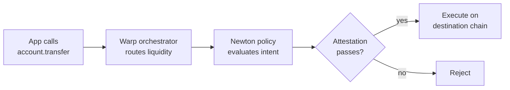

The Newton Smart Account SDK (`@newton-xyz/warp`) lets developers spin up ERC-7579 smart accounts that combine two capabilities into a single account:

1. **Newton-verified actions** — Every transaction the account submits is evaluated against your Newton policy client. The account cannot move funds unless the policy attestation passes.
2. **Chain-abstracted balances** — The account holds stablecoins (USDC, USDT) and native ETH, and can pay out on any supported chain regardless of where the liquidity sits. You don't have to bridge, swap, or pre-fund the destination chain.

The two features compose: a single `transfer()` call routes liquidity across chains *and* gates execution behind your Newton policy.

## Use Cases

**Compliance-gated payouts** — Issue a smart account to each user or counterparty. Write a Rego policy (using [Newton Verifiable Credentials](/developers/verified-credential/overview) or your own data oracles) that enforces who can be paid, how much, and under what conditions. Every `transfer()` is checked before settlement.

**Treasury / agent wallets with one balance, many chains** — Fund the account once in USDC on Base, then have it pay invoices in USDT on Ethereum or USDC on Optimism without managing per-chain balances. The SDK handles routing and bridging under the hood.

**AI agent accounts** — Give an agent a smart account whose policy constrains it (allow-listed counterparties, per-period spend caps, KYC checks on recipients). The agent gets one account it can spend from on any chain; you keep deterministic guardrails.

## How It Works

1. **Account creation** — `sdk.createAccount({ owner })` deploys (or addresses) an ERC-7579 smart account bound to your policy client contract. The `owner` is a developer-controlled signer (`viem` `Account`) that authorizes intents on the account's behalf.
2. **Transfer intent** — Calling `account.transfer({ to, amount, token, chain })` builds an intent, asks the Warp orchestrator to route liquidity from wherever the account holds balances to the destination chain, and submits the bundle to Newton for policy evaluation.
3. **Policy check** — Newton evaluates your Rego policy against the intent. If the policy passes, Newton issues an attestation that authorizes the smart account to execute.
4. **Settlement** — The account executes on the destination chain. `account.waitForExecution(result)` resolves once the transaction is mined.

## Requirements

| Requirement | Details |
|-------------|---------|
| **Newton API key** | [Create one in the dashboard](/developers/overview/dashboard-api-keys) |
| **Policy client contract** | An on-chain contract that inherits `NewtonPolicyClient` and is registered with `PolicyClientRegistry`. See [Smart Contract Integration](/developers/guides/smart-contract-integration). |
| **Owner signer** | A `viem` `Account` your app controls — typically backed by a server-side KMS, Turnkey, or similar. Treat this as a hot signer with policy-bounded blast radius. |
| **Node 20+** | The SDK targets modern Node and modern browsers. |

<Note>
The owner key is the signer — not the spending authority. What the account can do is bounded by your Newton policy, not by what the owner key could sign in isolation. That's the security model: the owner key signs intents, the policy decides which intents are valid.
</Note>

## Supported Networks

Testnet (set `isTestnet: true`):

| Chain | ID |
|-------|----|
| Sepolia | `11155111` |
| Base Sepolia | `84532` |

Mainnet support and the full mainnet chain list ship with the SDK — see [`mainnetChains`](/developers/smart-account/reference#exported-chains) in the reference.

## Supported Tokens

`USDC`, `USDT`, and native `ETH` on every supported chain. Amounts are passed as `bigint` in the token's smallest unit (use `viem`'s `parseUnits`).

## Next Steps

<CardGroup cols={2}>
  <Card icon="list-check" href="/developers/smart-account/integration-guide" title="Integration Guide">
    Build the demo end-to-end: install, create an account, send a cross-chain transfer
  </Card>
  <Card icon="code" href="/developers/smart-account/reference" title="SDK Reference">
    Full `NewtonAccountSDK` and `NewtonAccountInstance` API
  </Card>
  <Card icon="shield-check" href="/developers/verified-credential/overview" title="Verifiable Credentials">
    Pair Smart Accounts with KYC-aware policies
  </Card>
  <Card icon="brackets-curly" href="/developers/guides/writing-policies" title="Writing Policies">
    Author the Rego policy that gates account spending
  </Card>
</CardGroup>
