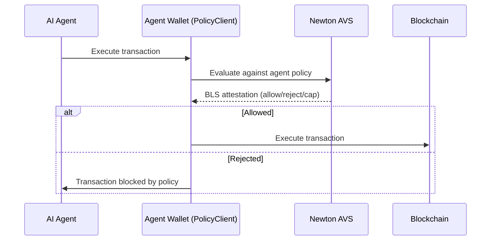

Autonomous AI agents that transact on-chain need guardrails. Without policy enforcement, a compromised or hallucinating agent can drain a wallet, interact with malicious contracts, or exceed its intended scope. Newton Protocol provides programmable, verifiable transaction authorization that runs before any agent-initiated transaction executes.

## The Problem

AI agents operating on-chain face unique risks:

- **Unbounded spending** — an agent with wallet access can send any amount to any address
- **Scope creep** — an agent authorized for one task (e.g., swap tokens) might attempt unrelated actions
- **No audit trail** — you cannot easily verify why an agent made a specific transaction
- **Prompt injection / manipulation** — adversarial inputs can cause agents to take unintended actions

Current approaches rely on either no guardrails (trusting the agent) or hardcoded allowlists in the wallet (inflexible and hard to update).

## How Newton Solves It

Newton evaluates every agent-initiated transaction against a policy before execution. The policy is a [Rego program](/developers/guides/writing-policies) that encodes your guardrails — what the agent can do, how much it can spend, and which contracts it can interact with.

### Per-Transaction Spending Limits

```rego
package newton

default allow = false

allow if {
    input.intent.value <= data.params.max_agent_spend
}

cap := data.params.max_agent_spend if {
    input.intent.value > data.params.max_agent_spend
}
```

### Contract Allowlists

Restrict the agent to interacting with approved contracts only:

```rego
package newton

default allow = false

allow if {
    input.intent.to == data.params.allowed_contracts[_]
}
```

### Function-Level Restrictions

Limit which contract functions the agent can call:

```rego
package newton

default allow = false

allow if {
    input.intent.functionSignature == data.params.allowed_functions[_]
    input.intent.to == data.params.allowed_contracts[_]
}
```

### Time-Based and Rate Limiting

Use a [WASM data oracle](/developers/guides/writing-data-oracles) to track recent agent activity and enforce rate limits:

```rego
package newton

default allow = false

allow if {
    data.data.transactions_last_hour < data.params.max_hourly_transactions
    data.data.spend_last_hour < data.params.max_hourly_spend
}
```

## Architecture for Agent Wallets



The agent wallet inherits from [NewtonPolicyClient](/developers/guides/smart-contract-integration). Every transaction the agent attempts must pass policy evaluation. The agent itself never has direct access to execute arbitrary transactions.

## Policy Patterns for AI Agents

| Pattern | What it enforces |
|---------|-----------------|
| Spending cap | Maximum value per transaction or per time window |
| Contract allowlist | Only interact with approved contract addresses |
| Function allowlist | Only call specific functions (e.g., `swap`, not `transferOwnership`) |
| Rate limiting | Maximum transactions per hour/day |
| Human approval threshold | Transactions above a value require off-chain human confirmation |
| Time windows | Agent can only transact during defined hours |
| Destination restrictions | Can only send funds to pre-approved addresses |

## Why Newton for Agent Security

| Approach | Limitation | Newton advantage |
|----------|-----------|-----------------|
| Hardcoded wallet allowlists | Inflexible, requires redeployment to change | Policies are updatable via IPFS — no contract redeploy |
| Off-chain policy server | Single point of failure, trust assumption | Decentralized evaluation with cryptographic attestations |
| No guardrails | Agent can do anything | Every action requires policy approval |
| Multisig approval | Slow, blocks autonomous operation | Policies evaluate in sub-seconds, no human in the loop (unless the policy requires it) |

## Get Started

<Card icon="rocket" href="/developers/overview/quickstart" title="Quickstart">
  Simulate your first policy evaluation in 5 minutes
</Card>
<Card icon="file-code" href="/developers/guides/writing-policies" title="Write Agent Policies">
  Author Rego rules for spending limits, allowlists, and rate limiting
</Card>
<Card icon="shield" href="/developers/guides/smart-contract-integration" title="Secure Your Agent Wallet">
  Add NewtonPolicyClient to your agent's smart contract wallet
</Card>
