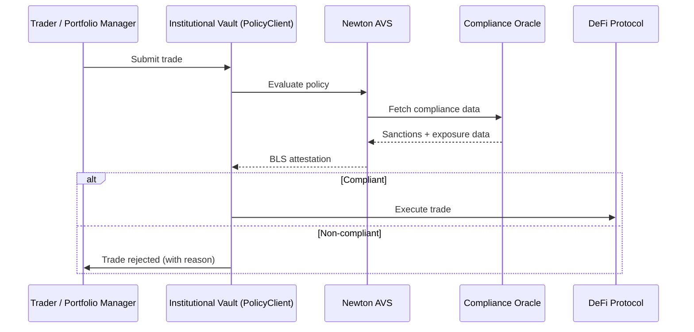

Institutional participants — asset managers, custodians, DAOs, and regulated funds — need compliance guardrails before they can deploy capital into DeFi. Newton Protocol provides programmable, verifiable policy enforcement at the transaction layer, enabling institutions to participate in DeFi without compromising on compliance or risk management.

## The Problem

Institutions face barriers that retail users do not:

- **Regulatory requirements** — mandated sanctions screening, transaction monitoring, and reporting
- **Risk controls** — exposure limits, counterparty restrictions, approved protocol lists
- **Audit requirements** — verifiable proof that every transaction was evaluated against compliance rules
- **Operational security** — multi-party authorization for large transactions, time-locked operations
- **Fiduciary duty** — fund managers must demonstrate that trades comply with investment mandates

Most DeFi protocols offer no compliance layer. Institutions either avoid DeFi entirely or build expensive, centralized middleware that creates single points of failure.

## How Newton Solves It

Newton inserts a policy evaluation step into every transaction. The policy is defined in [Rego](/developers/guides/writing-policies) and evaluated by a decentralized network of [EigenLayer operators](/developers/concepts/architecture). The result is a BLS attestation that proves the transaction was evaluated and approved.

### Exposure Limits

```rego
package newton

default allow = false

allow if {
    data.data.current_protocol_exposure + input.intent.value <= data.params.max_protocol_exposure
}
```

### Approved Protocol Lists

Restrict interactions to audited, approved DeFi protocols:

```rego
package newton

default allow = false

allow if {
    input.intent.to == data.params.approved_protocols[_]
}
```

### Transaction-Level Compliance

Combine sanctions screening, jurisdiction checks, and risk limits in a single policy:

```rego
package newton

default allow = false

allow if {
    not data.data.is_sanctioned
    data.data.jurisdiction_allowed
    input.intent.value <= data.params.single_transaction_limit
    data.data.daily_volume + input.intent.value <= data.params.daily_limit
}
```

## Architecture for Institutional Wallets



## Compliance Patterns

| Pattern | Institutional need |
|---------|-------------------|
| Sanctions screening | Regulatory mandate for all financial transactions |
| Exposure limits | Per-protocol, per-asset, and aggregate position limits |
| Approved protocol lists | Only interact with audited DeFi protocols |
| Daily/weekly volume caps | Risk management and regulatory reporting thresholds |
| Multi-party authorization | Large transactions require multiple signers |
| Time-locked operations | Withdrawals above threshold require a delay period |
| Investment mandate compliance | Fund trades must align with stated strategy |
| Counterparty restrictions | Restrict interactions to known, verified counterparties |

## Audit Trail

Every Newton policy evaluation produces an on-chain attestation — a BLS signature proving that the transaction was evaluated by the operator network and the result. This provides:

- **Verifiable compliance proof** for regulators and auditors
- **Immutable record** of every policy decision
- **Transparent rules** — policies are content-addressed on IPFS and can be audited independently

## Why Newton Over Centralized Compliance

| | Centralized middleware | Newton Protocol |
|---|---|---|
| Trust model | Trust the compliance vendor | Trust the math — cryptographic attestations |
| Availability | Single point of failure | Distributed EigenLayer operators |
| Auditability | Vendor-provided logs | On-chain attestations + IPFS-stored policies |
| Customization | Vendor-defined rules | Your own Rego policies |
| Latency | API round-trip | Sub-second (parallel evaluation) |
| Verifiability | "Trust us" | BLS proofs verifiable by anyone |

## Get Started

<Card icon="rocket" href="/developers/overview/quickstart" title="Quickstart">
  Simulate a compliance policy evaluation in 5 minutes
</Card>
<Card icon="file-code" href="/developers/guides/writing-policies" title="Write Compliance Policies">
  Author Rego rules for sanctions screening, exposure limits, and approved lists
</Card>
<Card icon="lock" href="/developers/concepts/privacy-layer" title="Privacy Layer">
  Evaluate policies on encrypted data for confidential transactions
</Card>
