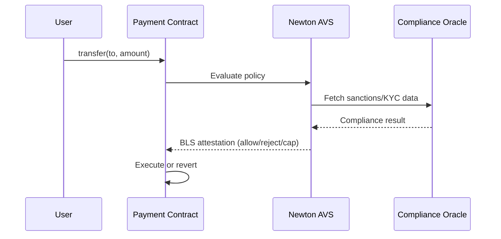

Stablecoin issuers, payment processors, and tokenized asset platforms need transaction-level compliance without sacrificing speed or decentralization. Newton Protocol provides programmable policy enforcement that runs at the transaction layer — every transfer can be evaluated against configurable rules before execution.

## The Problem

Payment and stablecoin protocols face competing demands:

- **Regulatory compliance** — sanctions screening, jurisdiction checks, transfer limits
- **Fraud prevention** — velocity checks, anomaly detection, blocklist enforcement
- **Speed** — sub-second authorization decisions, not batch review
- **Decentralization** — no single point of failure or censorship

Traditional approaches force a choice: either centralized compliance (a server that can block transfers) or no compliance at all. Newton removes this tradeoff by decentralizing the compliance decision.

## How Newton Solves It

Newton evaluates every transaction against a [Rego policy](/developers/guides/writing-policies) before it executes on-chain. The evaluation is performed by a decentralized network of [EigenLayer operators](/developers/concepts/architecture), and the result is cryptographically attested via BLS signatures.

### Sanctions Screening

A policy can call an external sanctions API via a [WASM data oracle](/developers/guides/writing-data-oracles) and block transfers involving sanctioned addresses:

```rego
package newton

default allow = false

allow if {
    not data.data.is_sanctioned_sender
    not data.data.is_sanctioned_recipient
}
```

### Transfer Limits

Enforce per-transaction or rolling-window spend limits without modifying your token contract:

```rego
package newton

default allow = false

allow if {
    input.intent.value <= data.params.max_transfer_amount
}

cap := data.params.max_transfer_amount if {
    input.intent.value > data.params.max_transfer_amount
}
```

### Jurisdiction Gating

Use oracle data to restrict transfers based on sender/recipient jurisdiction, enabling compliant cross-border payments.

## Use Cases

| Scenario | Policy approach |
|----------|----------------|
| Stablecoin issuer compliance | Sanctions screening + jurisdiction checks on every mint/transfer |
| Payment network authorization | Per-transaction limits + velocity checks + merchant allowlists |
| RWA token transfers | Accredited investor verification + transfer restrictions |
| Cross-border remittance | Country-level policy rules + amount thresholds |
| Card-to-crypto on-ramp | KYC status verification + daily limits |

## Architecture for Payment Protocols



The payment contract inherits from [NewtonPolicyClient](/developers/guides/smart-contract-integration), which validates the attestation before executing the transfer. No off-chain server sits in the critical path.

## Why Newton Over Centralized Compliance

| | Centralized server | Newton Protocol |
|---|---|---|
| Single point of failure | Yes | No — distributed operators |
| Censorship risk | Yes — operator can block arbitrarily | No — policy rules are transparent and auditable |
| Latency | Depends on server | Sub-second (parallel operator evaluation) |
| Auditability | Server logs (opaque) | On-chain attestations (verifiable) |
| Customization | Vendor-defined rules | Your own Rego policies |

## Get Started

<Card icon="rocket" href="/developers/overview/quickstart" title="Quickstart">
  Simulate a sanctions screening policy in 5 minutes
</Card>
<Card icon="file-code" href="/developers/guides/writing-policies" title="Write a Policy">
  Author Rego rules for transfer limits and compliance checks
</Card>
<Card icon="plug" href="/developers/guides/smart-contract-integration" title="Integrate Your Contract">
  Add NewtonPolicyClient to your payment or token contract
</Card>
