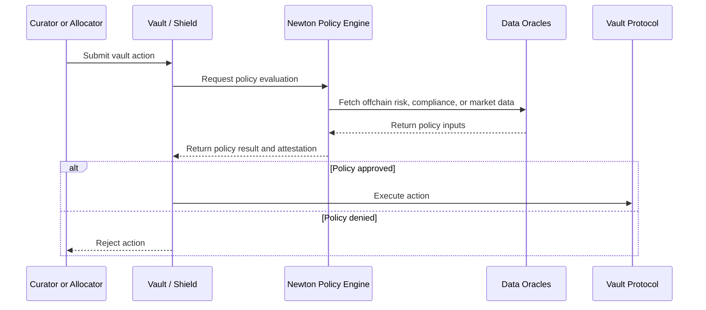

Vaults are DeFi primitives that let depositors place capital under a strategy managed by a curator, allocator, or automated system. They are increasingly used by institutions, exchanges, and DeFi applications to give users access to differentiated yield products without requiring every user to manage the strategy directly.

Newton adds a verifiable policy layer to vaults. Instead of relying only on trust in a curator, frontend checks, or static onchain limits, a vault can require policy approval before sensitive actions are executed.

## Why Vaults Need Policy Enforcement

Vault depositors trust that curators and allocators will make thoughtful decisions and will not misuse the authority granted to them. Existing vault infrastructure can restrict some operations onchain, but many risk decisions depend on changing offchain context:

- Is the depositor address associated with sanctions, exploits, or high-risk activity?
- Has a vault's APY, TVL, allocation, or risk score changed in a concerning way?
- Is an oracle feed stale or diverging from an expected reference?
- Does the action fit the vault's stated mandate and risk profile?

Without verifiable policy enforcement, these checks often live in dashboards, runbooks, or centralized services. That makes them easy to bypass, difficult to audit, and hard for depositors to rely on.

## How Newton Helps

Newton is a decentralized policy engine for transaction authorization. A vault action is represented as an intent, evaluated against a policy, and approved only when the Newton operator network returns a valid attestation.

This gives vault participants a stronger operating model:

- **Depositors** can see the rules that govern the vault and understand the risk controls before depositing.
- **Curators** can enforce their own mandates consistently, reducing operational mistakes across many vaults.
- **Institutions** can review verifiable guardrails and audit evidence before allocating capital.
- **Protocols** can expose higher-trust vault products without replacing their existing vault infrastructure.

## Common Vault Policy Areas

### Security

Security policies help prevent unsafe or unauthorized vault changes. They can restrict curator actions, check vault health, compare oracle feeds, and make sure decisions reflect the risk profile depositors agreed to up front.

### Compliance

Compliance policies help vaults control who can deposit and whether funds meet the vault's requirements. Policies can incorporate KYC status, sanctions screening, address reputation, and AML signals from external providers.

### Privacy

Privacy policies help curators protect sensitive curation decisions and proprietary strategy inputs. Newton's privacy layer can keep sensitive policy data away from public chain state while still producing an authorization result that a smart contract can enforce.

## Where Newton Fits

Newton does not replace the vault, the curator, or the DeFi protocol. It adds a policy enforcement layer between the requested action and execution.

For vaults, that layer can be used in two ways:

- **Policy data oracles** provide ready-made data inputs for vault risk, address screening, price divergence, and depositor reputation. See [Vault Policies](/developers/vaults/policies/overview).
- **Newton Shield SDK** is a coming-soon SDK for curator-facing vault integrations, starting with Morpho. See [Vault SDK](/developers/vaults/sdk/overview).

<Card title="Explore vault policies" icon="shield-check" href="/developers/vaults/policies/overview">
  Review the policy types Newton makes available for vault risk, compliance, and oracle checks.
</Card>

<Card title="Vault SDK" icon="package" href="/developers/vaults/sdk/overview">
  Learn about the coming-soon Newton Shield SDK for curator workflows.
</Card>
