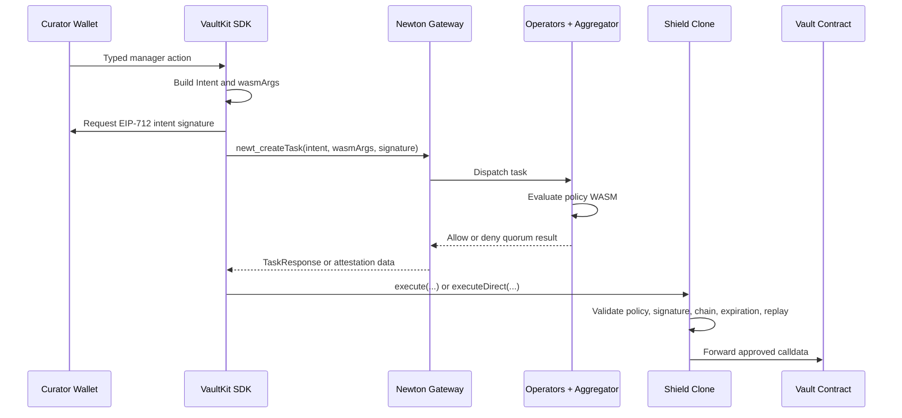

This is the lifecycle from "a curator wants to call `reallocate(...)`" to "the vault contract receives the call."

## 1. Intent Construction

The vendor module or `sendCall(...)` path produces calldata for the target vault action. The policy pack prepares `wasmArgs`. The SDK assembles an `Intent` that binds:

- The curator signer.
- The target contract.
- The calldata and value.
- The chain id.
- The human-readable function signature encoded as bytes.

The curator signs the intent with EIP-712. That signature lets operators and the Shield verify that the approved call originated from the expected curator address.

## 2. Task Submission

The SDK sends the signed intent, `wasmArgs`, and policy reference to Newton Gateway. The gateway returns a task id and coordinates policy evaluation.

## 3. Operator Evaluation

Operators load the policy WASM and evaluate it against:

- The intent.
- The Shield's current policy params.
- The per-call `wasmArgs`.
- Any allowed external data or encrypted secrets the pack needs.

If the policy denies, the SDK raises `PolicyDeniedError`. The Shield never receives a valid approval for that action.

## 4. Attestation Commit

In standard mode, the aggregator commits the quorum response through the AVS task manager. The SDK then calls `Shield.execute(attestation)`.

In direct mode, the SDK receives the raw `Task`, `TaskResponse`, and signature data, then calls `Shield.executeDirect(...)`. Direct mode avoids waiting for aggregator commit but costs more gas because the Shield verifies signatures inline.

## 5. Onchain Validation and Forwarding

The Shield validates:

- The attestation policy id matches the Shield's current policy id.
- The intent `from` matches the caller.
- The intent chain id matches `block.chainid`.
- The task is approved, unexpired, and not already spent.
- The BLS quorum is valid, either through the task manager or inline direct validation.

If validation passes, the Shield forwards `intent.data` and `intent.value` to `intent.to`. If the vault reverts, the Shield bubbles the target revert reason where possible.

## Replay, Expiration, and Freshness

Task ids are one-shot. Reusing the same attestation reverts. Attestations also expire after their configured block window.

Freshness comes from the policy pack. Packs commonly include hashes or snapshots in `wasmArgs`, then deny if chain state or external data moved beyond the accepted window during evaluation.

## Standard vs Direct

| Trait | Standard `execute` | Direct `executeDirect` |
| --- | --- | --- |
| Aggregator commit | Required | Skipped |
| BLS verification | AVS task manager | Inline in Shield |
| Gas | Lower | Higher |
| Latency | Higher | Lower |
| SDK argument | `shield.sendCall(args, 'ATTESTATION')` | `shield.sendCall(args, 'DIRECT')` |
