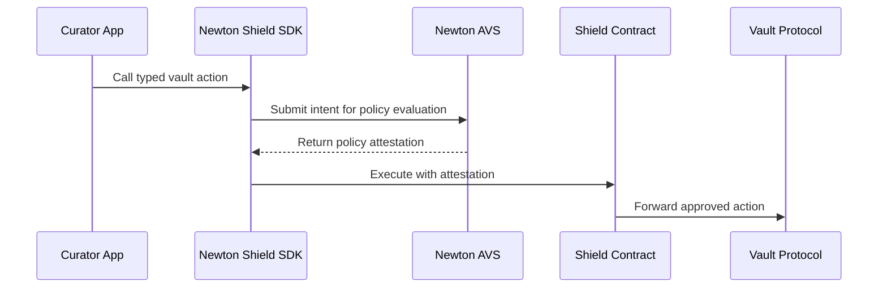

<Note>
  The Newton Shield SDK is coming soon. The API described here is the target shape for the pre-release SDK and may change before general availability.
</Note>

The Newton Shield SDK is a TypeScript SDK for vault curators. It wraps vault-management actions behind Newton policy attestations so the curator's manager role cannot execute actions that violate the configured policy.

The first target integration is Morpho. Curators continue using the vendor SDK they already know, such as `@morpho-org/blue-sdk-viem`, while Newton Shield handles policy evaluation and onchain enforcement.

## What It Does

Newton Shield turns a vault action into this flow:

## Target Capabilities

- **Create or attach to a Shield:** `createShield({ owner, vault, pack, params })` predicts a deterministic Shield address for a curator and vault, attaches to an existing Shield when parameters match, or deploys one when needed.
- **Typed vault actions:** The Shield runtime exposes vendor-specific methods such as `shield.morpho.reallocate(...)` and `shield.morpho.setCap(...)`.
- **Policy packs:** Open-source policy packs are available in [newt-foundation/newton-policy-packs](https://github.com/newt-foundation/newton-policy-packs) and are exposed as subpath imports like `@newton-xyz/newton-shield-sdk/packs/<name>` with typed parameters and helper queries.
- **Guarded escape hatch:** `shield.guardedCall({ to, data, functionSignature, wasmArgs })` supports vendors or actions that do not yet have a first-class module.
- **Typed errors:** The SDK is expected to expose errors such as `PolicyDeniedError`, `AttestationTimeoutError`, `ShieldExecutionError`, `ParamMismatchError`, `GatewayError`, and `UnsupportedChainError`.
- **Browser-safe core:** The target SDK avoids `node:*` imports in the core package.

<Card title="Integration Guide" icon="code" href="/developers/vaults/sdk/integration-guide">
  See how a Morpho curator integration would use Newton Shield.
</Card>

<Card title="Reference" icon="book-open" href="/developers/vaults/sdk/reference">
  Review the target API surface, chains, errors, and package structure.
</Card>
