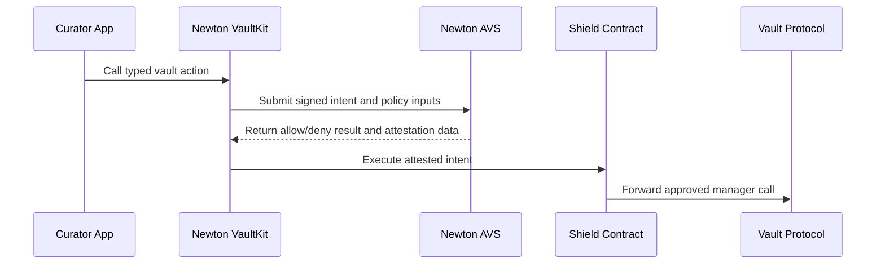

Newton VaultKit is a TypeScript SDK and companion Solidity contract system for vault curators. It routes manager actions through a Newton Policy Protocol attestation gate before the underlying vault receives the call.

Curators continue using the vault SDKs and contracts they already know. VaultKit adds a Shield clone between the curator and the vault, packages each action as an exact `Intent`, asks Newton operators to evaluate that intent against the configured policy, and forwards the action only when a valid attestation is available.

## What It Does

VaultKit turns a vault action into this flow:

## Core Pieces

- **Shield clones:** One audited implementation per chain, with deterministic per-curator clones deployed through `ShieldFactory`.
- **Policy packs:** Typed wrappers around Newton policy templates. Packs validate params, prepare `wasmArgs`, and expose per-pack helpers.
- **Vendor modules:** Typed wrappers for vault-manager actions, starting with Morpho. Vendor modules produce the calldata that the Shield forwards after policy approval.
- **Generic calls:** `shield.sendCall(...)` supports protocols and manager actions without a first-class vendor module.
- **Typed errors:** SDK failures map to stable error classes such as `PolicyDeniedError`, `AttestationTimeoutError`, `ShieldExecutionError`, `ParamMismatchError`, `GatewayError`, and `UnsupportedChainError`.
- **Browser-safe core:** The main package avoids `node:*` imports. Vendor modules may inherit constraints from the vendor SDKs they wrap.

## Manager Actions Only

VaultKit is for privileged vault operations such as reallocations, cap changes, and other curator or manager calls. End-user deposits and withdrawals still flow through the vault protocol's normal UX unless the vault deliberately routes those actions through a Shield.

## How to Read This Section

- Start with [Getting Started](/developers/vaults/sdk/integration-guide) to install packages, create clients, configure a Shield, and run a policy-gated action.
- Use [Morpho](/developers/vaults/sdk/morpho) for MetaMorpho curator setup, composite policy choices, and `reallocate` role requirements.
- Read [Concepts](/developers/vaults/sdk/concepts) if you want the mental model for `createShield`, packs, vendor modules, and `sendCall`.
- Use [Examples](/developers/vaults/sdk/examples) for copyable integration patterns.
- Keep [Reference](/developers/vaults/sdk/reference) nearby for parameters, return values, supported chains, and exported errors.

<Card title="Integration Guide" icon="code" href="/developers/vaults/sdk/integration-guide">
  Install VaultKit and run a policy-gated vault action.
</Card>

<Card title="Morpho" icon="blocks" href="/developers/vaults/sdk/morpho">
  Gate MetaMorpho curator actions with a Newton Shield.
</Card>

<Card title="Concepts" icon="book-open" href="/developers/vaults/sdk/concepts">
  Understand Shield clients, policy packs, vendor modules, and generic calls.
</Card>

<Card title="Reference" icon="book-open" href="/developers/vaults/sdk/reference">
  Review the API surface, chains, errors, and package structure.
</Card>
