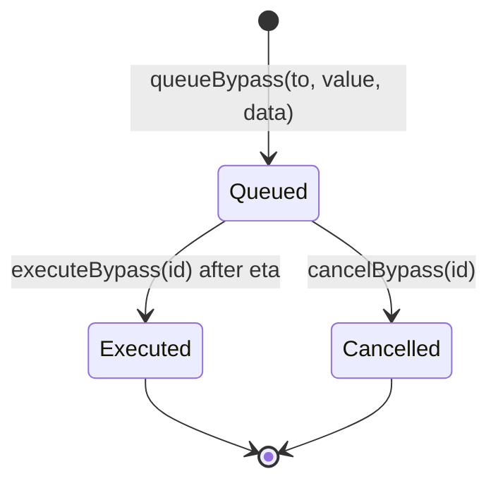

Shield supports three execution paths: standard attested execution, direct attested execution, and owner bypass.

## Standard Execution

Standard mode uses `Shield.execute(attestation)`.

1. The SDK submits a task to Newton Gateway.
2. Operators evaluate the policy.
3. The aggregator commits the approved task response through the AVS task manager.
4. The SDK calls `Shield.execute(attestation)`.
5. Shield validates the attestation through the task manager.
6. Shield forwards the approved calldata to the vault.

Standard mode is lower gas because BLS verification happens through the AVS task manager, but it waits for the aggregator commit.

## Direct Execution

Direct mode uses `Shield.executeDirect(task, taskResponse, signatureData)`.

1. The SDK submits a task to Newton Gateway.
2. Operators evaluate the policy.
3. The SDK receives the raw task response and BLS signature data.
4. The SDK calls `Shield.executeDirect(...)`.
5. Shield verifies the signatures inline.
6. Shield forwards the approved calldata to the vault.

Direct mode can reduce end-to-end wait time, but costs more gas.

## Execution Comparison

| Trait | Standard | Direct |
| --- | --- | --- |
| Method | `execute(attestation)` | `executeDirect(task, taskResponse, signatureData)` |
| Aggregator commit | Required | Not required |
| BLS verification | AVS task manager | Shield contract |
| Gas | Lower | Higher |
| Latency | Higher | Lower |
| Best for | Routine curator actions | Latency-sensitive actions |

## Bypass Timelock

Bypass is an owner-only recovery path for protocol outages or emergency operations. It does not require a Newton attestation, so it is deliberately delayed and observable.

The bypass id is derived from the target, value, data, nonce, and Shield address. Identical calls queued twice receive different ids because the nonce advances.

## Bypass Rules

- Only the Shield owner can queue, execute, or cancel bypasses.
- The minimum bypass delay is one day.
- `executeBypass` deletes the entry before making the outbound call.
- Cancelled and executed ids cannot be reused.
- All bypass state changes emit events for monitoring.

Bypass is not a normal operating path. It exists so a curator can recover from policy infrastructure outages without hiding the action from depositors.
