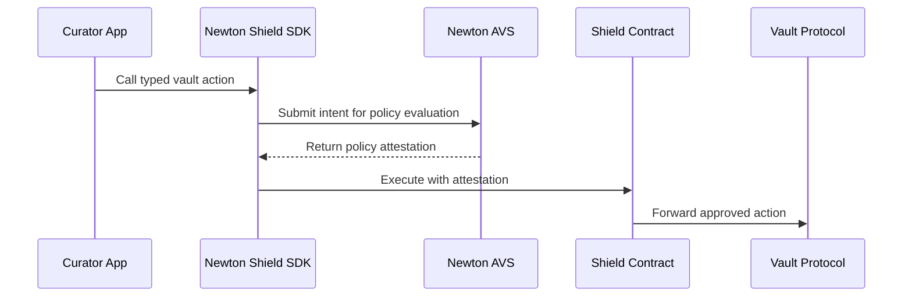

<Note>
  The Newton Shield SDK is coming soon. The API described here is the target shape for the pre-release SDK and may change before general availability.
</Note>

The Newton Shield SDK is a TypeScript SDK for vault curators. It wraps vault-management actions behind Newton policy attestations so the curator's manager role cannot execute actions that violate the configured policy.

The first target integration is Morpho. Curators continue using the vendor SDK they already know, such as `@morpho-org/blue-sdk-viem`, while Newton Shield handles policy evaluation and onchain enforcement.

## What It Does

Newton Shield turns a vault action into this flow:



## Target Capabilities

- **Create or attach to a Shield:** `createShield({ owner, vault, pack, params })` predicts a deterministic Shield address for a curator and vault, attaches to an existing Shield when parameters match, or deploys one when needed.
- **Typed vault actions:** The Shield runtime exposes vendor-specific methods such as `shield.morpho.reallocate(...)` and `shield.morpho.setCap(...)`.
- **Policy packs:** Policy packs are exposed as subpath imports like `@newton-xyz/newton-shield-sdk/packs/<name>` with typed parameters and helper queries.
- **Guarded escape hatch:** `shield.guardedCall({ to, data, functionSignature, wasmArgs })` supports vendors or actions that do not yet have a first-class module.
- **Typed errors:** The SDK is expected to expose errors such as `PolicyDeniedError`, `AttestationTimeoutError`, `ShieldExecutionError`, `ParamMismatchError`, `GatewayError`, and `UnsupportedChainError`.
- **Browser-safe core:** The target SDK avoids `node:*` imports in the core package.

## Supported Chains

The target pre-release supports:

| Chain | Chain ID |
| --- | --- |
| Ethereum | `1` |
| Base | `8453` |
| Sepolia | `11155111` |
| Base Sepolia | `84532` |

Calling `createShield` on an unsupported chain is expected to fail before sending a transaction.

## Installation Preview

When available, the package is expected to install with:

```bash
pnpm add @newton-xyz/newton-shield-sdk viem zod
```

`viem` and `zod` are peer dependencies. Vendor SDKs, such as `@morpho-org/blue-sdk-viem`, are also peer dependencies so applications only install the vault integrations they use.

## Morpho Integration Example

The Shield SDK is designed to sit beside the Morpho SDK rather than replace it. Your app prepares the same typed vault-management action it would normally send through Morpho, then routes execution through a Shield that requires a Newton attestation.

```typescript
import { createWalletClient, http, parseUnits } from 'viem'
import { base } from 'viem/chains'
import { privateKeyToAccount } from 'viem/accounts'
import { createShield } from '@newton-xyz/newton-shield-sdk'
import { vaultRiskPack } from '@newton-xyz/newton-shield-sdk/packs/vault-risk'
import { morpho } from '@newton-xyz/newton-shield-sdk/vendors/morpho'

const account = privateKeyToAccount(process.env.CURATOR_PRIVATE_KEY as `0x${string}`)

const walletClient = createWalletClient({
  account,
  chain: base,
  transport: http(process.env.BASE_RPC_URL),
})

const shield = await createShield({
  owner: account.address,
  vault: '0xVaultAddress',
  pack: vaultRiskPack,
  params: {
    vaultsFyi: {
      network: 'base',
      riskScoreFloor: 70,
      tvlDrawdown24hMaxPct: 10,
      tvlDrawdown7dMaxPct: 20,
      denyOnCriticalFlag: true,
    },
    oracleDivergence: {
      maxFeedAgeSeconds: 300,
      warnBp: 50,
      denyBp: 100,
    },
  },
  walletClient,
}).extend(morpho())

await shield.morpho.setCap({
  marketId: '0xMorphoMarketId',
  cap: parseUnits('5000000', 6),
  wasmArgs: {
    vaultAddress: '0xVaultAddress',
    network: 'base',
    symbol: 'USDC',
    rpcUrl: process.env.BASE_RPC_URL,
  },
})
```

In this example, `setCap` is only forwarded to Morpho if Newton approves the intent. If the Vaults.fyi or oracle-divergence checks fail, the SDK raises a typed policy error instead of sending the vault-management transaction.

## How This Relates to Vault Policies

Vault policies define whether an action is allowed. The Shield SDK is the curator-facing integration layer that makes those policies harder to bypass during normal vault operations.

For example:

- A curator calls a typed Morpho vault action.
- The SDK submits the action intent to Newton.
- Newton evaluates the configured policy and returns an attestation only if the action is allowed.
- The Shield contract forwards the action to the vault protocol only when the attestation is valid.

<Card title="Vault Policies" icon="shield-check" href="/developers/vaults/policies">
  Review the policy types that can protect vault operations.
</Card>

<Card title="Newton SDK Reference" icon="book-open" href="/developers/reference/sdk-reference">
  See the current Newton SDK APIs for policy evaluation and task handling.
</Card>
