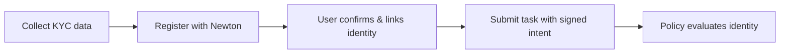

Newton Verifiable Credential (Newton VC) lets developers bring user identity data into Newton policies. Instead of managing identity checks separately, you can write Rego policies that enforce KYC requirements—like age, country, or approval status—as part of the same policy evaluation that governs your transactions.

## Use Cases

**Use case A — Use your own KYC data**

Developers collect KYC data from users via a third-party vendor and register it with Newton. Policies can then enforce compliance requirements based on that data (e.g., only allow transactions from users aged 18+ in approved countries).

**Use case B — Use another developer's KYC data**

Developers can leverage KYC data collected by another developer in a privacy-preserving manner. You can ensure that a user's identity meets your policy requirements without ever seeing the underlying personal data.

## How It Works

At a high level, Newton VC follows this flow:

1. **Collect** — Your app collects KYC data from users via a third-party vendor.
2. **Register** — You call the Newton SDK to register the KYC data for the user, scoped to your identity domain.
3. **Link** — The user confirms the link between their identity and your policy client contract.
4. **Submit** — Your app submits a task with a signed intent. Newton evaluates the Rego policy, which checks identity data using built-in functions.

## Policy Client Requirements

Your policy client contract must:
- Inherit from both `NewtonPolicyClient` and `EIP712`
- Be registered with the `PolicyClientRegistry`
- Set policy params with your identity domain: `{"identity_domain": "<keccak256 of your domain string>"}`

The `identity_domain` value is the `keccak256` hash of your domain string (e.g., `keccak256(bytes("my.dev.domain.co"))`), encoded as a `bytes32` hex string.

## Next Steps

<CardGroup cols={2}>
  <Card icon="list-check" href="/developers/verified-credential/integration-guide" title="Integration Guide">
    Step-by-step walkthrough for integrating Newton VC into your app
  </Card>
  <Card icon="code" href="/developers/verified-credential/reference" title="SDK & Contract Reference">
    SDK methods and contract function signatures
  </Card>
  <Card icon="brackets-curly" href="/developers/verified-credential/identity-policy-reference" title="Identity Policy Reference">
    Built-in Rego functions for writing identity-aware policies
  </Card>
  <Card icon="map" href="/developers/reference/contract-addresses" title="Contract Addresses">
    IdentityRegistry and other deployed contract addresses
  </Card>
</CardGroup>
