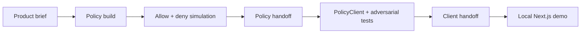

import { Card,Tabs,Tab } from 'vocs'


# Build with an Agent [Use Newton Agent Skills to create, test, and optionally deploy a policy, PolicyClient, and local application from a product brief.]

Newton Agent Skills give coding agents a versioned workflow for building with Newton. Start from a plain-language brief, validate the policy and contract locally, and decide later whether to deploy or submit a live transaction.

:::warning
Newton Agent Skills are under active dogfood testing. Review generated code and report friction instead of silently working around it.
:::

## What do you want to build?

| Goal | Skill | Result |
|---|---|---|
| Create or test policy logic | `newton-policy` | Rego, WASM, schemas, allow/deny simulations, and `policy-handoff.json` |
| Protect a Solidity action | `newton-policy-client` | A `NewtonPolicyClient` integration, adversarial Foundry tests, and `client-handoff.json` |
| Build an end-to-end local demo | `newton-demo` | Policy, PolicyClient, handoff files, and a local Next.js application |

`newton-demo` coordinates the other two skills. Use it when your brief includes a policy, contract, and user interface.

## Step 1 — Install the skills

Clone the public skills repository:

```bash
git clone https://github.com/newt-foundation/newton-agent-skills.git
cd newton-agent-skills
```

<Tabs>
  <Tab title="Cursor or Codex">
    Create the local discovery link, then open the repository as your agent workspace:

    ```bash
    mkdir -p .agents
    ln -sfn ../skills .agents/skills
    ```

    To use the skills in an existing project, copy or link the required skill folders into that project's `.agents/skills/` or `.cursor/skills/` directory.
  </Tab>
  <Tab title="Claude Code">
    Copy the skill folders into the project or user-level Claude skills directory:

    ```bash
    mkdir -p .claude/skills
    cp -R skills/newton-policy skills/newton-policy-client skills/newton-demo .claude/skills/
    ```
  </Tab>
  <Tab title="Other agents">
    Copy the required folders under `skills/` into the Agent Skills directory supported by your coding agent. Each folder is self-contained and begins with a `SKILL.md` file.
  </Tab>
</Tabs>

Install and verify `newton-cli` before policy work:

```bash
curl -L cli.newton.xyz | sh
newtup
newton-cli doctor
```

Local scaffold, build, and policy simulation do not require dashboard login, a wallet, or deployment credentials.

## Step 2 — Write a brief

Give the agent the decisions that define the integration. Include:

- What must be allowed and denied
- The protected action and its arguments
- The target chain and downstream contract or token, when known
- Who signs the intent and later calls the PolicyClient
- Whether you want only a policy, a Solidity integration, or a local UI
- Whether deployment, gateway evaluation, or live transactions are in scope

Use this template:

```text
Use newton-demo to build a local Newton demo.

Policy:
- Allow when: <conditions>
- Deny when: <conditions>
- Configurable parameters: <values>
- External data or secrets: <requirements, or none>

Protected action:
- Chain: <chain and chain ID>
- Target: <contract/token address, or not known yet>
- Function: <function and arguments>
- intent.from / msg.sender: <who signs and submits>

Scope:
- Build and test locally first.
- Run at least one allow and one deny policy simulation.
- Run adversarial Foundry tests before any deployment.
- Do not deploy, call the gateway, submit a transaction, or host the app
  until I explicitly approve that checkpoint.
- Use credentials already configured on this machine. Never ask me to paste
  private keys, API keys, JWTs, or RPC credentials into chat.
```

If a policy rule, chain, target, or protected action is missing, the agent should ask instead of inventing it.

## Step 3 — Review the local result

The agent works locally before requesting live access:



The handoff files make the workflow resumable:

| File | Purpose |
|---|---|
| `policy-handoff.json` | Records chain, intent encoding, policy inputs, and deployed addresses when available |
| `client-handoff.json` | Records the protected function, PolicyClient wiring, ownership, and frontend inputs |
| `demo-config.json` | Configures the generated UI without embedding credentials |

Review the agent's reported paths, allow/deny results, Foundry test results, and any unresolved questions. A partial handoff may contain `null` addresses before deployment; that is expected.

## Step 4 — Approve live operations separately

The agent must stop before each operation that changes external state:

1. Uploading or deploying a policy
2. Deploying or wiring a PolicyClient
3. Transferring PolicyClient ownership
4. Uploading policy secrets
5. Calling the gateway for a live evaluation
6. Sending the first attested application transaction
7. Hosting the generated application

Provide credentials outside chat through the process environment or `~/.newton/.env`. The generated Next.js app is the exception: it reads `NEWTON_API_KEY` from its gitignored `.env.local` on the server. Never use `NEXT_PUBLIC_NEWTON_API_KEY`.

:::note
The user's browser wallet signs the EIP-712 intent. The generated server Route Handler calls `evaluateIntentDirect` with `NEWTON_API_KEY`; it does not need the user's private key.
:::

## Step 5 — Resume instead of starting over

When continuing later, point the agent at the handoff files:

```text
Resume this Newton integration. Read the existing policy-handoff.json and
client-handoff.json as the source of truth. Do not redeploy completed pieces.
Continue locally and stop before the next live checkpoint.
```

<Card icon="github" to="https://github.com/newt-foundation/newton-agent-skills" title="Newton Agent Skills">
  Browse the skills, templates, sample briefs, and current preview status
</Card>

<Card icon="book" to="/developers/guides/integration-guide" title="Manual Integration Guide">
  Understand each policy, contract, and frontend step in detail
</Card>
