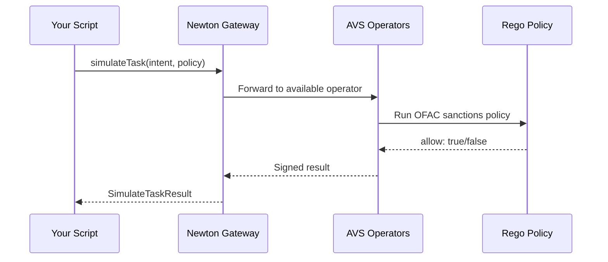

import { Card } from 'vocs'


# Quickstart [Simulate your first Newton Protocol policy evaluation in 5 minutes using the TypeScript SDK. OFAC sanctions screening example with step-by-step setup.]

Simulate a policy evaluation in under 5 minutes. The example policy performs **OFAC sanctions screening** — checking a transaction sender against a sanctions list before allowing it to proceed. No smart contract deployment required.

## Prerequisites

| Requirement        | How to get it                                                                                                           |
| ------------------ | ----------------------------------------------------------------------------------------------------------------------- |
| **Node.js \>= 20** | [nodejs.org](https://nodejs.org/)                                                                                       |
| **Newton API key** | [Dashboard](/developers/overview/dashboard-api-keys) or email [support@newton.xyz](mailto:support@newton.xyz) |

:::note
This quickstart uses `simulateTask` — a dry run that does not submit anything on-chain. No Sepolia ETH or wallet needed.
:::

## Step 1 — Install

:::code-group
```bash [pnpm (recommended)]
mkdir newton-quickstart && cd newton-quickstart
pnpm init
pnpm add @newton-xyz/sdk viem
```


```bash [npm]
mkdir newton-quickstart && cd newton-quickstart
npm init -y
npm install @newton-xyz/sdk viem
```


```bash [yarn]
mkdir newton-quickstart && cd newton-quickstart
yarn init -y
yarn add @newton-xyz/sdk viem
```
:::

## Step 2 — Run a simulation

Create `quickstart.ts` and paste:

```ts twoslash
import { createPublicClient, createWalletClient, http } from 'viem';
import { privateKeyToAccount } from 'viem/accounts'
import { sepolia } from 'viem/chains';
import {
  newtonPublicClientActions,
  newtonWalletClientActions,
} from '@newton-xyz/sdk';
declare const process: { env: { NEWTON_API_KEY?: string } };
// ---cut---
const API_KEY = process.env.NEWTON_API_KEY;
if (!API_KEY) throw new Error('NEWTON_API_KEY is required');
const RPC_URL = 'https://eth-sepolia.g.alchemy.com/v2/demo';

// Public client — read-only operations (poll for task responses, read policy state)
const publicClient = createPublicClient({
  chain: sepolia,
  transport: http(RPC_URL),
}).extend(newtonPublicClientActions());

// Wallet client — write operations (submit tasks, run simulations)
const walletClient = createWalletClient({
  account: privateKeyToAccount('0x' + '1'.repeat(64) as `0x${string}`),
  chain: sepolia,
  transport: http(RPC_URL),
}).extend(
  newtonWalletClientActions({
    apiKey: API_KEY,
  })
);

async function main() {
  // Simulate OFAC sanctions screening on a transaction.
  // No on-chain transaction occurs — this is a dry run.
  const result = await walletClient.simulateTask({
    intent: {
      from: '0xf39Fd6e51aad88F6F4ce6aB8827279cffFb92266',   // sender to check against sanctions list
      to: '0xb1aD5f82407bC0f19f42b2614fb9083035a36b69',     // downstream target evaluated by the policy
      value: '0x0',                                           // no ETH value
      data: '0xa9059cbb000000000000000000000000e42e3458283032c669c98e0d8f883a92fc64fe220000000000000000000000000000000000000000000000000000000000000001' as `0x${string}`,  // transfer(recipient, 1)
      chainId: 11155111,                                      // Sepolia
      functionSignature: '0x66756e6374696f6e207472616e73666572286164647265737320726563697069656e742c2075696e7432353620616d6f756e7429' as `0x${string}`, // function transfer(address recipient, uint256 amount)
    },
    policyTaskData: {
      // Pre-deployed OFAC sanctions policy — you can use this for testing
      policyId: '0x27b7c88f256114a1fc9924953fbbad4d6db50f141978fd7b5766d456eecd1626' as `0x${string}`,
      policyAddress: '0x5FeaeBfB4439F3516c74939A9D04e95AFE82C4ae',
      policy: '0x',
      policyData: [
        {
          wasmArgs: '0x7b22626173655f73796d626f6c223a22425443227d' as `0x${string}`, // {"base_symbol":"BTC"}
          data: '0x',
          policyDataAddress: '0x30E545603d6205B6887BAb0C1a630aa383d71e07', // sanctions list oracle
          expireBlock: 0,
        },
      ],
    },
  });

  console.log('Simulation result:', {
    success: result.success,
    allowed: result.result?.allow,
    reason: result.result?.reason,
    error: result.error,
  });
}

main().catch(console.error);
```

Run it:

```bash
NEWTON_API_KEY=your_key_here npx tsx quickstart.ts
```

## Step 3 — Understand the response

The simulation returns a `SimulateTaskResult`:

| Field           | Type      | Description                                     |
| --------------- | --------- | ----------------------------------------------- |
| `success`       | `boolean` | Whether the evaluation completed without errors |
| `result.allow`  | `boolean` | Whether the policy approved the intent          |
| `result.reason` | `string`  | Human-readable explanation                      |
| `error`         | `string`  | Error message if evaluation failed              |

A successful response:

```json
{
  "success": true,
  "result": {
    "allow": true,
    "reason": "Policy conditions met"
  },
  "error": null
}
```

## Step 4 — What just happened?



Your script submitted an [Intent](/developers/overview/core-concepts#intent) to the Newton [Gateway](/developers/overview/core-concepts#gateway), where an [Operator](/developers/overview/core-concepts#operator) ran the OFAC sanctions [Rego policy](/developers/overview/core-concepts#policy) with a [PolicyData](/developers/overview/core-concepts#policydata) oracle and returned an allow/deny result. This was a **simulation** — no on-chain transaction occurred.

In production, the same flow produces a [**BLS attestation**](/developers/overview/core-concepts#attestation) that your smart contract verifies on-chain before executing the transaction.

## Next steps

<Card icon="book" to="/developers/guides/integration-guide" title="Integration Guide">
  Build and deploy a full Newton integration — policy, contract, and frontend
</Card>

<Card icon="terminal" to="/developers/overview/agent-quickstart" title="Build with an Agent">
  Turn a product brief into a locally tested policy, PolicyClient, and optional Next.js demo
</Card>

<Card icon="lightbulb" to="/developers/overview/core-concepts" title="Core Concepts">
  Understand policies, intents, tasks, and attestations
</Card>

<Card icon="code" to="/developers/reference/sdk-reference" title="SDK Reference">
  Full TypeScript SDK documentation
</Card>

<Card icon="play" to="https://demo.newton.xyz/" title="Try the demo">
  See a live sanctions-checked transfer app built with the Newton SDK
</Card>
