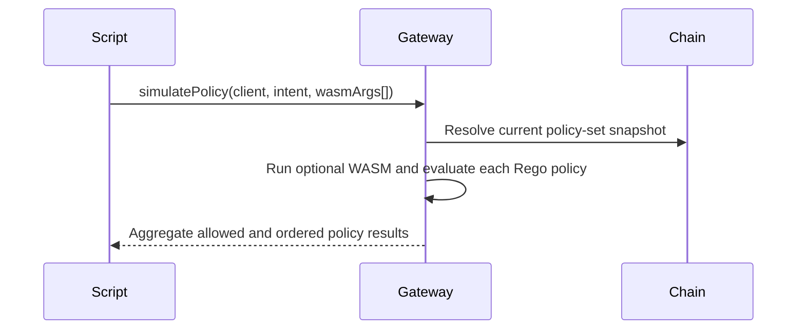

import { Card } from 'vocs'


# Quickstart [Simulate a configured Newton policy set with the TypeScript SDK.]

Evaluate a configured policy set and inspect the aggregate decision and each policy result. This example uses two pure-Rego policies; no funded signer is needed for simulation.

## Prerequisites

- Node.js 20 or later and a Newton API key associated with the configured client’s owner (or explicitly authorized for the gateway’s read-only admin bypass).
- A policy-set-capable client configured with two pure-Rego policies on Sepolia. Obtain a test client from your team or follow [Smart Contract Integration](/developers/guides/smart-contract-integration).
- An intent fixture accepted by those policies. The sample below is a zero-value, empty-calldata intent; use the exact function encoding for your application.

## Install

```bash
npm install @newton-xyz/sdk viem
npm install --save-dev tsx
```

## Simulate

Save as `quickstart.ts`. Supply `NEWTON_API_KEY` and `POLICY_CLIENT` in your process environment; keep the API key on the server or in this local script.

```typescript
import { createWalletClient, http, isAddress } from 'viem';
import { generatePrivateKey, privateKeyToAccount } from 'viem/accounts';
import { sepolia } from 'viem/chains';
import { newtonWalletClientActions } from '@newton-xyz/sdk';

const apiKey = process.env.NEWTON_API_KEY;
const policyClient = process.env.POLICY_CLIENT;
if (!apiKey || !policyClient || !isAddress(policyClient)) {
  throw new Error('Set NEWTON_API_KEY and a valid POLICY_CLIENT');
}

// Simulation only: this account is never funded and sends no transaction.
const account = privateKeyToAccount(generatePrivateKey());
const client = createWalletClient({ account, chain: sepolia, transport: http() })
  .extend(newtonWalletClientActions({ apiKey }));

async function main() {
  const result = await client.simulatePolicy({
    policyClient: policyClient as `0x${string}`,
    chainId: sepolia.id,
    intent: {
      from: account.address,
      to: policyClient as `0x${string}`,
      value: '0x0', data: '0x',
      chainId: sepolia.id, functionSignature: '0x',
    },
    wasmArgs: ['0x', '0x'],
  });
  if (!result.success) throw new Error(result.error ?? 'Simulation failed');
  console.log('Policy set:', result.policy_id, 'Allowed:', result.allowed);
  for (const policy of result.policies ?? []) {
    console.log(policy.policy_index, policy.policy, policy.allowed, policy.result);
  }
}
main().catch(console.error);
```

```bash
npx tsx quickstart.ts
```

## Understand the result

`success` reports whether simulation completed. `allowed` is true only when every policy allows. `policies` retains set order and exposes each policy's index, address, result, verdict, and expiration window. A denial is a completed evaluation, not a transport error.


```mermaid
sequenceDiagram
    participant Script
    participant Gateway
    participant Chain
    Script->>Gateway: simulatePolicy(client, intent, wasmArgs[])
    Gateway->>Chain: Resolve current policy-set snapshot
    Gateway->>Gateway: Run optional WASM and evaluate each Rego policy
    Gateway-->>Script: Aggregate allowed and ordered policy results
```

Simulation produces no BLS signatures and sends no application transaction. For live authorization, sign the exact intent, call `evaluateIntentDirect`, and validate the returned task and attestation in your contract before executing. See [Frontend SDK Integration](/developers/guides/frontend-sdk-integration).

SDK v1.2.2's `simulateTask` wrapper still targets the old gateway schema; use `simulatePolicy` as shown here. See [RPC API](/developers/reference/rpc-api#newt_simulatetask) for the provided-output alternative.
