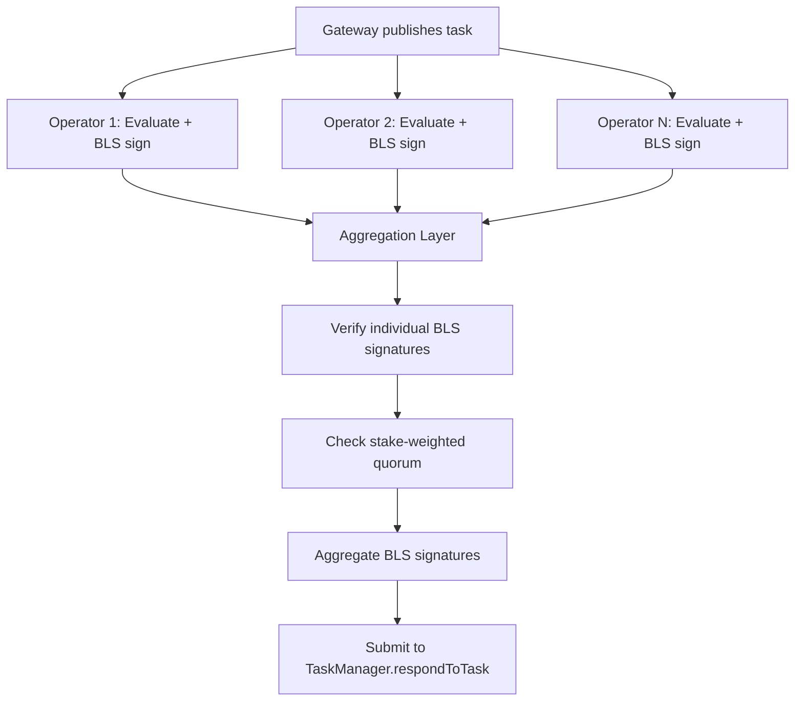

## BLS Attestation Protocol

Newton Protocol uses two complementary signature schemes: BLS (Boneh-Lynn-Shacham) signatures for aggregatable operator consensus, and ECDSA signatures for individual data attestations. The combination provides both compact multi-party proofs and individually attributable data provenance.

### BLS Signature Scheme

Newton uses BLS signatures on the BN254 (alt_bn128) elliptic curve, chosen for its compatibility with Ethereum's precompiled contracts at addresses 0x06 (EIP-196: addition and scalar multiplication) and 0x08 (EIP-197: pairing check). Operators hold BLS private keys and register their corresponding public keys in the BLS APK registry contract.

The curve provides two groups: G1 (signatures, 32 bytes compressed) and G2 (public keys, 64 bytes compressed). The bilinear pairing function `e: G1 x G2 -> GT` enables signature aggregation: given individual signatures `sigma_1, ..., sigma_n` over the same message, the aggregate signature `sigma = sigma_1 + ... + sigma_n` can be verified against the aggregate public key `apk = pk_1 + ... + pk_n` with a single pairing check.

The on-chain verification equation is:

```
e(sigma, -G2) * e(H(m), apkG2) == 1
```

Where `sigma` is the aggregated BLS signature (G1 point), `G2` is the generator of the G2 group, `H(m)` is the message hash mapped to G1 (the consensus digest), and `apkG2` is the aggregated public key in G2 queried from the BLS APK registry at the task's reference block.

For multi-quorum verification, a gamma randomization factor prevents rogue public key attacks:

```
e(sigma + gamma * apk, -G2) * e(H(m) + gamma * G1, apkG2) == 1
```

The gamma factor binds each quorum's signature to its public key, preventing an attacker from choosing a rogue public key that cancels another operator's key during aggregation.

### Two-Digest System

BLS signature aggregation requires all operators to sign the exact same message. However, operators independently generate unique ECDSA attestations over the policy data they fetched (each operator signs with their own ECDSA key, producing a different signature). This creates a fundamental conflict: the task response includes attestation fields that differ per operator, so the hash of the full response differs.

The Two-Digest System resolves this by computing two distinct digests from the same task response:

| Digest Type      | Computation           | Attestation Fields       | Used For                                  |
|------------------|-----------------------|--------------------------|-------------------------------------------|
| Consensus Digest | Consensus digest hash | Zeroed out (empty bytes) | BLS signing and on-chain BLS verification |
| Full Digest      | Full digest hash      | Included                 | Contract storage, challenge verification  |

**Consensus digest computation** (implemented in both the off-chain service layer and the on-chain contract library):

1. Clone the task response.
2. For each policy data entry, set the attestation field to empty bytes.
3. ABI-encode the modified response.
4. Compute keccak256 over the encoded bytes.

Because all operators zero out attestations before hashing, they all produce the same consensus digest regardless of their individual ECDSA signatures. This enables BLS aggregation while preserving the full attestation data in the actual response for challenge verification.

The verification flow on-chain proceeds through a middleware chain: the TaskManager delegates to a response handler, which computes the consensus digest and passes it to the BLS signature checker for pairing verification.

### BLS Aggregation Algorithm

The aggregation process proceeds as follows:



1. **Individual verification.** Each operator's BLS signature is verified against their registered public key before being accepted for aggregation. This prevents rogue key attacks where a malicious operator submits a crafted signature.

2. **Quorum check.** The aggregator computes the total stake of signing operators and compares it against the per-task quorum threshold percentage (0-100). The quorum check is: `signed_stake >= total_stake * quorum_threshold / 100`. The aggregator returns early once quorum is met to minimize latency.

3. **Signature aggregation.** Once quorum is reached, the BLS aggregation layer produces the aggregate signature along with non-signer stakes and signature data needed for on-chain verification.

The protocol selects a reference block for aggregate public key lookups that ensures validity at on-chain verification time.

### ECDSA Attestations

Each operator produces an ECDSA attestation over the policy data it fetched, providing individually attributable proof of data provenance. The attestation message hash is:

```
message_hash = keccak256(abi.encodePacked(
    policy_data_bytes,
    policy_data_address,
    expire_block,
    wasm_cid,
    args_cid
))
```

The operator signs this hash with its ECDSA private key (secp256k1). The resulting signature is included in the attestation field of the policy task data. On-chain, the TaskManager validates these attestation signatures during response submission, ensuring that the policy data was genuinely fetched and attested by registered operators.
