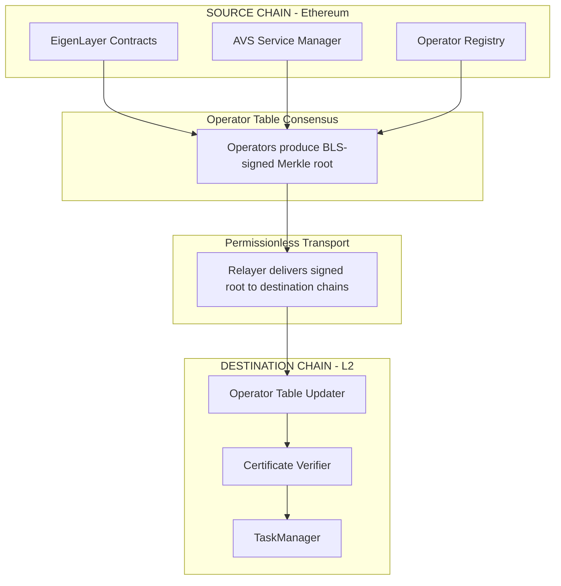

## Cross-Chain Interoperability

### Source and Destination Chain Model

Newton Protocol supports cross-chain authorization through a source chain / destination chain architecture compliant with EigenLayer's ELIP-008 specification:

| Chain Type        | Role                                                                        | Examples                                 |
|-------------------|-----------------------------------------------------------------------------|------------------------------------------|
| Source Chain      | Operator registration, BLS key management, staking, slashing via EigenLayer | Ethereum mainnet (1), Sepolia (11155111) |
| Destination Chain | Task execution, policy evaluation, transaction authorization                | Arbitrum, Optimism, Polygon, Base        |

The source chain is always an EigenLayer-supported chain (Ethereum mainnet or Sepolia). Operators register once on the source chain, and their registration data (BLS public keys, stake amounts, operator set membership) is synchronized to destination chains through Newton's consensus-based operator table synchronization protocol.

### Operator Table Synchronization

Newton uses a decentralized, consensus-based mechanism to synchronize operator set state from the source chain to destination chains. The protocol separates two concerns:

- **Slow path (operator table updates).** When operator membership changes on the source chain — registration, deregistration, stake updates, or slashing events — Newton operators collectively produce a BLS-signed Merkle root of the current operator table. This signed root serves as a portable, cryptographically verifiable snapshot of the operator set at a specific block height.
- **Fast path (task certificate verification).** Destination chains verify individual task certificates against the already-synchronized operator table. This is frequent and cheap — a single BLS pairing check against the stored aggregate public key.

The synchronization flow proceeds as follows:

**Operator Table Updater.** The on-chain contract on each destination chain that receives and verifies BLS-signed operator table roots. It validates the aggregate signature against the previously known operator set (bootstrapped during initial deployment) and updates the local operator table. Anyone can submit a valid signed root — the transport layer is permissionless and requires no trusted intermediary.

**Certificate Verifier.** The single integration point for applications on destination chains. When a task is completed and a BLS certificate is produced, the Certificate Verifier checks the aggregate signature against the operator table snapshot at the reference block height. It supports both proportion-based thresholds (e.g., >66% of stake signed) and nominal thresholds (e.g., absolute stake amount).

**Staleness protection.** Each operator set has a configurable maximum staleness period. If the operator table has not been updated within this period, the Certificate Verifier rejects new certificates until a fresh update is delivered. This ensures destination chains do not operate on stale operator sets that may include deregistered or slashed operators.

### Operator Table Calculator

Each destination chain maintains an operator table: a mapping of operator IDs to BLS public keys and stake weights. The table calculator contract computes and stores aggregate public keys per quorum, enabling efficient BLS verification without per-operator key lookups. When an operator table update arrives (via a BLS-signed Merkle root), the calculator processes the delta — adding newly registered operators, removing deregistered ones, and updating stake weights. The aggregate public key is recomputed to reflect the current set.

This design decouples destination chains from live source chain connectivity. Once an operator table is synchronized, destination chains can independently verify task certificates until the next table update is required.

### Cross-Chain BLS Verification

On source chains, BLS verification queries the BLS APK registry directly for operator public keys at the specified reference block.

On destination chains, a BN254 certificate verification path is used instead. The BN254 certificate contains the aggregated BLS signature and the quorum APK snapshot from the source chain. This allows destination chains to verify BLS signatures without maintaining a live connection to the source chain's registry.

Both paths share common verification logic for consensus digest computation and signature validation, ensuring consistent behavior across chain types.

### EIP-712 BN254Certificate

Cross-chain BLS verification uses EIP-712 typed structured data for certificate encoding. The certificate binds the operator set snapshot (quorum APK, total stake, non-signer information) to a specific source chain and block number, preventing cross-chain replay of certificates. The reference timestamp in each certificate must correspond to an actual recorded operator table update, ensuring certificates are always verified against a known-good snapshot of the operator set — not the current state, which may have changed since the task was created.

### Security Model

The cross-chain synchronization protocol inherits its security from the same BLS-attested consensus used for task verification:

- **Economic security.** Operators who sign an incorrect operator table root (e.g., omitting a registered operator or including a deregistered one) are subject to the same slashing conditions as operators who sign incorrect task responses. The cost of producing a fraudulent operator table update equals the cost of corrupting a quorum of the operator set.
- **Liveness.** Operator table updates require a quorum of operators to sign. If fewer than the quorum threshold are online, updates stall but existing destination chain operations continue using the last valid operator table until the staleness period expires.
- **ZK verification path.** As an alternative to BLS-signed roots, Newton's architecture supports a future transition to zero-knowledge proofs of operator set state transitions. A ZK proof that the source chain's operator registry transitioned from state A to state B can be verified on any destination chain with a single proof verification, achieving 1-of-N honest relayer liveness with full cryptographic security — eliminating the need for a quorum of operator signatures during table updates.
