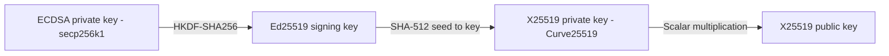
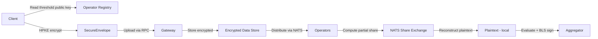

## Privacy Architecture

Newton Protocol provides a layered privacy architecture that protects sensitive policy inputs (identity data, financial records, compliance credentials) from exposure at every stage — transport, storage, and evaluation. The architecture is designed around three progressive layers: threshold HPKE decryption where operators collectively decrypt data without any single entity holding the complete key (standard mode), multi-party computation (MPC) for privacy-preserving policy evaluation where operators evaluate policies over secret-shared data without any individual operator learning the inputs (advanced mode), and a future path to fully homomorphic encryption (FHE) where operators evaluate policies directly over encrypted data without decryption at any stage. Individual operator keys for peer-to-peer communication are derived deterministically from existing ECDSA keys, while the system's threshold decryption key is produced by an interactive Distributed Key Generation (DKG) protocol that runs during operator set changes.

### HPKE Ciphersuite

The encryption layer uses Hybrid Public Key Encryption as specified in RFC 9180, operating in Base mode with the following ciphersuite:

| Component | Algorithm          | Specification                                  |
|-----------|--------------------|------------------------------------------------|
| KEM       | X25519-HKDF-SHA256 | Diffie-Hellman key encapsulation on Curve25519 |
| KDF       | HKDF-SHA256        | HMAC-based key derivation                      |
| AEAD      | ChaCha20-Poly1305  | Authenticated encryption with 256-bit key      |

**Design rationale.** HPKE provides a standardized KEM/KDF/AEAD composition with formal security proofs (the HPKE standard has been mechanically verified), native support for authenticated associated data (critical for policy-context binding), and a KEM-agnostic design that enables post-quantum migration by replacing X25519 with ML-KEM without changing the protocol structure.

Each encryption operation generates a fresh ephemeral keypair, providing per-message forward secrecy. Compromise of the recipient's long-term private key does not retroactively compromise past messages encrypted with different ephemeral keys.

### Key Derivation Chain

The privacy layer uses two types of HPKE keys: **individual operator keys** derived deterministically from existing ECDSA operator keys (used for peer-to-peer encrypted messaging such as threshold share exchange), and a **system threshold key** produced by an interactive DKG protocol (used by clients for encrypting privacy data). The individual key derivation chain proceeds through three stages:



**Stage 1: ECDSA to Ed25519.** The 32-byte ECDSA private key (secp256k1) is used as input key material to HKDF-SHA256. The salt is the fixed string `newton-privacy-ed25519`. The HKDF expand step produces a 32-byte output key material that serves as the Ed25519 seed. This derivation is deterministic: the same ECDSA key always produces the same Ed25519 key.

**Stage 2: Ed25519 to X25519.** The Ed25519 seed is hashed with SHA-512. The first 32 bytes of the SHA-512 output become the X25519 private key (static secret). This follows the standard Ed25519-to-X25519 conversion used in libsodium and other implementations.

**Stage 3: X25519 to public key.** The X25519 public key is computed via scalar multiplication of the private key against the Curve25519 base point. This public key is the HPKE recipient key that clients encrypt to.

Each operator derives its individual HPKE keypair from its ECDSA key at startup using a unified derivation function that composes all three stages. These individual keys are used for operator identification and direct encrypted messaging (e.g., threshold share exchange between peers). During operator registration, each operator registers its individual X25519 public key on-chain in the operator registry — alongside its BLS public key, stake, and quorum membership.

**Threshold key generation (DKG).** The system's combined HPKE public key — the key that clients encrypt to — is NOT derived from individual operator keys. Instead, it is produced by an interactive Distributed Key Generation (DKG) protocol run whenever the operator set changes (registration, deregistration, or stake updates). The DKG protocol (based on FROST DKG or Pedersen VSS) proceeds in two rounds:

1. **Commitment round.** Each operator generates a random polynomial of degree t-1 and broadcasts commitments (Feldman VSS commitments on Curve25519) to all other operators via NATS.
2. **Share distribution round.** Each operator evaluates its polynomial at each peer's index and sends the resulting share to that peer via encrypted NATS messages. Each operator verifies received shares against the published commitments.

The protocol produces: (a) a combined X25519 public key that is the sum of all operators' commitment constant terms, and (b) a private key share for each operator that is the sum of all shares received at its index. The combined public key is stored on-chain in a single storage slot on the operator registry contract. Clients read this combined key with a single contract call — no client-side aggregation is needed.

This DKG approach provides **key independence**: the threshold private key shares are cryptographically unrelated to operators' ECDSA or BLS keys. Compromise of an operator's ECDSA key does not compromise their threshold decryption share, and vice versa. The DKG ceremony is infrequent (only triggered by operator set changes) and does not affect task evaluation latency. Resharing protocols (proactive secret sharing) enable operator rotation without changing the combined public key, ensuring that clients' previously encrypted data remains decryptable by the updated operator set.

Decryption requires cooperation from at least t operators (where t matches the BLS quorum threshold), and no single entity — including the gateway — ever holds the complete private key.

### Newton Privacy Envelope (NPE) and AAD Binding

The combination of HPKE encryption with Ed25519 dual-signature authorization forms Newton's core privacy primitive: the **Newton Privacy Envelope (NPE)**. The NPE composes authenticated encryption (HPKE) with explicit authorization signatures (Ed25519) to ensure that encrypted data can only be accessed when both the user and the application have cryptographically consented to a specific policy evaluation context.

Encrypted data is transported in a SecureEnvelope structure — the on-the-wire representation of an NPE — that bundles the HPKE ciphertext with the metadata required for decryption and policy binding:

| Field              | Type                | Size                               | Encoding           | Description                                                    |
|--------------------|---------------------|------------------------------------|--------------------|----------------------------------------------------------------|
| `enc`              | hex string          | 32 bytes                           | Hex (64 chars)     | HPKE encapsulated key (X25519 ephemeral public key)            |
| `ciphertext`       | hex string          | Variable (msg + 16 bytes AEAD tag) | Hex                | HPKE ciphertext including ChaCha20-Poly1305 authentication tag |
| `policy_client`    | 0x-prefixed address | 20 bytes                           | EIP-55 checksummed | Ethereum address of the policy client contract                 |
| `chain_id`         | u64                 | 8 bytes                            | Decimal string     | Chain ID for context binding                                   |
| `recipient_pubkey` | hex string          | 32 bytes                           | Hex (64 chars)     | Recipient Ed25519 public key (for sender verification)         |

For the complete binary wire format specification with byte offsets and serialization rules, see [Appendix A](/whitepaper/references#appendix-a-newton-privacy-envelope-wire-format).

The additional authenticated data (AAD) is computed as:

```
AAD = keccak256(abi.encodePacked(policy_client_bytes, chain_id_be_bytes))
```

This AAD binding serves a critical security function: it cryptographically ties the ciphertext to a specific policy client on a specific chain. If an attacker attempts to replay a SecureEnvelope against a different policy client or chain, the AAD mismatch causes the ChaCha20-Poly1305 authentication check to fail, and decryption is rejected. The seal operation computes AAD automatically during encryption, and the open operation recomputes it from the stored `policy_client` and `chain_id` fields during decryption.

### Dual-Signature Authorization

Task creation with encrypted data references requires dual Ed25519 signatures to prevent unauthorized use of encrypted data across policy contexts.

**User signature.** The user signs a message binding their identity to the specific data references and intent:

```
user_message = keccak256(abi.encodePacked(policy_client, intent_hash, ref_id_1, ref_id_2, ...))
```

The user produces an Ed25519 signature over this digest using their derived Ed25519 signing key.

**Application signature.** The application signs a message that chains the user's authorization:

```
app_message = keccak256(abi.encodePacked(policy_client, intent_hash, user_signature))
```

The application produces an Ed25519 signature over this digest, creating a chain of authorization: the application attests that it received and verified the user's consent for this specific intent and data reference combination. Both signatures must verify against their respective Ed25519 public keys for the gateway to proceed with task creation.

This dual-signature scheme prevents several attack vectors: a compromised application key cannot fabricate user consent, a compromised user key cannot authorize data access without a valid application context, and neither signature can be replayed across different policy clients or intents because the `policy_client` and `intent_hash` are bound into both signing messages.

### Privacy Data Flow

The complete privacy data flow from client encryption through operator evaluation proceeds as follows:



The client reads the system's combined X25519 public key from the on-chain operator registry with a single contract call. This combined key is the output of the DKG protocol ([Key Derivation Chain](#key-derivation-chain)) — it corresponds to a threshold keypair distributed across the operator set, and no single entity holds the complete private key. The client encrypts sensitive data into one or more SecureEnvelopes using this combined key and uploads them. Each upload returns a reference UUID. At task creation time, the client includes these reference UUIDs along with dual-signature authorization.

The gateway distributes the encrypted envelopes to operators as part of the task payload via NATS. Each operator computes a partial decryption share using its DKG-produced share of the threshold private key, and publishes the partial share to the recipient operators via NATS operator-specific subjects (`newton.operators.{operator_id}.shares.{task_id}`). Shares are encrypted end-to-end to the recipient operator's individual X25519 public key (derived from their ECDSA key per the [Key Derivation Chain](#key-derivation-chain)) before publishing, ensuring that the NATS broker — and the current gateway operator — sees only ciphertext. Once an operator collects t partial shares from peers (where t is the threshold matching the BLS quorum requirement), it reconstructs the plaintext locally and evaluates the policy over the decrypted data. No single operator, and no central entity including the gateway, ever holds the complete decryption key. The verdict is then BLS-signed and aggregated as in the standard task flow.

### Multi-Party Computation for Policy Evaluation

Newton's privacy architecture provides two layers of privacy-preserving evaluation, each offering progressively stronger guarantees:

**Layer 1: Threshold Decryption (Standard).** The standard privacy mode described in [Privacy Data Flow](#privacy-data-flow). Operators collectively decrypt the HPKE-encrypted inputs using threshold decryption, evaluate the Rego policy locally over the plaintext, and BLS-sign the result. Each operator sees the decrypted data during evaluation but cannot decrypt it alone — cooperation from at least t operators is required. This provides strong protection against external adversaries and minority operator collusion, while keeping the evaluation model simple: standard Rego policies execute over plaintext data, and the existing two-phase consensus protocol ([Streaming Consensus Protocol](/whitepaper/streaming-consensus)) applies without modification.

**Layer 2: Secure Function Evaluation (Advanced).** For workloads requiring that no individual operator learns the underlying data — even during evaluation — Newton supports a full MPC evaluation mode. In this mode, operators execute the policy evaluation circuit over secret-shared data using a multi-party computation protocol. For Newton's policy workloads — primarily boolean logic, threshold comparisons, and set membership tests — the computation decomposes into arithmetic and boolean circuits that honest-majority MPC protocols handle efficiently. Recent three-party honest-majority protocols achieve throughput exceeding one billion 32-bit multiplications per second in LAN settings and maintain practical performance in WAN environments with asymmetric latency, where only one inter-party link is latency-critical during the online phase. The MPC protocol produces a single policy result (authorized/denied) that all honest operators agree on. Each operator then BLS-signs this result as in the standard attestation flow. The MPC evaluation is transparent to both the client (which sees the same HPKE encryption interface) and the smart contract layer (which sees the same BLS-attested response format).

**Collusion resistance.** Both layers depend on the honest-majority assumption: at least t of the n operators must be non-colluding. In Layer 1, collusion of t operators could reconstruct decrypted data. In Layer 2, collusion of t operators could reconstruct secret shares. EigenLayer's restaking mechanism provides the economic enforcement — corrupting t operators requires risking their combined staked capital, which is subject to slashing. The cost of collusion scales linearly with the total stake delegated to the operator set, creating an economic barrier proportional to the value of the data being protected. Applications choose the appropriate layer based on their data sensitivity requirements: Layer 1 for most compliance workloads (sanctions screening, KYC verification), Layer 2 for high-sensitivity data (medical records, financial portfolios, sealed-bid auctions).

### Research Horizon: Fully Homomorphic Evaluation

Newton's long-term privacy research tracks Fully Homomorphic Encryption (FHE) — the ability to evaluate arbitrary functions over ciphertexts without any decryption, even distributed decryption via MPC. Gentry's 2009 construction proved this is theoretically possible via a bootstrapping technique that refreshes noise accumulated during homomorphic operations, enabling unbounded-depth computation over encrypted data.

**Threshold FHE (ThFHE).** The most relevant construction for Newton is Threshold FHE, where a t-of-n threshold decryption key would be distributed across operators. The evaluation would proceed as follows:

1. **Encryption.** The client encrypts policy inputs under the system's combined FHE public key, producing an FHE ciphertext.
2. **Homomorphic evaluation.** Operators evaluate the policy circuit directly over the FHE ciphertext. All operators process the same encrypted data — no secret sharing or inter-operator communication is needed during evaluation.
3. **Partial decryption.** Each operator computes a partial decryption share of the result ciphertext. Each share is a noise-masked intermediate value that reveals nothing about the plaintext by itself.
4. **Threshold reconstruction.** Any t partial decryption shares are combined to recover the policy verdict. Only the final boolean result (authorized/denied) emerges in the clear — the underlying data remains encrypted throughout.

**Current limitations.** FHE evaluation remains approximately 1,000-1,000,000x slower than plaintext computation depending on circuit complexity. For Newton's policy workloads — boolean logic and threshold comparisons rather than floating-point arithmetic — the overhead is at the lower end of this range, but production-grade ThFHE for general policy evaluation remains a multi-year research effort. The protocol architecture is designed so that a future transition from MPC-based to FHE-based evaluation would be transparent to clients, policy authors, and the smart contract layer: the same HPKE-encrypted inputs, the same Rego policies, the same BLS-attested outputs.
