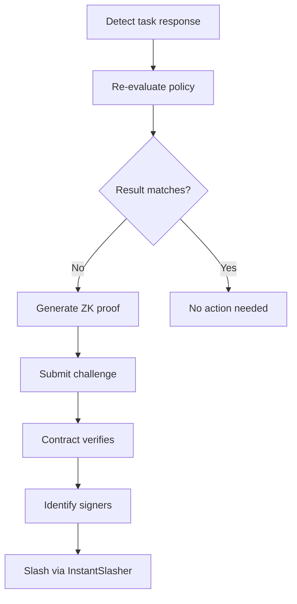

## Slashing and Challenge Mechanism

### Economic Deterrent

Newton's slashing mechanism creates an economic cost for incorrect attestations. The slashing amount is a governance-configurable percentage of the operator's staked ETH/LST (reference default: 10%).

Slashing is executed through EigenLayer's instant slashing mechanism, which immediately reduces the operator's stake in the delegation manager. The severity of the penalty is calibrated to be high enough to deter rational economic actors from producing false attestations while remaining proportional to a single offense.

### Challenge Window

The challenge window is the period during which any party can dispute a task response. The window is governance-configurable (reference default: 100 blocks, approximately 20 minutes on Ethereum mainnet). The window begins when the task response is recorded on-chain and ends at the response block plus the configured challenge window length.

Tasks can be evaluated and used as soon as the attestation is available. The challenge window provides a dispute period during which incorrect attestations can be challenged and slashed, but it does not block task consumption.

### ZK Proof Generation

When a challenger detects a discrepancy between the on-chain response and their independent evaluation, they generate a zero-knowledge proof using zero-knowledge virtual machines. The proof circuit is the complete Newton Rego evaluation engine compiled to a RISC-V target — a full policy interpreter, not a bespoke per-policy circuit. This means any policy written in Rego is automatically ZK-provable without specialized circuit engineering. The compiled engine:

1. Takes as public inputs: the task, the task response (including policy task data), and the expected evaluation result.
2. Re-evaluates the Rego policy against the policy task data contained in the response.
3. Produces a proof that the correct evaluation result differs from the on-chain response.

The circuit does not re-verify ECDSA attestations (that is handled on-chain by the TaskManager). It focuses solely on proving that the policy evaluation was incorrect given the attested inputs.

### Challenge Verification Flow

The challenge resolution function on the TaskManager:

1. Validates the challenge is within the challenge window.
2. Verifies the ZK proof against the configured verifier.
3. Confirms that the proven result differs from the stored response.
4. Identifies which operators signed the incorrect response using the aggregate signature data.
5. Executes slashing through EigenLayer's instant slashing mechanism.

### Direct Attestation Challenge Path

Newton supports an optimistic direct attestation path where policy clients validate attestations before the regular on-chain flow completes. This introduces a separate challenge vector:

1. The client validates the attestation directly on the TaskManager, which verifies the BLS signature and stores task and response hashes.
2. The regular path (task creation and response) completes asynchronously.
3. If the direct path hashes differ from the regular path hashes, any party can challenge the mismatch.
4. The function compares both hash sets, re-verifies signatures, slashes signing operators (on source chains where the BLS APK registry is available), and invalidates the direct attestation.

A spent sentinel value prevents double-spending: once an attestation is consumed via either the regular or direct flow, the sentinel is written to the attestation expiration mapping, and any subsequent attempt to use the same attestation reverts.
