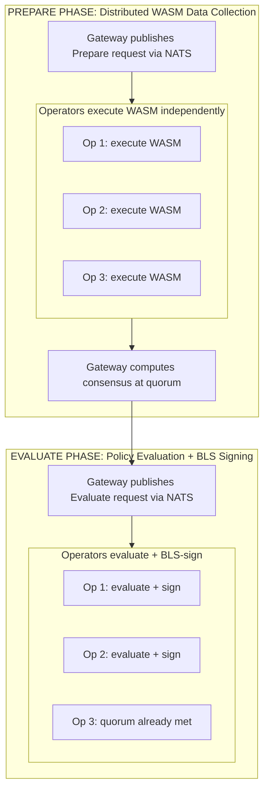

## Streaming Consensus Protocol

### Problem Statement

When operators independently fetch time-sensitive data from external sources (price feeds, sanctions lists, risk scores), they may receive different values due to timing differences, API response variability, or data source updates between requests. Since BLS signature aggregation requires all operators to sign the identical message, even minor numeric discrepancies in policy task data produce different consensus digests, causing aggregation to fail.

### Protocol Architecture

Newton solves this through a streaming two-phase consensus protocol built on NATS messaging. The protocol separates data collection (Prepare phase) from policy evaluation and BLS signing (Evaluate phase), using pipelined streaming to minimize end-to-end latency. Although the Evaluate phase performs two logical steps — policy evaluation and BLS signing — these execute atomically within a single NATS round-trip: each operator evaluates the policy, immediately signs the result, and streams the signed response back to the gateway.



The protocol achieves low latency through three key properties:

- **Non-blocking fan-out.** The gateway publishes a single NATS message that reaches all subscribed operators simultaneously, rather than making sequential per-operator requests.
- **Streaming response collection.** Operator responses are processed individually as they arrive over the NATS subscription, not collected in batch.
- **Early quorum exit.** Quorum is checked on every incoming Evaluate response. The moment the stake-weighted threshold is met, the protocol completes without waiting for remaining operators.

**Pipelining.** Operators that complete the Prepare phase first begin the Evaluate phase immediately upon receiving the consensus data, while slower operators are still completing their Prepare phase work. This pipelining eliminates sequential gaps between phases and reduces end-to-end latency to approximately the time of the slowest operator needed for quorum, rather than the slowest operator in the set.

### Prepare Phase: Distributed WASM Data Collection

The gateway publishes a Prepare request to the NATS task subject for the relevant chain. All operators subscribed to that chain's task subject receive the request simultaneously. Each operator independently executes the WASM data provider — the "policy data WASM" — in its own sandboxed Wasmtime environment ([WASM-Sandboxed Data Providers](/whitepaper/policy-engine#wasm-sandboxed-data-providers)), fetches external data from the configured data sources, and publishes a Prepare response to the task-specific response subject containing:

- The generated policy task data with ECDSA attestation
- A hash of the data for quick comparison
- A timestamp for freshness verification

This distributed WASM execution is a foundational property of Newton's decentralized architecture: every operator in the active validator set independently runs the data provider, ensuring that no single entity controls the inputs to policy evaluation. Each operator fetches data from external sources (sanctions feeds, oracle prices, risk scores) through its own network path, producing independent attestations over the data it observed. This redundancy provides both fault tolerance (no single data source failure blocks the protocol) and tamper resistance (manipulating the data input requires compromising a quorum of independent data paths).

Prepare phase responses are unsigned (no BLS signature). Operators do not evaluate the Rego policy during this phase; they only fetch and attest data. Responses stream back to the gateway as each operator completes, enabling the gateway to begin consensus computation as soon as a quorum of responses has arrived.

### Consensus Computation

The gateway applies median-based normalization to produce a single canonical dataset from the Prepare phase responses:

1. **Early consensus check.** If all operator responses contain identical policy task data, the gateway skips median computation entirely and uses the common data as-is. This avoids unnecessary processing for deterministic data sources.

2. **Numeric field extraction.** The gateway parses each operator's policy data JSON and extracts all numeric fields (integers and floating-point values) by path.

3. **Median computation.** For each numeric field across all operator responses, the gateway computes the median value. The median is chosen over the mean because it is robust to outliers: a single operator returning an anomalous value does not skew the result.

4. **Tolerance verification.** Each operator's value is checked to ensure it falls within a configurable tolerance of the computed median. Values outside tolerance are rejected. This prevents operators with stale or manipulated data from influencing the consensus dataset.

5. **Normalization.** All operator responses are normalized to use the median values, producing a canonical policy task dataset that all operators will use in the Evaluate phase.

| Parameter           | Reference Default | Description                                    |
|---------------------|-------------------|------------------------------------------------|
| Tolerance threshold | 10%               | Maximum deviation from median before rejection |

### Evaluate Phase: Policy Evaluation and BLS Signing

The gateway publishes an Evaluate request to the NATS task subject with the consensus policy task data, the policy configuration fetched from on-chain, the original intent, and the task's reference block. Each operator:

1. Receives the Evaluate request via its NATS subscription.
2. Constructs the task response using the consensus policy task data (not their own data).
3. Fetches the Rego policy from IPFS by CID.
4. Evaluates the Rego policy against the canonical data.
5. Computes the consensus digest (attestations zeroed).
6. Signs the consensus digest with their BLS key.
7. Publishes the BLS-signed response to the task-specific NATS response subject.

Because all operators evaluate with identical data and the same deterministic Rego policy, they produce identical evaluation results and identical consensus digests, enabling BLS aggregation. Policy evaluation and BLS signing execute atomically within a single operator step — there is no separate signing phase, because the deterministic evaluation guarantees that all honest operators arrive at the same result without requiring an intermediate consistency check.

The gateway checks quorum on every incoming Evaluate response. As soon as the stake-weighted quorum threshold is met, the aggregation completes and the aggregate BLS signature is submitted on-chain. Remaining operator responses are discarded. This early quorum exit means that in a network of N operators where quorum requires K, the protocol completes as soon as the K-th fastest operator responds — regardless of how slow the remaining N-K operators may be.

**Pipelining detail.** Because NATS delivers the Evaluate request to all operators simultaneously, operators that completed the Prepare phase earliest begin evaluation immediately. In practice, the fastest operators may complete Prepare and Evaluate before the slowest operators finish Prepare, collapsing two-phase latency toward a single-phase equivalent for the quorum-critical subset of operators.

### NATS Messaging Architecture

Newton uses NATS as its core messaging layer for all gateway-operator communication. NATS provides sub-millisecond message dispatch, automatic reconnection with configurable backoff, guaranteed per-subject ordering, and natural publish-subscribe fan-out.

**Subject hierarchy.** All NATS subjects follow a structured namespace:

```
newton.
  tasks.
    {chain_id}.
      prepare.request          # Prepare requests (Gateway → Operators)
      evaluate.request         # Evaluate requests with consensus data (Gateway → Operators)
      cancel                   # Task cancellation
    broadcast                  # All-chain broadcasts

  responses.
    {task_id}.
      prepare                  # Prepare responses — unsigned (Operators → Gateway)
      evaluate                 # Evaluate responses — BLS-signed (Operators → Gateway)
    errors                     # Error responses

  operators.
    {operator_id}.
      heartbeat                # Health checks
      direct                   # Direct messages
      shares.{task_id}         # Threshold decryption shares (Operator → Operator, E2E encrypted)
    announce                   # Operator announcements

  dkg.
    {ceremony_id}.
      commitments              # DKG commitment broadcasts (Operator → All)
      shares.{operator_id}     # DKG share distribution (Operator → Operator, E2E encrypted)
```

Chain-specific subjects ensure operators only receive tasks for the chains they are registered to validate. Task-specific response subjects enable the gateway to subscribe to a single wildcard subject per task and receive Prepare and Evaluate responses in a unified stream. Operator share subjects (`shares.{task_id}`) carry threshold decryption partial shares encrypted end-to-end to the recipient operator's individual X25519 public key. DKG subjects are used during key generation ceremonies when the operator set changes.

**Message authentication.** All gateway-published messages include a gateway signature (EIP-712 typed structured data) that operators verify before processing. This prevents unauthorized parties from injecting tasks into the NATS subject namespace.

**Deployment modes.** NATS supports two deployment configurations:

| Mode     | Description                                       | Use Case                          |
|----------|---------------------------------------------------|-----------------------------------|
| Embedded | NATS server runs in-process within the gateway    | Local development and testing     |
| Cluster  | External multi-node NATS cluster with replication | Staging and production deployment |

The embedded mode requires zero additional infrastructure, enabling developers to run the full protocol locally. The cluster mode provides high availability through multi-node replication across availability zones, with automatic failover and partition tolerance.

**Operator discovery.** Operators discover tasks through subject-based routing rather than explicit registration with the gateway. An operator subscribes to its chain's task subjects upon startup and automatically receives all relevant tasks. This decouples operator lifecycle management from the gateway and enables seamless operator additions and removals without gateway reconfiguration.

### Centralized Single-Phase Mode

For tasks where policy data is deterministic or pre-cached (no operator-independent data fetching needed), the protocol supports a simplified single-phase mode. The gateway generates the policy task data centrally and publishes a single Evaluate request — skipping the Prepare phase entirely. Operators evaluate the policy, BLS-sign, and stream responses. This mode reduces latency to a single NATS round-trip and is appropriate for policies that do not depend on external data sources.
